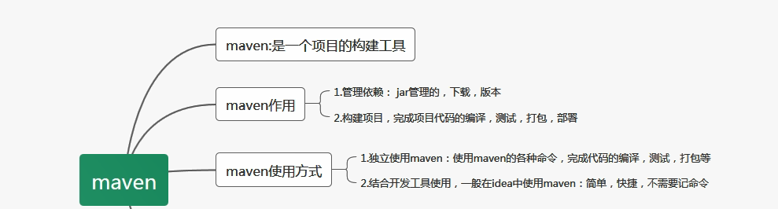
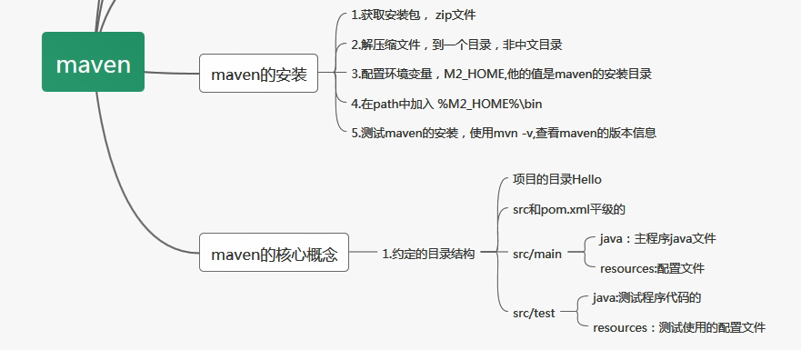
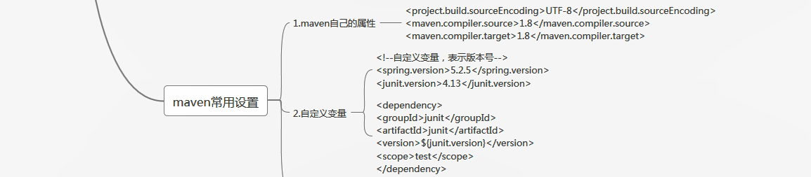
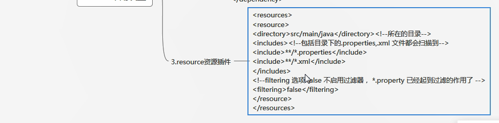
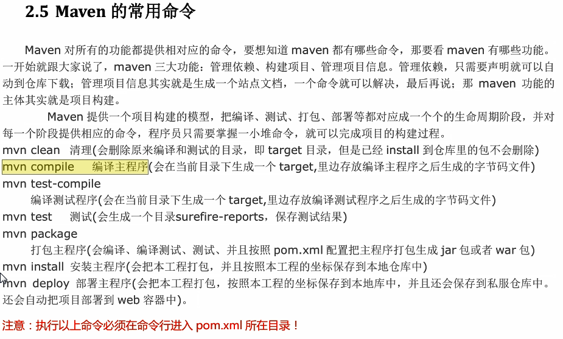
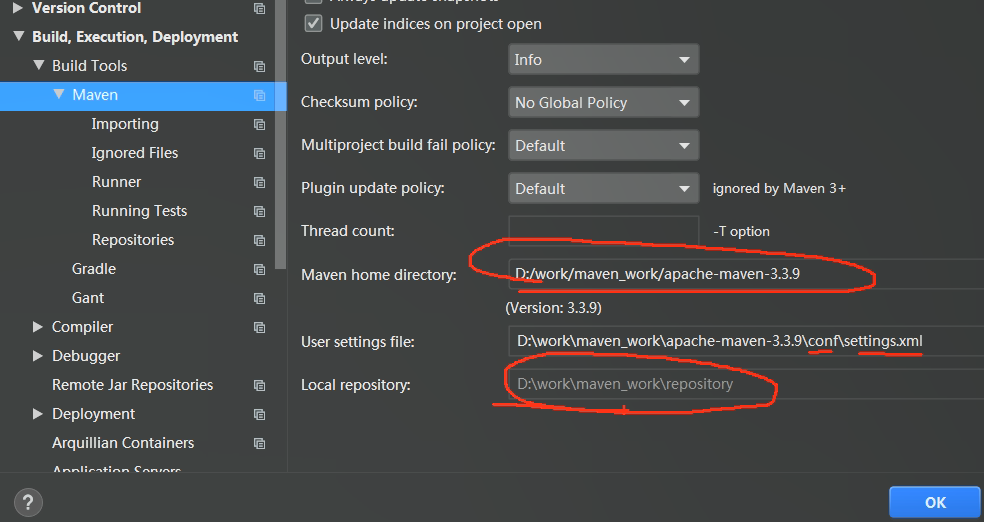
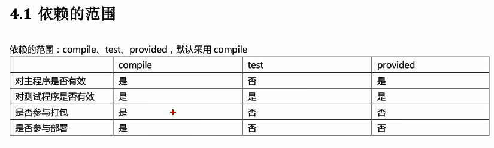

# Maven学习

## 简介:

 基于java的项目构建, 依赖管理和项目信息管理

(瀑布式开发和敏捷开发都合适)










### 项目构建

build都是每天做的事情, maven帮我们进行打包,部署等build进行自动化

jar包管理, class编译, war或者jar打包, 部署项目

1. 清理:　把之前编译的东西删除掉，为了新的代码做准备
2. 编译：把源程序编译未可执行代码，java-class, 批量编译
3. 测试: maven可以执行测试程序代码, 同时测试很多的功能
4. 报告: 生成测试结果文件, 测试通过了没有
5. 打包: 把项目中所有class中, 配置文件等所有支援放到一个压缩文件中,java为jar包, web项目为war
6. 安装:把生成的文件jar, war安装到本机仓库
7. 部署: 把程序安装好可以执行

### Maven的核心概念

1. POM:一个文件, pom.xml(项目对象模型), maven把一个项目当作一个模型来用, 控制maven构建项目的过程, 管理jar包的依赖
2. 约定的目录结构: maven项目目录和文件位置是固定的
3. 坐标:唯一标识资源的
4. 依赖管理:管理项目中可以使用jar文件
5. 仓库管理(了解): 资源存放位置
6. 生命周期:maven 工具构建项目的过程,就是生命周期
7. 插件和目标(了解): 执行maven构建的时候用的工具就是插件
8. 继承(maven高级):
9. 聚合(maven高级):

### 构建工具

ant, **maven[java]**, **gradle**

### maven四大特性

1. #### 依赖管理

   jar包依赖进行配置(groupid 公司和公司名称,artifactId maven模块-项目名,version)这三个组成一个坐标形成一个唯一的依赖

2. #### 多模块构建

   parent POM作为一组module的聚合POM, POM中可以使用<module>标签来定义一组子模块,, parent POM不会有什么实际的构建产出, 而parent POM中的build配置以及依赖配置都会自动继承给子module

3. #### 一致的项目结构

   maven的设计里面(约定大于配置), 指定了一套项目目录结构作为标准的java项目结构, 解决不同ide的目录文件结构不一致的问题

4. #### 一致的构建模型和插件机制

## maven的安装

### 安装

1. jdk要求1.8以上
2. 下载maven
3. 配置maven环境变量(MAVEN_HOME,bin配置到path中)
4. 检查 `mvn -v`

### 目录结构

##  Maven目录结构


具有公共目录布局允许用户熟悉Maven项目从一个到另一个。

Maven定义了一个标准的目录结构。

```
- src
  - main
    - java
    - resources
    - webapp
  - test
    - java
    - resources

- target
- pom.xml
```

`src `目录是源代码和测试代码的根目录。

`main `目录是与源代码相关的根目录到应用程序本身，而不是测试代码。

`test `目录包含测试源代码。

main和test下的` java `目录包含Java代码的应用程序本身是在main和用于测试的Java代码。

`resources `目录包含您项目所需的资源。

`target `目录由Maven创建。它包含所有编译的类，JAR文件等。

当执行` mvn clean `命令时，Maven将清除目标目录。

`webapp `目录包含Java Web应用程序，如果项目是Web应用程序。

`webapp `目录是Web应用程序的根目录。webapp目录包含` WEB-INF `目录。

如果按照目录结构，你不需要指定你的源代码的目录，测试代码，资源文件等。

### 目录结构

这里是最重要的目录:

| 目录               | 商店                                                         |
| ------------------ | ------------------------------------------------------------ |
| src/main/java      | 应用程序/库源                                                |
| src/main/resources | 应用程序/库资源                                              |
| src/main/config    | 配置文件                                                     |
| src/main/scripts   | 应用程序/库脚本                                              |
| src/main/webapp    | 应用程序/库脚本...                                           |
| src/test/java      | 测试源                                                       |
| src/test/resources | 测试资源                                                     |
| src/assembly       | 汇编描述符                                                   |
| src/site           | Site                                                         |
| target             | The `target` directory is used to store all output of the build. |
| LICENSE.txt        | 项目许可证                                                   |
| NOTICE.txt         | 通知和归因                                                   |
| README.txt         | 项目的自述                                                   |

在项目根目录的顶部有pom.xml文件和任何属性，maven.xml。

另外，还有文本文件用户在接收时立即读取来源:README.txt，LICENSE.txt等。

这个结构有两个子目录:` src `和` target `。

`src `目录包含所有源建筑项目的材料，其场地等。

它包含每个类型的子目录:` main `用于主构建工件，` test `用于单元测试代码和` resources `，` site `等。

在源目录中，` main `和` test `有一个目录为java的语言，在其下有正常的包层次，一个用于资源。

下面的资源被复制到目标类路径。

如果工件构建有其他贡献源，他们将在其他子目录下:例如` src / main / antlr `将包含Antlr语法定义文件。

2.疑问： mvn compile 编译src/main目录下的所有java文件的。
  1）**为什么要下载**
	   maven工具执行的操作需要很多插件（java类--jar文件）完成的
	2）**下载什么东西了**
	    jar文件--叫做插件--插件是完成某些功能

​	3）**下载的东西存放到哪里了。**
​    默认仓库（本机仓库）：
   C:\Users\（登录操作系统的用户名）Administrator\.m2\repository


	Downloading: https://repo.maven.apache.org/maven2/org/apache/maven/maven-plugin-parameter-documenter-2.0.9.pom

   https://repo.maven.apache.org ：中央仓库的地址

	执行mvn compile， 结果是在项目的根目录下生成target目录（结果目录），
	maven编译的java程序，最后的class文件都放在target目录中

**设置本机存放资源的目录位置(设置本机仓库)：**

 1. 修改maven的配置文件， maven安装目录/conf/settings.xml
    先备份 settings.xml

 2. 修改 <localRepository>  指定你的目录（不要使用中文目录）

 D:\work\maven_work\maven_repository

## 仓库

  1）仓库是什么： 仓库是存放东西的， 存放maven使用的jar 和 我们项目使用的jar
     > maven使用的插件（各种jar）
	  > 我项目使用的jar(第三方的工具)

  2）**仓库的分类**
     >本地仓库， 就是你的个人计算机上的文件夹，存放各种jar
	  >远程仓库， 在互联网上的，使用网络才能使用的仓库
	      ①：中央仓库，最权威的， 所有的开发人员都共享使用的一个集中的仓库，
			      https://repo.maven.apache.org ：中央仓库的地址
			②：中央仓库的镜像：就是中央仓库的备份， 在各大洲，重要的城市都是镜像。

​		③：私服，在公司内部，在局域网中使用的， 不是对外使用的。

  3）仓库的使用，maven仓库的使用不需要人为参与。 
       

​	开发人员需要使用mysql驱动--->maven首先查本地仓库--->私服--->镜像--->中央仓库

4. pom:项目对象模型

   ​	pom.xml是maven的灵魂

   

- ​	 **groupId:** 组织id,一般是公司的域名的倒写

- ​	**artifactId:** 项目名称, 也是模块迷宫, 对象groupId的子项目

-  	**version:** 一般是三位数字 -snapshot为开发版本

- ​	**坐标:** 以上三个组合在一起称为坐标

- ​	 **packaging:**默认是jar, 打包后压缩文件拓展名,web应用是war

- ​	**dependency和dependences:** 项目中要用的各种资源说明

- ​	**properties:** 定义一些配置属性的, 例如编码集等

- **build:** maven在进行项目构建的时候, 配置的信息,例如设置编译插件的jdk版本

- **parent:**声明父工程使用的配置

- **modules:** maven聚合

  

## maven的生命周期

maven的生命周期就是构建项目的过程 , 清理,编译,测试,报告,打包,安装,部署的过程

maven的命令: maven独立使用,通过命令, 完成maven的生命周期的执行

maven的插件: maven命令执行时,真正完成功能的是插件,就是一些jar文件, 一些类


1)单元测试: 用的是junit ,junit是一个专门测试的框架(工具)

​						junit的测试内容: 测试的是类中的方法,每一个方法都是独立测试的

​							方法是测试的基本单位(单元)

maven借助单元测试, 批量测试你类中的大量方法是否符合预期的

**2) 使用步骤**

1. 加入单元测试的依赖

```xml
 <!-- 单元测试 -->
	 <dependency>
		<groupId>junit</groupId>
		<artifactId>junit</artifactId>
		<version>4.11</version>
		<scope>test</scope>
	</dependency>
```
2.在maven项目中的src/test/java目录下，创建测试程序。
	    推荐的创建类和方法的提示：
		 1.测试类的名称 是Test + 你要测试的类名
		 2.测试的方法名称 是：Test + 方法名称

​	 例如你要测试HelloMaven ,
​	 创建测试类 TestHelloMaven

```xml
   @Test
	 public void testAdd(){
      测试HelloMaven的add方法是否正确
	 }
```


​	 其中testAdd叫做测试方法，它的定义规则
​	 1.方法是public的，必须的
​	 2.方法没有返回值， 必须的
​	 3.方法名称是自定义的，推荐是Test + 方法名称
​	 4.在方法的上面加入 @Test



**maven 执行以上常用命令的时候, 会把前面的命令执行** 

**3)mvn compile** 
	   编译main/java/目录下的java 为class文件， 同时把class拷贝到 target/classes目录下面
		把main/resources目录下的所有文件 都拷贝到target/classes目录下

## idea配置maven

###  1.在idea中设置maven ，让idea和maven结合使用。 

   idea中内置了maven ，一般不使用内置的， 因为用内置修改maven的设置不方便。
	使用自己安装的maven， 需要覆盖idea中的默认的设置。让idea指定maven安装位置等信息

**配置的入口 ①**：**配置当前工程的设置**， **file--settings** ---Build, Excution,Deployment--Build Tools
               --Maven 
					   Maven Home directory: maven的安装目录
						User Settings File :  就是maven安装目录conf/setting.xml配置文件
						Local Repository :    本机仓库的目录位置



​				   --Build Tools--Maven--Runner  
​					  VM Options : archetypeCatalog=internal
​					  JRE: 你项目的jdk

​                **archetypeCatalog=internal** , maven项目创建时，会联网下载模版文件，
​					  比较大， 使用archetypeCatalog=internal，不用下载， 创建maven项目速度快。


​            ②：**配置以后新建工程的设置**， **file--other setting**s--Settings for New Project(然后配置以上内容)


### 2.使用模版创建项目

  1）maven-archetype-quickstart : 普通的java项目
  2）maven-archetype-webapp : web工程

## 依赖范围

### scope: 

- scope表示依赖使用的范围, 也就是maven构建项目在那个阶段起作用

- scope的值由compile((都用到),  test(compile不需要, test需要), provided(服务器提供了, 不需要提供) , 默认是compile

-   maven构建项目: 编译,测试, 打包, 安装, 部署 

  

 你在写项目的中的用到的所有依赖（jar ） ，必须在本地仓库中有。
	没有必须通过maven下载， 包括provided的都必须下载。

你在servlet需要继承HttpServlet( provided) , 你使用的HttpServlet是maven仓库中的。

当你的写好的程序， 放到 tomat服务器中运行时， 此时你的程序中不包含servlet的jar
因为tomcat提供了 servlet的.jar

## maven常用操作


1. ### maven的属性设置

     <properties> 设置maven的常用属性

2. ### maven的全局变量

   自定义的属性，1.在<properties> 通过自定义标签声明变量（标签名就是变量名）
   	                 2.在`pom.xml`文件中的其它位置，使用 `${标签名}` 使用变量的值

   自定义全局变量一般是定义 依赖的版本号， 当你的项目中要使用多个相同的版本号，
   先使用全局变量定义， 在使用`${变量名}`

3. ### 资源插件


  作用： mybatis课程中会用到这个作用

  1. 默认没有使用resources的时候， maven执行编译代码时， 会把src/main/resource目录中的文件拷贝到target/classes目录中。对于src/main/java目录下的非java文件不处理, 不拷贝到target/classes目录中
    2. 我们的程序有需要把一些文件放在src/main/java中, 当我们执行java程序时候, 需要用到src/main/java目录中, 需要告诉maven在maven compile src/main/java目录下的程序时候, 需要把文件拷贝到target/classes中,此时需要在<build>中加入<resources>

  <build>
	<resources>
	<resource>
	<directory>src/main/java</directory><!--所在的目录-->
	<includes><!--包括目录下的.properties,.xml 文件都会扫描到-->
	<include>**/*.properties</include>
	<include>**/*.xml</include>
	</includes>
	<!—filtering 选项 false 不启用过滤器， *.property 已经起到过滤的作用了 -->
	<filtering>false</filtering>
	</resource>
	</resources>
  </build>