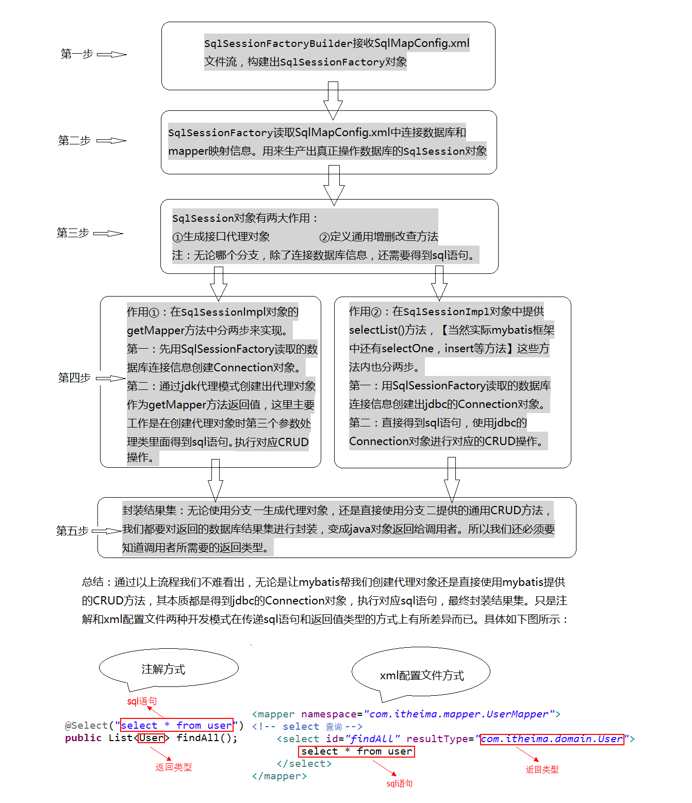
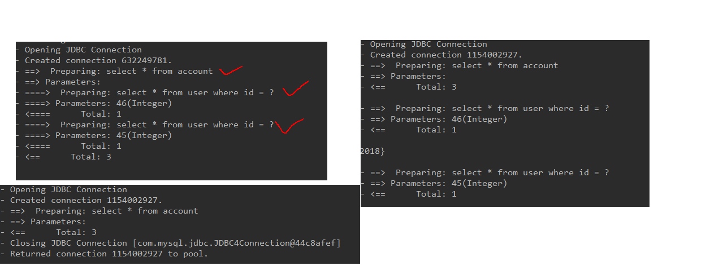

### mybatis框架

1. 入门(概述\环境\自定义)
2. 使用(单表crud\参数\dao\配置)
3. 多表(连接池\事务控制\多表crud)
4. 缓存和注解(加载时机\一级二级缓存\注解开发(单crud和多crud))


##### 框架: 项目开发的一套解决方案,半成品

​	好处: 框架封装了细节, 简化了功能的实现过程, 提高开发效率(节约成本)

##### 三层架构:

 1. 表现层(展示数据)

 2. 业务层(业务处理)

 3. 持久层(数据库交互)

    

    持久层技术解决方案

    jdbc

    jdbcTemplate

    DBUtils

    以上都不是框架

    ​		jdbc是规范

    ​		jdbcTemplate和DBUtils是工具类

    

### mybatis框架

内部封装jdbc 只关注sql本身, 不用费力加载驱动 创建连接, 创建statement等复杂东西

通过xml配置或者注解配置, 通过sql动态参数映射生成最终执行的sql语句, 最后又mybatis执行并映射为java对象返回

mybatis使用 ORM思想解决实体类和数据库的映射问题, 对jdbc进行封装, 完成对数据库的持久化操作


### mybatis概述

​	是一个持久层框架,用java写的,封装了jdbc的细节, 让开发者只关注sql本身,无需加载注册驱动,创建连接等繁杂过程,使用ORM思想实现结果集的封装

​	ORM:

​				对象关系映射: 实体类和数据库表的属性对应起来(实体类属性和数据库表的字段保持一致)


### mybatis入门

#### 环境搭建

 1. 创建maven工程并导入坐标

 2. 创建实体类和dao接口

 3. 创建mybatis主配置文件(SqlMapConfig.xml)

 4. 创建映射配置文件(IUserDao.xml)

    #### 注意事项:

    1. mybatis中把持久层的操作接口名称和映射文件叫做Mapper(IUserDao就是IUserMapper)

    2. mybatis的映射配置文件位置必须和dao接口的包结构相同

    3. 映射配置文件的mapper标签namespace属性的取值必须是dao接口的全限定类名

    4. 映射配置文件的操作配置,id属性的取值必须是dao接口的方法名

       ---

       如果遵从了2.3.4之后,开发中无需写dao的实现类

#### 入门案例()

​			第一步:读取配置文件

​			第二部: 创SqlSessionFactory工厂

​			第三步:创建SqlSession

​			第四步: 创建Dao接口的代理对象

​			第五步:执行Dao中的方法

​			第六步:释放资源

​			


​			(注意:千万要再映射配置中告知mybatis要封装到哪个实体类中)

​				配置的方式为:指定实体类的全限定类名

#### 			mybatis基于注解的入门案例

				1. 把IUserDao.xml移除, 再打接口的方法上使用@Select注解并指定SQL语句,同时需要再SqlMapConfig.xml的mapper配置时,使用class属性指定dao接口的全限定类名
				2. 明确: 再实际开发中,越简单也好, 都是采用不写dao实现类的方式(不管使用xml还是注解配置,但是mybatis是支持写dao实现类的)
				3. !查找配置里的id需要用 全限定类名+.方法的类型去唯一确定


#### 自定义mybatis的分析

1. mybatis再使用代理dao的方式实现crud时做了什么事?
   - 创建代理对象
   - 在代理对象中调用selectList方法

##### 自定义mybatis能通过入门案例看到的类

1. Class Resources

2. Class SqlSessionFactoryBuilder

3. interface SqlSessionFactory

4. interface SqlSession

   

---


### mybatis课程第二天: 

#### 简介:

1. 回顾mybatis自定义在分析和环境搭建+完善基于注解的mybatis

2. mybatis中的curd

3. mybatis中的参数深入及结果集的深入

4. mybatis中基于传统dao的方式  ---------了解的内容

5. mybatis中的配置: (主配置文件:SqlMapConfig.xml)

   ​			properties标签

   ​			typeAliases标签  -解释Integet写法

   ​			mappers标签

   

   细节:如果想要获取保存的id可以使用last_insert_id 将查询到的id封装到实体类中

   

   

   #### mybatis的参数深入
   
   ##### parameterType(输入类型)
   
   1. 传递简单对象
   
   2. 传递pojo对象
   
      mybatis用**ognl表达式**(Object Graphic Navigation Language, 作用是通过对象中的取值方法来获取数据, 写法上把get省略了, 比如获取用户的名称, 正常用user.getUserName, 而ognl表达式写法为user.username)
   
      用法为#{} ${}括号中的值为pojo属性名称
   
      mybatis为什么能直接写username而不用user.呢?因为在parameterType中已经提供了属性所属的类, 所以此时不需要写对象名而直接写了属性名
   
   3. 开发中通过pojo传递查询条件,查询条件时钟和的查询条件, 不仅包含用户查询条件还包括其他的查询条件,这是可以使用包装对象传递输入参数, Pojo类中包含pojo.需求: 根据用户名查询用户信息, 查询条件放到QueryVo的user属性中
   
   ##### ResultType(输出类型, 封装到哪个实体类中,需要属性名和数据库类名对应)
   
   ##### ResultMap
   
   ​	如果实体类名字和数据库列名对不上怎么办?
   
   		1. Sql语句中起别名 as(执行效率快但是改得很麻烦)
   		2. 配置中配置查询结果列名和实体类属性的对应关系, 使用ResultMap配置(执行效率不算快, 因为多解析一些xml, 但是开发效率变快了)
   
   
   
   
   
   ### Mybatis实现Dao实现类的开发
   
   ​		实现步骤如下
   
   
   
   
   
   源码分析如下(目前不是我水平....看不懂):
   
   
   
   
   
   ##### 	1. Properties属性
   
   ​		可以配置文件支持放到外部, 使用${}来引入 ,
   
   ```
    <!--配置properties
           可以在标签内部配置连接数据库的信息,也可以通过属性引用外部的配置文件信息
           resources属性:
               用于指定配置文件的位置, 是按照类路径来写, 并且必须保存在类路径下
           url属性:可用http协议也可用file协议
                要求按照url的写法来写地址
                   url:uniform resources locator 统一资源定位符: 唯一标志一个资源的位置
                       写法: http://localhost:8080:/mybatis/....
                             协议    主机       端口    uri
                   uri:uniform resources identifier 统一资源标识符: 在应用中可以唯一定位一个资源
   
       -->
   ```
   
   ​	注意数据库连接信息的key要与${key}保持一直否则不能成功
   
   2. ##### typeAliases标签和package标签
   
      ```
          <!--使用typeAliases配置别名,它只能配置domain中类的别名-->
          <typeAliases>
              <!--typeAlias用于配置别名,type属性指定的是实体类的全限定类名, alias属性指定别名, 当指定了别名就不再区分大小写-->
             <!-- <typeAlias type="com.itheima.domain.User"  alias="user"></typeAlias>-->
              <!--提供了package标签
                  用于必定要配置别名的包, 指定后该包下的实体类都会注册别名, 并且类名就是别名, 不在区分大小写
                  -->
              <package name="com.itheima.domain"/>
          
          
      ```
   
      


---

###   mybatis 课程第三天

#### 1. mybatis中的连接池及事务控制										- 原理部分了解

##### 		- mybatis中事务控制的分析

### 2. mybatis中基于xml配置的动态sql语句的使用            - 会用就行

  - mappers配置文件中的几个标签

    <if>

    <where>

    <foreach>

    <sql>

### 3. mybatis中的多表操作                             - 掌握应用

		- 一对多
		- 一对一(?)
		- 多对多


1. 连接池:

   1. 我们在实际开发中我们都会使用连接池, 因为能减少获取连接的时间, 类似一个容器, 先获取连接放在容器中,当需要使用的时候就使用容器中的连接

      

   2.mybatis中的连接池

    - mybatis中提供了3种方式的配置

       - 配置的位置: 主配置文件SqlMapConfig.xml中的dataSource 标签, type属性表示使用何种连接池

       - type的取值:

         POOLED: 采用传统javax.sql.dataSource规范中的连接池, mybatis中有实现

         UNPOOLED: 采用传统的获取连接方式, 虽然也是先了JavaX.sql.DataSource, 但是没有使用池的思想

         JNDI: 采用服务器提供的JNDI技术实现,来获取DataSource对象, 不同的服务器能拿到的DataSource是不一样的, 如果不是Web或者maven的war工程是不能使用的

         ​		课程中使用的是tomcat服务器, 采用的连接池是dbcp连接池

pooled和unpooled的区别


pooled的源码分析


#### mybatis中的事务控制

	- 什么是事务
	- 事务的四大特性(ACID)
	- 事务不考虑隔离性产生的4个问题
	- 解决办法:四种隔离级别

 


mybatis通过sqlsession对象的commit方法和rollback方法实现事务的提交和回滚

可实现自动事务提交

```java
sqlSession=factory.openSession(true);// 传入true即可实现自动提交(单个crud可以,多个会控制不住,类似转账操作)
```

#### mybatis查询条件的参数深入

<if>标签 test属性写的是实体类属性名

```xml
<if test="userName != null">
    and username=#{userName}
</if>
```

<where>标签

```xml
<select id="findUserByCondition" resultMap="userMap" parameterType="com.itheima.domain.User">
    select * from user
    <where>
        <if test="userName != null">
            and username=#{userName}
        </if>
        <if test="userSex != null">
            and sex=#{userSex}
        </if>
    </where>
</select>
```

<foreach>

```xml
<!--根据queryvo中的id集合实现查询用户列表(实现子查询)-->
<select id="findUserInIds" resultMap="userMap" parameterType="com.itheima.domain.QueryVo">
    select * from user
<where>
    <if test="ids != null and ids.size()>0">
        <foreach collection="ids" open="and id in (" close=")" item="id" separator=",">
            #{id}
        </foreach>
    </if>
</where>

</select>
```

了解的内容 : 抽取重复的sql语句

<sql>

```xml
<!--了解的内容, 抽取的重复的sql语句-->
<sql id="defaultUser">
    select * from user
</sql>
```

使用的时候用```<include refid ="defaultUser"></include>```引入

#### mybatis中的多表连接查询

1. 表间关系

   - 1-1

   - 1-n

   - n-1

   - n-m

     举例: 一个用户可以下多个订单, 多个订单属于同一个用户 (用户和订单就是一对多, 订单和用户就是多对一)

     ​		一个人只能有一个id, 一个id只能有一个人(人和id就是一对一)

     ​		一个学生可以被多个老师教过, 一个老师可以教多个学生, 老师和学生之间就是多对多

   特例: 如果拿出每一个订单都只能属于一个用户,所以mybatis中把多对一看成了一对一

   

   ##### mybatis中的多表查询

   示例: 用户和账户

   ​		一个用户可以 有多个账号

   ​		一个账户只能属于一个用户(多个账户也可以属于同一个用户)

   步骤: 

     		1. 先建立两张表: 用户表 账户表
     	   - 让用户表和账户表之间具备一对多的关系 :  需要使用外键在账户表中添加
     		2. 建立两个实体类: 用户实体类和账户实体类
     	   - 让用户和账户实体类中体现出一对多的关系

   3. 建立两个配置文件
      - 用户的配置文件
      - 账户的配置文件

   4. 实现配置
      - 当我们查询用户时, 可以同时得到用户下所包含的账户信息
      - 当我们查询账户时, 可以同时得到账户的所属用户信息


#### 一对一关系实现:

主表持有一个从表的引用, 然后配置中使用resultMap 中使用association 进行引用的配置(association中需要配置property(引用的类型) 和javaType(封装的数据类型), mybatis会根据查询出来的名称对应封装进相应对象中.

```xml
<!--定义封装account和user的resultMap-->
    <resultMap id="accountUserMap" type="account">
        <id property="id" column="aid"></id>
        <result property="uid" column="uid"></result>
        <result property="money" column="money"></result>
        <!--一对一的关系映射: 封装user的内容-->
        <association property="user"  javaType="user"> <!--关联封装属性user , 封装类型是user(配置了别名)-->
            <id property="id" column="id"></id>
            <result column="username" property="username"></result>
            <result column="address" property="address"></result>
            <result column="sex" property="sex"></result>
            <result column="birthday" property="birthday"></result>
        </association>

    </resultMap>

    <!--查询所有操作-->
    <select id="findAll" resultMap="accountUserMap">
        select u.*,a.id as aid,a.uid,a.money from account a, user u where a.uid=u.id
    </select>
```

#### 一对多关系实现

主表持有从表的返回类型引用集合,  然后配置中使用resultMap标签进行配置, resultMap标签中使用Colletion标签设置封装的集合类型, property为引用的名称, ofType为封装进的类名(已进行配置别名)

```xml
<!--定义User的resultMap-->
    <resultMap id="userAccountMap" type="user">
            <id property="id" column="id"></id>
        <result property="username" column="username" ></result>
        <result property="address" column="address" ></result>
        <result property="sex" column="sex" ></result>
        <result property="birthday" column="birthday" ></result>
        <collection property="accounts" ofType="account">
            <id column="aid" property="id"></id>
            <result column="uid" property="uid"></result>
            <result column="money" property="money"></result>

        </collection>
    </resultMap>

    <!--查询所有操作-->
    <select id="findAll" resultMap="userAccountMap">
        select * from user u left outer join account a on u.id=a.uid
    </select>
```

#### 多对多关系

示例: 用户和角色(多对多关系)(一个用户可以有多个角色,一个角色可赋予多个用户)

步骤: 

  		1. 先建立两张表: 用户表 角色表
  	   - 让用户表和角色表之间具备多对多关系, 需要使用中间表, 中间表中包含各自的主键, 在中间表中是外键
  		2. 建立两个实体类: 用户实体类和角色实体类
  	   - 让用户和角色实体能体现多对多的关系(各自包含对方的集合引用)

3. 建立两个配置文件
   - 用户的配置文件
   - 角色的配置文件

4. 实现配置
   - 当我们查询用户时, 可以同时得到用户下所包含的角色信息
   - 当我们查询角色时, 可以同时得到角色的所属账户信息

需要**两个左外连接**(左边的一直存在, 右值可未null)才能实现查询多对多关系的功能

​		

角色到用户的配置如下(角色到用户的配置略.....)

```xml
<resultMap id="RoleMap" type="role">
    <id property="roleId" column="rid"></id>
    <result property="roleName" column="role_name"></result>
    <result property="roleDesc" column="role_desc"></result>
    <collection property="users" ofType="user">
        <id column="id" property="id" ></id>
        <result column="username" property="username"></result>
        <result column="address" property="address"></result>
        <result column="sex" property="sex"></result>
        <result column="birthday" property="birthday"></result>


    </collection>
</resultMap>
<!--查询所有-->
<select id="findAll" resultMap="RoleMap">
    select u.*, r.id as rid,r.role_name,r.role_desc from role r
        left outer join user_role ur on r.id=ur.rid
        left outer join user u on u.id=ur.uid
</select>
```

JNDI(现在先了解下, 以后再学........)

​	JNDI : java naming and directory interface 即java命名和目录接口 , 作用是模仿windows系统的注册表, 使用一大串路径作为key , value为资源


注意创建maven工程的war工程

​		必须WebApp建立META-INF目录

里面有context.xml目录

​		


### mybatis第四天

##### 	1. 延迟加载

		- 什么是延迟加载
		- 什么是立即加载

##### 	2. mybatis中的缓存

		- 什么是缓存
		- 为什么使用缓存
		- 什么样的数据能使用缓存,什么样的数据不能使用
		- mybatis中的一级和二级缓存

3. #### mybatis中的注解开发

   - 环境搭建
   - 单表crud操作(代理Dao的方式)
   - 多表查询操作
   - 缓存的配置


- #### 延迟加载

**问题**: 在一对多中,当我们有一个用户,他又100个账户,在查询用户的时候,  要不要把关联的账户一起查询出来,? 

​			在查询账户的时候要不要把关联的用户查询出来?

**答案**: 再查询用户的时候, 用户下的账户信息应该是, 什么时候使用, 什么时候查询的    ------- 延迟加载

​		但是在查询账户的时候,  因为需要给客户一个直观的体验, 通常情况下, 需要将查询账户时, 账户的所属用户`				信息应该是随着账户查询的时候一起查询出来       --------- 立即加载


​	**什么是延迟加载:**

​					在真正使用数据的时候才发起查询, 不用的时候不查询, **按需加载(延迟加载, 懒加载)**

​	**什么是立即加载:**

​					不管用不用,只要一调用方法 ,,马上发起查询

**四种表关系中:(可分成两种)**

		1. 一对多/多对多: 通常情况下**懒加载**
		2. 多对一/一对一:通常情况下**立即加载**

**实现懒加载:** 需要调整association 标签中,提供column属性(此属性为已封装的uid来查询未封装的id, 即查询参数),提供select属性,内容为需要调用的子查询的接口方法的全限定类名

​		**思想**:在用的时候去调用对方的配置文件的配置来实现查询的功能

```xml
<!--定义封装account和user的resultMap-->
    <resultMap id="accountUserMap" type="account">
        <id property="id" column="id"></id>
        <result property="uid" column="uid"></result>
        <result property="money" column="money"></result>
        <!--一对一的关系映射: 封装user的内容-->
        <!--select属性的内容: 查询用户的唯一标志, 用的是关联属性的查询接口全限定类名 -->
        <!--colunm属性指定的内容: 用的是已封装的id去查询未封装的内容-->
        <association property="user" column="uid" javaType="user" select="com.itheima.dao.IUserDao.findById"></association>

    </resultMap>

    <!--查询所有操作-->
    <select id="findAll" resultMap="accountUserMap">
        select * from account
    </select>
```

​				需要在主配置文件中开启延迟加载功能

```xml
<!--配置参数-->
    <settings>
        <!--开启mybatis支持延迟加载的开关-->
        <setting name="lazyLoadingEnabled" value="true"/>
        <setting name="aggressiveLazyLoading" value="false"/>
    </settings>
```

执行对比




#### mybatis中的缓存

**定义** :  存在内存中的临时数据

**为什么使用缓存:**减少和数据库的交互, 提高执行效率

**什么数据能用缓存:**经常查询, 不常变化的

**什么数据不能用缓存:** 经常变化的数据, 数据的正确性对最终结果影响很大(类似银行汇率, 股市牌价,商品库存)

- ##### mybatis中的一级缓存

  ​	指的是mybatis中SqlSession对象的缓存: 当我们执行查询后, 查询的结果会同时存入到SqlSession中为我们提供的一块区域中, 该区域的结构是一个map, 当我们再次查询同样的数据, mybatis会先去SqlSession中查询是否有数据有得话就直接拿来用.

  - 当sqlSession对象消失的时候, mybatis的一级缓存也就消失了

  - mybatis中的一级缓存默认是开启的
  - sqlSession中有一个方法可以清空缓存 `sqlSession.clear()`
  - mybatis的一级缓存调用SqlSession 的添加/修改/删除,commit(),close()方法的时候,  会清空一级缓存

- ##### mybatis中的二级缓存

  - 二级缓存指的是Mybatis中的SqlSessionFactory对象的缓存,由同一个SqlSessionFactory对象创建的SqlSession共享其缓存


二级缓存的使用步骤:

1. 让 Mybatis框架支持二级缓存(在SqlMapConfig.xml中配置setting 设置cacheEnabled 为true)

2. 在当前映射文件支持二级缓存(在IUserDao.xml配置 配置<cache/>)

3. 在当前操作支持二级缓存(在select标签中配置 useCache="true")

   注意:mybatis中的二级缓存存放的是散装数据而不是对象

   

#### mybatis的注解开发

​		注解与xml开发的对应关系


细节: 只要使用注解开发 ,但是**配置路径下有了xml , 不管用没用都会报错**(可以挪位置或者删除解决)

​		

```java
/**
 * 在mybatis中, 针对crud一共有四个注解
 * @Select
 * @Insert
 * @Update
 * @Delete
 * 查询所有用户
 * @return
 */
@Select("select * from user")
List<User> findAll();

/**
 * 保存用户
 * @param user
 */
@Insert("insert into user(username,address,sex,birthday)values(#{username},#{address},#{sex},#{birthday})")
void saveUser(User user);
/**
 * 更新用户
 */
@Update(" update user set username=#{username},address=#{address}, sex=#{sex}, birthday=#{birthday} where id=#{id} ")
void updateUser(User user);

/**
 * 删除用户
 * @param userId
 */
@Delete("delete from user where id=#{id}")
void deleteUser(Integer userId);
/**
 * 查询一个
 */
@Select("select * from user where id=#{id}")
User findOne(Integer userId);

/**
 * 模糊查询
 */
/*@Select("select * from user where username like #{userNmae}")*/  /*pareparedStatement 处理成?占位符*/
@Select("select * from user where username like '%${value}%'")   /*直接字符串拼接, 不太安全, 容易被sql注入*/
List<User> findUserByName(String userNmae);

/**
 * 查询用户总数
 */
@Select("select count(*) from user")
int findTotalUser();
```

##### mybatis中的多表

- 数据库表名和实体类不一致的话: 使用@Results注解

```java
    @Select("select * from user")
    @Results(id = "userMap",value={
            @Result(column = "id", property = "userId",id = true),
            @Result(column = "username", property = "userName"),
            @Result(column = "address", property = "userAddress"),
            @Result(column = "sex", property = "userSex"),
            @Result(column = "birthday", property = "userBirthday")
    })
    List<User> findAll();
```

**一对一查询(多对一)**

```java
/**
 * 查询所有账户并且获取每个账户所属的用户信息
 * @return
 */
@Select("select * from account")
@Results(id = "accountMap",value={
        @Result(id = true,column = "id", property = "id"),
        @Result(column = "uid", property = "uid"),
        @Result(column = "money", property = "money"),
        @Result(property = "user", column = "uid",one=@One(select="com.itheima.dao.IUserDao.findOne",fetchType=FetchType.EAGER) )

})
List<Account> findAll();
```

**一对多查询**

```java
/**
 * 在mybatis中, 针对crud一共有四个注解
 * @Select
 * @Insert
 * @Update
 * @Delete
 * 查询所有用户
 * @return
 */
@Select("select * from user")
@Results(id = "userMap",value={
        @Result(column = "id", property = "userId",id = true),
        @Result(column = "username", property = "userName"),
        @Result(column = "address", property = "userAddress"),
        @Result(column = "sex", property = "userSex"),
        @Result(column = "birthday", property = "userBirthday"),
        @Result(property = "accounts",column = "id", many=@Many(select = "com.itheima.dao.IAccountDao.findAccountByUid",fetchType = FetchType.LAZY))
})
List<User> findAll();
```

**注解方式二级缓存的配置**

- 主配置文件中开启配置

  ```xml
  <!--全局的配置开启二级缓存-->
  <settings>
      <setting name="cacheEnabled" value="true"/>
  </settings>
  ```

- 在接口中使用@CacheNamespace(blocking = true)

  ```java
  @CacheNamespace(blocking = true)
  public interface IUserDao 
  ```