# 02.Spring框架

课程介绍:(4天)

1. 第一天:spring框架概述以及基于XML的IOC配置
2. 第二天:spring基于注解的IOC和ioc案例
3. 第三天:spring中的AOP和基于XML和注解的AOP配置
4. 第四天: spring中的JdbcTemplate以及Spring的事务控制


---

- ## 第一天

  ### 1. spring的概述

  - **spring是什么**

    spring是分层的java se应用的 full-stack开源架构, 以**IOC(反转控制)** 和**AOP(面向却面编程)**为内核, 提供展现层和持久层以及业务层事务管理等众多企业级应用技术, 整合多种开源框架和类库

  - **spring的两大核心**
    - AOC(面向切面编程)
    - IOC(控制反转)

  - **spring的优势**

    - *方便解耦 简化开发*

      通过spring提供的IOC容器, 将对象间的依赖关系交给spring进行控制, 避免硬编码所造成的过度程序耦合, 用户不必为单例模式属性文件解析等这些底层需求编写代码, 可以更加专注于上层开发

    - *AOP编程的支持*

    - 声明式事务的支持

    - 方便程序的测试

    - 方便各种优秀框架

    - 降低javaee api的使用难度

    - java源码是经典的学习案例

  - **spring的体系结构**

    

  ### 2. 程序的耦合及解耦

  - **程序的耦合及解耦**

    如果jar包不存在, 那么工程就会在编译的时候直接出现错误, 则证明没有这个依赖类的情况下是不能够正常编译的(这种情况即为简单认为是程序的耦合,即程序间的依赖关系)

    - 类的依赖
    - 方法的依赖

    解耦就是降低程序间的依赖关系(不可能做到完全没有耦合), 实际开发中应该做到**编译期不依赖, 运行时才依赖**: 类似用forname 反射, 在运行时候才去找这个具体的类

  - **解耦的思路**

    1. 使用反射创建对象, 而避免使用new关键字

    2. 通过读取配置文件的方式, 来获取要创建的对象全限定类名

       

  - **工厂模式的解耦**

    ```java
    /**
     * 创建Bean对象的工厂
     * Bean在计算机英语中, 有可重用组件的含义
     * JavaBean: 用java语言编写的可重用组件
     *    javabean==实体类?  它不等于实体类, javabean> 实体类
     *
     *    它就是创建我们的service和dao对象的
     *
     *    第一个:需要一个配置文件来配置我们的service和dao
     *            配置的内容: 唯一标志=全限定类名 (key=value)
     *    第二个: 通过读取配置文件的配置的内容反射创建对象
     *
     *    我们的配置文件可以是xml也可以是properties
     *    
     */	
    
    
    ```

  以下为工厂模式的原理

  ```java
  package com.itheima.factory;
  
  import java.io.IOException;
  import java.io.InputStream;
  import java.util.Properties;
  
  /**
   * 创建Bean对象的工厂
   * Bean在计算机英语中, 有可重用组件的含义
   * JavaBean: 用java语言编写的可重用组件
   *    javabean==实体类?  它不等于实体类, javabean> 实体类
   *
   *    它就是创建我们的service和dao对象的
   *
   *    第一个:需要一个配置文件来配置我们的service和dao
   *            配置的内容: 唯一标志=全限定类名 (key=value)
   *    第二个: 通过读取配置文件的配置的内容反射创建对象
   *
   *    我们的配置文件可以是xml也可以是properties
   *
   */
  public class BeanFactory {
      //定义一个Properties对象
      private  static Properties props;
      // 使用静态代码块为Properties赋值
      static{
  
          try {
              //1.实例化对象
              props=new Properties();
              //2. 获取properties文件的流对象
              InputStream in= BeanFactory.class.getClassLoader().getResourceAsStream ("bean.properties");
              props.load(in);
          } catch (IOException e) {
              throw new ExceptionInInitializerError("初始化properties失败");
          }
      }
  
      /**
       * 根据bean的名称获取bean对象
       * @param beanName
       * @return
       */
      public Object getBean(String beanName) {
          Object bean=null;
          try{
              String beanPath=props.getProperty(beanName);
              bean=Class.forName(beanName).newInstance();
          }catch (Exception e){
              e.printStackTrace();
          }
  
          return bean;
  
      }
  
  }
  ```

  但是上面代码还有问题, 生成出来的对象是**多例的**(每次生产出来的都是**不同的对象**,导致对象重用性很差,执行效率差)

  如果是单例对象的话, 如果改变**单例**对象的类成员的话, 会出现**线程问题**(所以尽量不要在单例对象中定义类成员)

  

  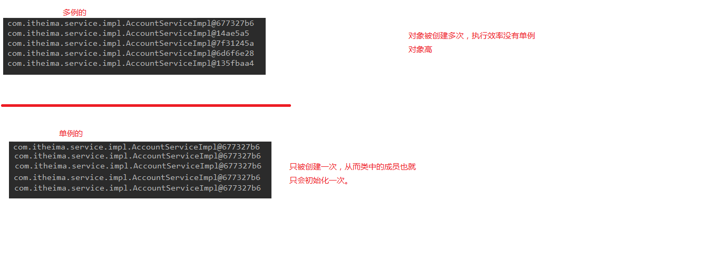

  所以**Service和Dao中不会有可以改变的类成员**, 所以不会出现线程问题,故可以使用单例对象

  - **实现方法**: 初始化工厂的时候读取配置文件, 一次性创建出来所有对象, 使用map容器把创建出来的对象名称和创建出来的对象存起来(key,value), getBean()的时候在map容器中取

  

  改造过后的BeanFactory.java如下

  ```java
  package com.itheima.factory;
  
  import java.io.IOException;
  import java.io.InputStream;
  import java.util.Enumeration;
  import java.util.HashMap;
  import java.util.Map;
  import java.util.Properties;
  
  /**
   * 创建Bean对象的工厂
   * Bean在计算机英语中, 有可重用组件的含义
   * JavaBean: 用java语言编写的可重用组件
   *    javabean==实体类?  它不等于实体类, javabean> 实体类
   *
   *    它就是创建我们的service和dao对象的
   *
   *    第一个:需要一个配置文件来配置我们的service和dao
   *            配置的内容: 唯一标志=全限定类名 (key=value)
   *    第二个: 通过读取配置文件的配置的内容反射创建对象
   *
   *    我们的配置文件可以是xml也可以是properties
   *
   */
  public class BeanFactory {
      //定义一个Properties对象
      private  static Properties props;
      //定义一个map, 用于存放我们的对象, 我们把它称之为容器
      private  static Map<String,Object> beans;
  
      // 使用静态代码块为Properties赋值
      static{
  
          try {
              //1.实例化对象
              props=new Properties();
              //2. 获取properties文件的流对象
              InputStream in= BeanFactory.class.getClassLoader().getResourceAsStream ("bean.properties");
              props.load(in);
              //实例化容器
              beans=new HashMap<String,Object>();
              //取出配置文件中所有的key
              Enumeration keys= props.keys();
              //遍历枚举
              while(keys.hasMoreElements()){
                  //取出每个key
                  String key=keys.nextElement().toString();
                  //根据key获取value
                  String beanPath=props.getProperty(key);
                  //反射创建对象
                  Object value=Class.forName(beanPath).newInstance();
                  //把key和value存入容器中
                  beans.put(key,value);
              }
          } catch (Exception e) {
              throw new ExceptionInInitializerError("初始化properties失败");
          }
      }
  
      /**
       * 根据bean的名称获取bean对象
       * @param beanName
       * @return
       */
      public static Object getBean(String beanName) {
          return beans.get(beanName);
  
      }
  
  }
  ```

  ### 3. IOC概念和spring的IOC

  直接new和工厂模式的对比

  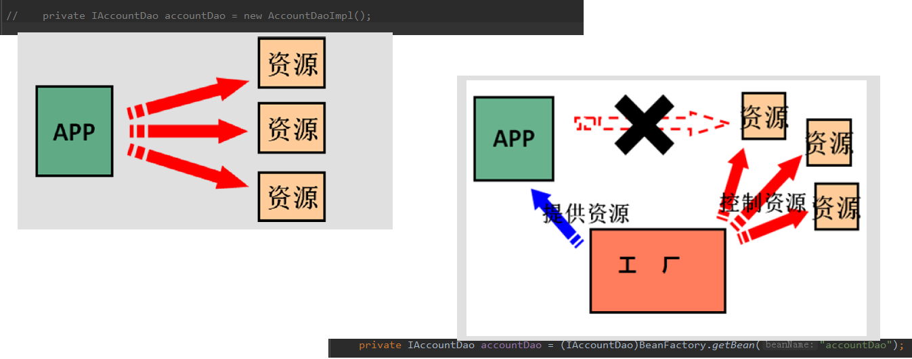

  控制权由主动new变成了把**控制权给工厂获取对象**, 这就叫**控制反转**

  

  - **spring中基于xml的IOC环境搭建**

    导入spring支持的jar包

    ```xml
    <dependency>
        <groupId>org.springframework</groupId>
        <artifactId>spring-context</artifactId>
        <version>5.0.2.RELEASE</version>
    </dependency>
    ```

    ```java
    /**
     * 模拟一个表现层用于调用业务层
     *
     */
    public class Client {
        /**
         *  ApplicationContext的三个常用实现类
         *           ClassPathXmlApplicationContext  它可以加载类路径下的配置文件  要求配置文件必须在类路径下
         *           FileSystemXmlApplicationContext    它可以加载磁盘任意路径下的配置文件(必须有访问权限)
         *           AnnotationConfigApplicationContext   他是用于读取注解创建容器
         *      核心容器的两个接口引发出的问题
         *           ApplicationContext: (单例模式使用)   采用此接口
         *              他在构建容器的时候, 创建对象采取的策略是立即加载的方式,也就是说, 只要以读取配置文件就立即加载对象
         *           BeanFactory: (多例对象使用)
         *              他在构建核心容器的时候, 创建对象采取的策略是延迟加载的形式, 也就是说, 什么时候根据id获取对象了, 什么时候才真正创建对象
         *     获取spring的ioc核心容器 并根据id获取对象
         *     用于调用业务层的
         * @param args
         */
        public static void main(String[] args) {
           //1. 获取核心容器对象(ApplicationContext加载方式)
            ApplicationContext ac=new ClassPathXmlApplicationContext("bean.xml");
            //2. 根据id获取Bean对象
            IAccountService as=(IAccountService)ac.getBean("accountService");//自己强制转的方式拿
            IAccountDao adao=ac.getBean("accountDao",IAccountDao.class);// 传字节码让他强转
    
            System.out.println(as);
            System.out.println(adao);
            //BeanFactory的加载方式
            Resource resource=new ClassPathResource("bean.xml");
            BeanFactory factory=new XmlBeanFactory(resource);
            IAccountService as1=(IAccountService) factory.getBean("accountService");
            System.out.println(as);
        }
    }
    
    ```

  bean对象的三种创建方式

  ```xml
  <!--把对象的创建交给spring来管理-->
      <!--spring对bean的管理细节
          1. 创建bean的三种方式
          2. bean对象的作用范围
          3. bean对象的生命周期
      -->
      <!--创建bean的三种方式-->
      <!--第一种方式:使用默认构造函数创建
          在spring的配置文件中使用bean标签配以id和class属性之后, 且没有其他属性标签时, 采用的就是采用默认函数创建bean对象
          如果类中没有默认构造函数, 则对象无法创建
      -->
  <!--    <bean id="accountService" class="com.itheima.service.Impl.AccountServiceImpl"></bean>-->
  
      <!--第二种方式: 使用普通工厂的方法创建对象(使用某个类中的方法创建对象并存入spring容器)-->
    <!--  <bean id="instanceFactory" class="com.itheima.factory.InstanceFactory"></bean>
      <bean id="accountService" factory-bean="instanceFactory" factory-method="getAccountService"></bean>
  -->
      <!--第三种方式: 使用静态工厂中的静态方法创建对象(使用某个类中的静态方法创建对象,并存入spring容器)-->
      <bean id="accountService" class="com.itheima.factory.StaticFactory" factory-method="getAccountService"></bean>
  ```

  使用容器:

  ```
      public static void main(String[] args) {
          //1.获取核心容器对象
  //        ApplicationContext ac = new ClassPathXmlApplicationContext("bean.xml");
          ClassPathXmlApplicationContext ac = new ClassPathXmlApplicationContext("bean.xml");
          //2.根据id获取Bean对象
          IAccountService as  = (IAccountService)ac.getBean("accountService");
          as.saveAccount();
  
          //手动关闭容器
          ac.close();
      }
  ```

  - bean的作用范围

  bean对象创建的默认的是单例对象, 如果想调整, 在bean标签中的scope属性(指定bean的作用范围), 取值:**singleton(单例对象, 默认值) prototype(多例模式)** request(作用于web应用的请求范围) session(作用于web应用的会话范围) global-session(作用于集群环境的会话范围, 当不是集群环境时, 他就是session))

  - 集群环境介绍

    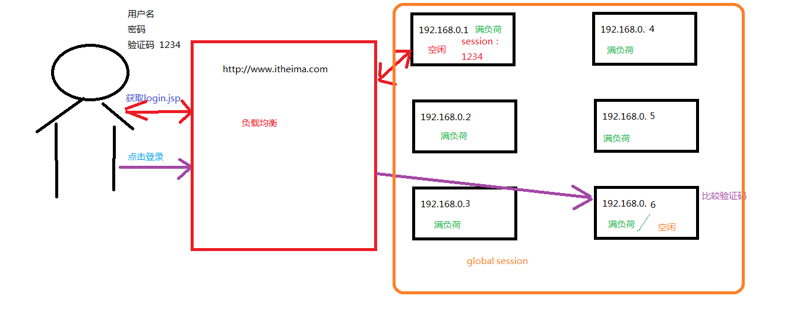

  - bean对象的生命周期

    1. 单例对象:(只要容器还在,对象就还在)

       出生:当容器**创建**时候,对象出生

       活着:只要容器还在, 对象一直或者

       死亡:**容器销毁,** 对象消亡

    2. 多例对象

       出生:等我们**使用**对象时, spring框架为我们创建

       活着:对象在使用过程中, 就一直活着
       死亡:当对象长时间不用且没有别的对象引用时, 由java的**垃圾回收器回收**

  ### 4. 依赖注入(dependency injection)

  ​	

  ```xml
  <?xml version="1.0" encoding="UTF-8"?>
  <beans xmlns="http://www.springframework.org/schema/beans"
         xmlns:xsi="http://www.w3.org/2001/XMLSchema-instance"
         xsi:schemaLocation="http://www.springframework.org/schema/beans
          http://www.springframework.org/schema/beans/spring-beans.xsd">
  
  <!--spring中的依赖注入
      依赖注入:
          dependency injection
          IOC的作用:
              降低程序见的耦合关系(依赖关系)
          依赖关系的管理:
              以后都交给了spring来维护
          在当前类需要用到其他类的对象,由spring为我们提供, 我们只需要在配置文件中说明
          依赖关系的维护:
              就称之为依赖注入
           依赖注入:
              能注入的类型有三类
                  1. 基本类型和String
                  2. 其他bean类型(在配置文件中或者注解配置过的bean)
                  3. 复杂类型/集合类型
               注入的方式, 有三种
                  1. 使用构造函数提供
                  2. 使用set方法提供
                  3. 使用注解提供
  
  -->
      <!--使用构造函数注入:
          使用的标签:constructor-grg(在bean的内部)
              标签中的属性:
                  type:用于指定要注入的数据的数据类型, 同时该数据类型也是构造函数中某个或者某些参数的类型
                  index:用于指定要注入的数据给构造函数指定索引位置的参数赋值, 索引位置从0开始
                  name:用于指定给构造函数中的指定名称的参数赋值
                  ========以上三个用于指定给构造函数中的哪个参数赋值=========
                  value: 用于给基本类型和String类型的数据
                  ref:用于指定其他bean类型数据(指得是在spring的IOC核心容器中出现过的vean对象, 也就是需要配置过的bean对象)
          优势:
              在获取bean对象时候, 注入数据是必须的操作,否则对象无法创建成功(没有无参数构造,强制要求注入参数)
          弊端:
              该表了bean对象的实例化方式,使我们在创建对象时, 如果用不到这些数据我们也要提供
      -->
      <!--使用构造函数注入:-->
      <bean id="accountService" class="com.itheima.service.impl.AccountServiceImpl">
          <constructor-arg name="name" value="text"></constructor-arg>
          <constructor-arg name="age" value="18"></constructor-arg>
          <constructor-arg name="birthday" ref="now"></constructor-arg>
      </bean>
      <!--配置一个日期对象-->
      <bean id="now" class="java.util.Date"></bean>
  
  
      <!--使用set方法注入:  (更常用的方式)
          涉及的标签:property
          出现的位置:bean标签的内部
          标签的属性:
                name:用于指定注入的时候要调用的set方法名称
               value:用于给基本类型和String类型的数据
                ref:用于指定其他bean类型数据(指得是在spring的IOC核心容器中出现过的vean对象, 也就是需要配置过的bean对象)
          优势:
              创建对象时没有明确的限制, 可以直接使用默认构造函数
          弊端:
              如果有某个成员必须有值,则获取对象时候有可能set方法没有执行, 无法保证一定注入
      -->
  
  <!--    使用set方法注入:-->
      <bean id="accountService2" class="com.itheima.service.impl.AccountServiceImpl2">
          <property name="name" value="TEST" ></property>
          <property name="age" value="21"></property>
          <property name="birthday" ref="now"></property>
      </bean>
  
      <!--复杂类型的注入/集合类型的注入-->
      <!--
          就两组:
          用于给list结构集合注入的标签:
              list array set
          用于给map结构集合注入的标签:
              map props
          
         结构相同, 标签可以互换
      -->
          <bean id="accountService3" class="com.itheima.service.impl.AccountServiceImpl3">
              <property name="myStrs">
                  <set>
                      <value>AAA</value>
                      <value>BBB</value>
                      <value>CCC</value>
                  </set>
              </property>
  
              <property name="myList">
                  <array>
                      <value>AAA</value>
                      <value>BBB</value>
                      <value>CCC</value>
                  </array>
              </property>
  
              <property name="mySet">
                  <set>
                      <value>AAA</value>
                      <value>BBB</value>
                      <value>CCC</value>
                  </set>
              </property>
              <property name="myMap">
                  <map>
                      <entry key="testA" value="aaa"></entry>
                      <entry key="testB" >
                         <value>BBB</value>
                      </entry>
                  </map>
              </property>
              <property name="myPropss">
                  <props>
                      <prop key="testC">ccc</prop>
                      <prop key="testD">ddd</prop>
  
                  </props>
              </property>
      </bean>
  
  </beans>
  ```

  

## 第二天: spring中的基于注解的IOC以及IOC的案例

### 1. spring中的ioc的常用注解

```java
package com.itheima.service.Impl;

import com.itheima.dao.IAccountDao;
import com.itheima.dao.Impl.AccountDaoImpl;

import com.itheima.service.IAccountService;
import org.springframework.beans.factory.annotation.Autowired;
import org.springframework.beans.factory.annotation.Qualifier;
import org.springframework.context.annotation.Scope;
import org.springframework.stereotype.Component;
import org.springframework.stereotype.Service;

import javax.annotation.PostConstruct;
import javax.annotation.PreDestroy;
import javax.annotation.Resource;

/**
 * 账户的业务层实现类
 * 曾经xml的配置:
 *     <bean id="accountService" class="com.itheima.service.Impl.AccountServiceImpl">
 *         scope="" init-method="" destroy-method=""
 *         <property name="" value="" / ref=""></property>
 *         </bean>
 *
 * 用于创建对象的注解
 *      他们的作用就和xml配置文件中编写一个<bean>标签是一样的
 * @Component:
 *          作用: 用于把当前类对象存入容器中
 *          属性:
 *              value:用于指定bean的id. 当我们不写的时候, 他的默认值是当前的类名首字母改小写
 * 以下三个注解作用和属性和Component是一模一样的, 他们是spring框架提供给我们, 让三层框架更加清晰
 *
 * @Controller:一般用在表现层
 * @Service:一般用在业务层
 * @Repository:一般用在持久层
 * 用于注入数据的
 *@Autowired:(自动按照类型注入)(如果容器中有唯一一个bean对象和要注入的变量类型匹配, 就可以注入成功
 *                  如果ioc容器中没有任何bean类型(ioc容器中的value)和要注入的变量类型匹配, 就报错
 *                  如果有多个匹配的时候:
*                            首先按照类型圈定出来匹配的对象, 然后使用变量名称作为bean的id查找ioc中的key
 *                            (有一样就注入成功)
*                            )
 *          作用: 自动按照类型注入, 只要容器中有唯一的一个bean对象类型和要注入的类型匹配, 就可以注入成功
*          出现位置: 可以是成员变量上,也可以是方法上
 *           细节: 使用注解注入的时候, set方法就不是必须的了
 *
 * @qulifier:
 *          作用:在按照类型注入的基础上, 在按照名称注入,它在给类成员注入时, 不能单独使用,
 *               但是在给方法参数注入时,可以单独使用
 *          属性:
 *              value:用于指定注入bean的id
* @Resource:  作用: 直接按照bean的注入, 它可以独立使用,不在依赖于@Autowired
 *            属性:
 *              naem:用于指定bean的id
 *      他们的作用就和xml配置文件的<bean>中的<property>标签是一样的
 *
 *      以上三个注解只能注入其他bean类型的数据, 而基本类型和String类型的数据无法使用上述注解实现
 *      另外集合类型的注入只能通过xml的方式实现
 * @Value:
 *         作用:用于注入基本类型和String类型的数据
 *         属性:用于指定数据的值, 它可以使用spring中的SpEl(也就是spring的EL表达式)
 *              SpEL的写法也是${表达式}
 * 用于改变作用范围的
 * @Scope:
 *        作用: 用于指定bean的作用范围
 *        属性:
 *              value:指定范围的取值,常用取值: singleton prototype request session global-session
 *      他们的作用就和在<bean>标签中使用scope属性是一样的
 * 和生命周期相关的(了解)
 * @PreDestroy
 *          作用:用于指定销毁方法
 * @PostConstruct
 *          作用:用于指定初始化方法
 *      他们的作用就和<bean></bean>标签中使用init-method和destroy-method是一样的
 */
@Service("accountService")
//@Scope("prototype")
public class AccountServiceImpl implements IAccountService {
//        @Autowired
//        @Qualifier("accountDao1")
        @Resource(name = "accountDao2")
        private IAccountDao accountDao;
    @PostConstruct
    public void init() {
        System.out.println("初始化方法执行了");
    }
    @PreDestroy
    public void destroy() {
        System.out.println("销毁方法执行了");
    }
    @Override
    public void saveAccount() {
        accountDao.saveAccount();
    }
}
```

@Autowired注解自动按照类型注入分析

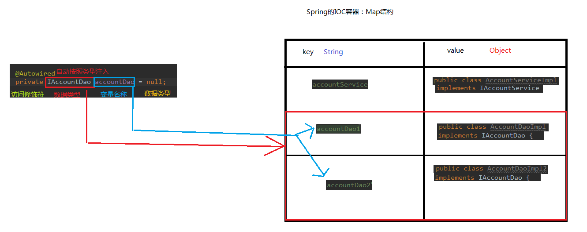

### 2. 案例使用xml方式和注解方式实现单表的crud操作

​		持久层技术选择: dbutils

xml方式配置如下:

```xml
<?xml version="1.0" encoding="UTF-8"?>
<beans xmlns="http://www.springframework.org/schema/beans"
       xmlns:xsi="http://www.w3.org/2001/XMLSchema-instance" xmlns:cache="http://www.springframework.org/schema/cache"
       xsi:schemaLocation="http://www.springframework.org/schema/beans http://www.springframework.org/schema/beans/spring-beans.xsd http://www.springframework.org/schema/cache http://www.springframework.org/schema/cache/spring-cache.xsd">
    <!--配置Service-->
    <bean id ="accountService" class="com.itheima.service.impl.AccountServiceImpl">
        <!--注入dao-->
        <property name="accountDao" ref="accountDao">

        </property>
    </bean>
    <!--配置Dao对象-->
    <bean id="accountDao" class="com.itheima.dao.impl.IAccountDaoImpl">
            <property name="runner" ref="runner"></property>
    </bean>

    <!--配置QueryRunner-->
    <bean id="runner" class="org.apache.commons.dbutils.QueryRunner" scope="prototype">
        <!--注入数据源-->
        <constructor-arg name="ds" ref="dataSource"></constructor-arg>
    </bean>

    <!--配置数据源-->
    <bean id="dataSource" class="com.mchange.v2.c3p0.ComboPooledDataSource">
        <!--注入连接数据库的必备信息-->
        <property name="driverClass" value="com.mysql.jdbc.Driver"></property>
        <property name="jdbcUrl" value="jdbc:mysql://localhost:3306/eesy"></property>
        <property name="user" value="root"></property>
        <property name="password"   value="123456"></property>

    </bean>
</beans>
```

注解配置如下:

- service和dao的实现类直接注解使用ioc和自动注入

  ```java
  /**
   * 账户的持久层实现类
   */
  @Repository("accountDao")
  public class IAccountDaoImpl implements IAccountDao {
      @Autowired
      private QueryRunner runner;
  ```

```java
/**
 * 账户的业务层实现类
 */
@Service("accountService")
public class AccountServiceImpl implements IAccountService {
    @Autowired
    private IAccountDao accountDao;
```


### 3.改造基于注解的ioc案例,使用纯注解的方式实现(实际开发看企业, 怎么方便怎么来)

还需要实现的注入如QueryRunner和DataSource则新建两个个配置类(父子配置类, 有Import去导入子配置)去注入

```java
package config;

import com.mchange.v2.c3p0.ComboPooledDataSource;
import org.apache.commons.dbutils.QueryRunner;
import org.springframework.context.annotation.*;

import javax.sql.DataSource;

/**
 * 该类是一个配置类, 作用和bean.xml是一样的
 * spring中的新注解
 * @Configuration
 *     作用: 执行当前类是一个配置类
 *     细节:　当配置类作为AnnotationConfigApplicationContext对象创建的参数的时候, 该注解可以不写
 *
 * @ComponentScan
 *     作用: 用于通过注解指定spring创建容器的时候要扫描的包
 *     属性:value属性, 和basePackage的作用是一样的(互为别名), 都是指定容器创建的时候要扫描的包
 *      我们使用此注解就相当于xml中配置类注解类扫描    <context:component-scan base-package="com.itheima"></context:component-scan>
 * @Bean
 *      作用: 用于把当前方法的返回值作为bean对象存入spring的ioc容器中
 *      属性:　name: 用于指定bean的id. (默认值是不写的是当前方法的名称)
 *      细节: 当我们使用注解配置方法时, 如果方法有参数, spring框架会去容器中查找有没有可用的bean对象
 *      查找的方式和@Autowired的注解是一样的(自动按照类型注入, 没有匹配出错, 多个匹配按照spring注入机制)
 *
 * @Import:
 *       作用: 用于导入其他配置类
 *       属性:
 *          value: 用于指定其他配置类的字节码.
 *                  当我们使用Import注解后, 有Import注解的类,就是主配置(父配置类), 而导入的都是子配置类
 * @PropertySource:
 *          作用: 用于指定properties属性的文件的位置
 *          属性: value: 指定文件的名称和路径
 *                  关键字: classpath,标识类路径下
 */
@Configuration
@ComponentScan("com.itheima")
@Import(JdbcConfig.class)
@PropertySource("classpath:jdbcConfig.properties")
public class SpringConfiguration {
    /**
     * 用于创建一个QueryRunner对象
     * @param dataSource
     * @return
     */
    @Bean(name = "runner")
    @Scope("prototype")
    public QueryRunner createQueryRunner(DataSource dataSource){
        return new QueryRunner(dataSource);
    }


}

```

```java
package config;

import com.mchange.v2.c3p0.ComboPooledDataSource;
import org.springframework.context.annotation.Bean;
import org.springframework.context.annotation.Configuration;

import javax.sql.DataSource;

/**
 * 和数据框相关的配置类
 */
@Configuration
public class JdbcConfig {
    /**
     * 创建数据源对象
     * @return
     */
    @Bean(name = "dataSource")
    public DataSource createDataSource() {
        ComboPooledDataSource ds = new ComboPooledDataSource();
        try {
            ds.setDriverClass("com.mysql.jdbc.Driver");
            ds.setJdbcUrl("jdbc:mysql://localhost:3306/eesy");
            ds.setUser("root");
            ds.setPassword("123456");
            return ds;
        } catch (Exception e) {
            throw new RuntimeException(e);
        }


    }

}
```

### 4.spring和junit的整合

​	分析: 

​			**1.  应用程序的入口**

​						main方法:

​			**2. junit单元测试中, 没有main方法也能执行**

​						junit集成了一个main方法

​						该方法就会判断当前测试类中哪些方法有@Test注解	

​						junit就会让有@Test的方法执行

​			**3. junit不会管我们是否使用了spring框架**

​						在执行测试方法的时候, junit不知道我们是否使用了spring框架, 所以就不会为我们读取配置文件/配置类, 创建spring容器,


#### 所以, 基于以上三点可知, 在测试方法执行的时候, 没有使用spring的ioc容器, 无法为我们自动注入


### 解决的思路

**spring整合junit使用**

```java
package com.itheima.test;

import config.SpringConfiguration;
import com.itheima.domain.Account;
import com.itheima.service.IAccountService;
import org.junit.Before;
import org.junit.Test;
import org.junit.runner.RunWith;
import org.springframework.beans.factory.annotation.Autowired;
import org.springframework.context.ApplicationContext;
import org.springframework.context.annotation.AnnotationConfigApplicationContext;
import org.springframework.test.context.ContextConfiguration;
import org.springframework.test.context.junit4.SpringJUnit4ClassRunner;

import java.util.List;

/**
 * 使用junit单元测试测试我们的配置
 * spring整合单元测试: 测试我们的配置
 *      1. 使用spring整合junit的jar包(导入坐标)
 *      2. 使用junit使用的一个注解把原有的main方法替换掉成spring提供的一个main方法
 * @Runwith:
 *          作用:替换junit的自带main方法, 使它支持spring的ioc和di
 *      3. 告知spring的运行器件,spring的ioc创建是基于xml还是注解的, 并且说明位置
 * @ContextConfiguration
 *          作用:告知spring的运行器, 是xml还是注解
 *          属性:
 *              location: 指定xml的位置,加上classpath关键字, 表示在类路径下
 *              classes: 指定注解的所在地
 *          细节: 当我们使用spring5 版本的时候, 要求junit的jar包必须是4.1.2及以上
 *
 */
@RunWith(SpringJUnit4ClassRunner.class)
@ContextConfiguration(classes = SpringConfiguration.class) //注解配置类的位置
public class AccountServiceTest {
    @Autowired
    IAccountService as;


    @Test
    public void testFindAll() {

        List<Account> accounts=as.findAllAccount();
        for(Account account:accounts){
            System.out.println(account);
        }
    }

    @Test
    public void testFindOne() {


       Account account=as.findAccountById(2);
        System.out.println(account);
    }

    @Test
    public void TestSave() {

        Account account = new Account();
        account.setMoney(123456f);
        account.setName("大头鬼");
        as.saveAccount(account);
    }
    @Test
    public void testUpdate() {

        Account account=as.findAccountById(3);
        System.out.println(account);
        account.setMoney(00124f);
        as.updateAccount(account);
        System.out.println(as.findAccountById(3));

    }

    @Test
    public void testDelete() {

        as.deleteAccount(4);
    }
}
```


## day03 

- 完善account案例
- 分析案例中的问题
- 回顾之前讲过的一种技术:动态代理
- 动态代理的另一种实现方式
- 解决案例中的问题
- aop的概念
- spring中中的Aop相关术语
- spring中的基于xml的注解和aop配置


### 事务控制会出现的问题:

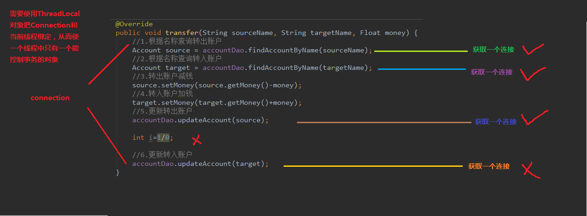

事务控制都是在业务层的

### 解决办法: 

**实现事务和线程的绑定**

```java
/**
 * 连接的工具类,它用于从数据源中获取一个连接并且实现和线程的绑定
 */
public class ConnectionUtils {
    private ThreadLocal<Connection> tl =new ThreadLocal<Connection>();
    private DataSource dataSource;

    public void setDataSource(DataSource dataSource) {
        this.dataSource = dataSource;
    }

    public ThreadLocal<Connection> getTl() {
        return tl;
    }
    /**
     * 获取当前线程上的连接
     */
    public Connection getThreadConnection()  {
        //1. 先从ThreadLocal上获取
        Connection conn=tl.get();
        //2. 判断当前线程上是否有连接
        if(conn==null){
            //3. 从数据源中获取一个连接, 并且存入ThraedLocal中
            try {
                conn=dataSource.getConnection();
                tl.set(conn);
            }
            catch (Exception e) {
                throw new RuntimeException(e);

            }
        }


        //返回当前线程上的连接
        return  conn;
    }
    //把连接和线程解绑
    public void removeConnection(){
        tl.remove();
    }
}

```

事务控制类, 利用已和连接绑定的线程, 实现事务的控制, 避免一个线程中出现多个数据库连接造成的数据框状态不一致

```java


/**
 * 事务管理相关的工具类, 里面包含了 开启事务 提交事务 回滚事务 和释放连接
 */
public class TransactionManager {
    private ConnectionUtils connectionUtils;

    public void setConnectionUtils(ConnectionUtils connectionUtils) {
        this.connectionUtils = connectionUtils;
    }

    //开启事务
    public void beginTransaction(){
        try {
            connectionUtils.getThreadConnection().setAutoCommit(false);
        } catch (Exception e) {
            e.printStackTrace();
        }
    }
    //提交事务
    public void commit(){
        try {
            connectionUtils.getThreadConnection().commit();
        } catch (Exception e) {
            e.printStackTrace();
        }
    }
    //回滚事务
    public void rollback(){
        try {
            connectionUtils.getThreadConnection().rollback();
        } catch (Exception e) {
            e.printStackTrace();
        }
    }
    //释放连接
    public void release(){
        try {
            connectionUtils.getThreadConnection().close(); //close()只是还回连接池中(线程和连接仍然还是绑定的)
            connectionUtils.removeConnection();//线程和连接解绑
        } catch (Exception e) {
            e.printStackTrace();
        }
    }

}
```

改造service层

```java
**
 * 账户的业务层实现类
 * 事务控制都是在业务层
 */
public class AccountServiceImpl implements IAccountService {

    private IAccountDao accountDao;

    private TransactionManager txManager;

    public void setTxManager(TransactionManager txManager) {
        this.txManager = txManager;
    }

    public void setAccountDao(IAccountDao accountDao) {
        this.accountDao = accountDao;
    }

    @Override
    public List<Account> findAllAccount() {
        try{
            //1. 开启事务
            txManager.beginTransaction();
            //2. 执行操作
            List<Account> accounts= accountDao.findAllAccount();
            //3. 提交事务
            txManager.commit();
            //4. 返回结果
            return accounts;
        }catch (Exception e){
            //5. 回滚操作
            txManager.rollback();
            throw new RuntimeException();
        }finally {
            //6. 释放连接
            txManager.release();
        }

    }

    @Override
    public Account findAccountById(Integer id){
        try{
            //1. 开启事务
            txManager.beginTransaction();
            //2. 执行操作
            Account account= accountDao.findAccountById(id);
            //3. 提交事务
            txManager.commit();
            //4. 返回结果
            return account;
        }catch (Exception e){
            //5. 回滚操作
            txManager.rollback();
            throw new RuntimeException();
        }finally {
            //6. 释放连接
            txManager.release();
        }


    }

    @Override
    public void saveAccount(Account account) {

        try{
            //1. 开启事务
            txManager.beginTransaction();
            //2. 执行操作
            accountDao.saveAccount(account);
            //3. 提交事务
            txManager.commit();
            //4. 返回结果

        }catch (Exception e){
            //5. 回滚操作
            txManager.rollback();
            throw new RuntimeException();
        }finally {
            //6. 释放连接
            txManager.release();
        }

    }

    @Override
    public void updateAccount(Account account) {
        try{
            //1. 开启事务
            txManager.beginTransaction();
            //2. 执行操作
            accountDao.updateAccount(account);
            //3. 提交事务
            txManager.commit();
            //4. 返回结果

        }catch (Exception e){
            //5. 回滚操作
            txManager.rollback();
            throw new RuntimeException();
        }finally {
            //6. 释放连接
            txManager.release();
        }

    }

    @Override
    public void deleteAccount(Integer accountId) {
        try{
            //1. 开启事务
            txManager.beginTransaction();
            //2. 执行操作
            accountDao.deleteAccount(accountId);
            //3. 提交事务
            txManager.commit();
            //4. 返回结果

        }catch (Exception e){
            //5. 回滚操作
            txManager.rollback();
            throw new RuntimeException();
        }finally {
            //6. 释放连接
            txManager.release();
        }

    }

    @Override
    public void transfer(String sourceName, String targetName, float money) {
        try{
            //1. 开启事务
            txManager.beginTransaction();
            //2. 执行操作
            //2.1. 根据名称查询转出账户
            Account source=accountDao.findAccountByName(sourceName);
            //2.2. 根据名称查询转入账户
            Account target=accountDao.findAccountByName(targetName);
            //2.3. 转出账户扣钱
            source.setMoney(source.getMoney()-money);
            //2.4. 转入账户加钱
            target.setMoney(target.getMoney()+money);
            //2.5. 更新转出账户
            accountDao.updateAccount(source);
            //        int i=1/0;
            //2.6. 更新转入账户
            accountDao.updateAccount(target);
            //3. 提交事务
            txManager.commit();
            //4. 返回结果

        }catch (Exception e){
            //5. 回滚操作
            txManager.rollback();
            throw new RuntimeException();
        }finally {
            //6. 释放连接
            txManager.release();
        }


    }
```

**引出的问题:**

由上面代码可以看出, 事务控制的时候需要在业务层手动添加大量重复代码(而且如果修改了一些的话, 就需要改动大量的代码, 太多依赖了, 耦合太严重)

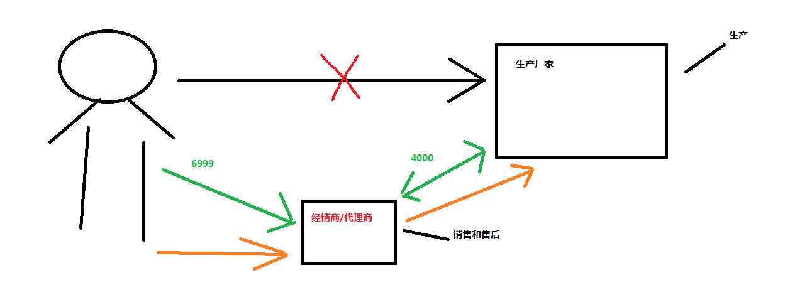

**解决办法**:

*基于接口的动态代理:*

生产者接口:

```java
public interface IProducer {
    //销售
    public void saleProduce(float money ) ;
    //售后
    public void afterService(float money);
}
```

生产者:

```java
/**
 *一个生产者
 */
public class Producer implements IProducer{
    //销售
    public void saleProduce(float money )   {
        System.out.println("销售产品拿到钱"+money);
    }
    //售后
    public void afterService(float money){
        System.out.println("提供售后服务并拿到钱"+money);
    }
}
```

main入口和InvocationHandler内部类

```java
public class Client {
    /**
     * 模拟一个消费者
     */
    public static void main(String[] args) {
        final Producer producer = new Producer();
        /**
         * 特点: 动态代理的特点就是字节码随用随创建, 随用谁加载
         * 作用:　不修改源码的基础上对方法增强
         * 分类：　基于接口的动态代理出
         *        基于子类的动态代理
         *        这里讲的是基于接口的动态代理
         *              涉及的类：　Proxy(jdk官方提供)
         * 如何创建对象:
         *      使用Proxy类中的newProxyInstance方法
         * 创建代理对象的要求:
         *      被代理类最少实现一个接口, 如果没有则不能使用
         * newProxyInstance方法的参数:
         *       1. ClassLoder: 他是用于代理对象字节码的, 和被被代理对象使用相同的类加载器. 固定写法
         *       2. Class[]: 字节码数组, 他是用于代理对象和被代理对象有相同的方法. 固定写法
         *       3. InvocationHandler: 用于提供增强的代码.它是让我们写如何代理,通常情况下都是匿名内部类, 但不是必须的
         *          此接口的实现类都是谁用谁写
         */
        IProducer proxyProducer = (IProducer) Proxy.newProxyInstance(producer.getClass().getClassLoader(), producer.getClass().getInterfaces(), new InvocationHandler() {
            /**
             * 执行被代理对象的任何接口方法都会经过该方法
             * 方法参数:
             *
             * @param proxy  代理对象的引用
             * @param method 当前执行的方法
             * @param args   当前执行方法所需的参数
             * @return 和被代理对象有相同的返回值
             * @throws Throwable
             */
            @Override
            public Object invoke(Object proxy, Method method, Object[] args) throws Throwable {
                //提供增强的代码
                Object returnValue=null;
                //1. 获取方法执行的参数
                Float money=(Float)args[0];
                //2. 判断当前方法是不是销售
                if("saleProduce".equals(method.getName())){
                   returnValue=method.invoke(producer, money*0.8f);
                }
                return returnValue;
            }
        });
        proxyProducer.saleProduce(10000f);
    }
```

*基于子类的动态代理*

引入jar包

```xml
<dependency>
    <groupId>cglib</groupId>
    <artifactId>cglib</artifactId>
    <version>2.1_3</version>
</dependency>
```

```java
public class Client {
    /**
     * 模拟一个消费者
     */
    public static void main(String[] args) {
        final Producer producer = new Producer();
        /**
         * 特点: 动态代理的特点就是字节码随用随创建, 随用谁加载
         * 作用:　不修改源码的基础上对方法增强
         * 分类：　基于接口的动态代理出
         *        基于子类的动态代理
         * 这里讲的是基于子类的动态代理
         *              涉及的类：Enhancer(cglib库提供)
         * 如何创建对象:
         *      使用Enhancer中的一个create方法
         * 创建代理对象的要求:
         *      被代理类不能为最终类
         * create方法的参数:
         *    1. Class: 字节码 , 用于指定被代理对象的字节码
         *    2. Callback: 用于提供增强的代码, 它是让我们写如何代理,通常情况下都是匿名内部类, 但不是必须的
         *          我们一般写的是该接口的子接口实现类: MethodInterceptor
         *
         */
        Producer cglibProducer = (Producer) Enhancer.create(producer.getClass(), new MethodInterceptor() {
            /**
             * 执行此对象的任何方法都会经过该方法
             *
             * @param proxy
             * @param method
             * @param objects      以上三个参数和基于接口的动态代理中的invoke中的参数是一样的
             * @param methodProxy: 当前执行方法的代理对象
             * @return
             * @throws Throwable
             */
            @Override
            public Object intercept(Object proxy, Method method, Object[] objects, MethodProxy methodProxy) throws Throwable {
                //提供增强的代码
                Object returnValue = null;
                //1. 获取方法执行的参数
                Float money = (Float) objects[0];
                //2. 判断当前方法是不是销售
                if ("saleProduce".equals(method.getName())) {
                    returnValue = method.invoke(producer, money * 0.8f);
                }
                return returnValue;
            }
        });
        cglibProducer.saleProduce(12000f);
    }
}
```

**使用动态代理进行配置事务管理**

1. 建立一个service的工厂

```java
/**
 * 用于创建 Service代理对象的工厂
 */
public class beanFactory {
    private IAccountService accountService;
    private TransactionManager txManager;

    public void setTxManager(TransactionManager txManager) {
        this.txManager = txManager;
    }


    /**
     * 获取Service的代理对象
     * @return
     */
    public IAccountService getAccountService() {
        return(IAccountService) Proxy.newProxyInstance(accountService.getClass().getClassLoader(), accountService.getClass().getInterfaces(), new InvocationHandler() {
            /**
             * 添加事务的支持
             * @param proxy
             * @param method
             * @param args
             * @return
             * @throws Throwable
             */
            @Override
            public Object invoke(Object proxy, Method method, Object[] args) throws Throwable {
                Object rtValue=null;
                try{
                    //1. 开启事务
                    txManager.beginTransaction();
                    //2. 执行操作
                    rtValue=method.invoke(accountService,args);
                    //3. 提交事务
                    txManager.commit();
                    //4. 返回结果
                    return rtValue;
                }catch (Exception e){
                    //5. 回滚操作
                    txManager.rollback();
                    throw new RuntimeException();
                }finally {
                    //6. 释放连接
                    txManager.release();
                }
            }
        });

    }

    public void setAccountService(IAccountService accountService) {
        this.accountService = accountService;
    }
}
```

2. 为工厂类的属性注入数据

```xml
 <!--配置代理的service对象-->
<bean id="proxyAccountService" factory-bean="beanFactory" factory-method="getAccountService"></bean>
<!--配置beanFactory-->
<bean id="beanFactory" class="com.itheima.factory.beanFactory">
    <!--注入service-->
    <property name="accountService" ref="accountService"></property>
    <!--注入事务管理器-->
    <property name="txManager" ref="txManager"></property>
</bean>
```

3. 因测试类中spring会找到两个IAccountService的实例, 故用@Qualifier("proxyAccountService")来指定使用这一个

   

```java
/**
 * 使用junit单元测试测试我们的配置
 */
@RunWith(SpringJUnit4ClassRunner.class)
@ContextConfiguration(locations = "classpath:bean.xml")
public class AccountServiceTest {
        @Autowired
        @Qualifier("proxyAccountService")
        private IAccountService as;

        @Test
    public void testTransfer(){
            as.transfer("aaa","bbb", 100f);
        }
}
```

### AOP的相关概念


AOP即为面向切面编程, 是通过预编译和**动态代理实现**的程序功能的统一维护的一种技术, 可提高程序的重用性和开发效率

作用:

- 在程序运行的过程中,不修改源码的方式对已有的方法进行增强

优势: 

1. 减少重复代码
2. 提高开发效率
3. 维护方便


- spring中可以控制使用子类或者使用基于接口的aop-

- spring 中是通过配置的方式, 实现上面动态代理加bean工厂类的时候功能

**术语:**

- **JoinPoint:连接点**

  指得是那些被拦截到的点, spring中, 这些点指得是方法, 因为spring只支持方法类型的连接点 (工程中业务层中所有的方法)

- **PointCut:切入点**

  所谓切入点是指我们要对哪些JoinPoint进行拦截的定义(工程中被增强的方法)

- **advice: 通知**

  有前置通知, 后置通知, 环绕通知, 异常通知(catch里), 最终通知(finally里) (以切入点方法来确定的)

- **introduction: 引介**

  引介是一种特殊的通知, 在不修改类代码的前提下,  引介可以在运行期为类动态添加一些方法或者Field

- **Target: 目标对象**

  代理的目标对象

- **Weaving:织入**

  是指把增强应用到目标对象来创建新的代理对象的过程

  spring采用动态代理织入, 而AspectJ采用编译器织入和类装载期织入

- **Proxy:代理**

  一个类被AOP织入增强后, 就产生类一个结果代理类

- **Aspect(切面)**

  是切入点和通知(引介)的结合


#### 学习spring要明确的

- 开发相关

  核心代码(主线), 大部分程序员来做, 要熟悉业务需求

  抽取公共代码, 制成通知(开发阶段最后做):AOP编程人员来做

  配置文件中,生命却如点和通知间的关系, 即切面:AOP编程人员来做

- 运行阶段

  ​	Spring框架监控却如点方法的执行, 监控到切入点方法被运行, 使用代理机制, 动态创建目标对象, 根据通知类别, 在代理对象的对应位置, 将通知对应功能的织入, 完成整个代码逻辑的运行

  

### **xml方式实现**

1. server层接口实现

   ```java
   /**
    * 账户的业务层接口
    */
   public interface IAccountService {
       /**
        * 模拟保存账户
        */
       void saveAccount();
       /**
        * 模拟更新账户
        */
       void updateAccount(int i);
       /**
        * 模拟删除账户
        */
       int deleteAccount();
   }
   ```

2. **service实现类**

```java
/**
 * 账户的业务层实现类
 */
public class AccountServiceImpl implements IAccountService {
    @Override
    public void saveAccount() {
        System.out.println("执行类保存");
    }

    @Override
    public void updateAccount(int i) {
        System.out.println("执行类更新"+i);
    }

    @Override
    public int deleteAccount() {
        System.out.println("执行类删除");
        return 0;
    }
}**
```

3. **需要织入的方法对应类**

```java
/**
 * 用于记录日志的工具类, 它里面提供了公共的代码
 */
public class Logger {
    /**
     * 用于打印日志, 计划让其在切入点方法之前执行(切入点方法就是我们的业务层方法)
     */
    public void pringLog(){
        System.out.println("Logger类中的printLog方法开始记录日志了....");
    }
}
```

4. **配置的写法**

```xml
<?xml version="1.0" encoding="UTF-8"?>
<beans xmlns="http://www.springframework.org/schema/beans"
       xmlns:xsi="http://www.w3.org/2001/XMLSchema-instance" xmlns:aop="http://www.springframework.org/schema/aop"
       xsi:schemaLocation="http://www.springframework.org/schema/beans http://www.springframework.org/schema/beans/spring-beans.xsd http://www.springframework.org/schema/aop http://www.springframework.org/schema/aop/spring-aop.xsd">
    <!--配置spring的IOC, 把service对象配置进来-->
    <bean id="accountService" class="com.itheima.service.impl.AccountServiceImpl"></bean>
    <!--spring中基于xml的aop配置步骤
        1. 把通知的bean也交给spring管理
        2. 使用aop:config标签开始AOP标签
        3. 使用aop:aspect标签表明配置切面
            id属性: 给切面提供一个唯一的标识
            ref属性:指定通知类的bean的id
        4. 在aop:aspect标签的内部使用对应的标签来配置通知的类型
                我们现在的实例让pringLog方法在切入点方法之前执行, 所以是前置通知, 使用
                aop:before配置前置通知
                    method属性:用于指定Logger类中哪个方法是前置通知
                    pointcut属性: 用于指定切入点表达式, 该表达式含义指的是对应业务层中哪些方法增强

             切入点表达式的写法:
                关键字: execution(表达式)
                表达式:
                    访问修饰符 返回值 包名.包名.包名...类名.方法名(参数列表)
                    public void com.itheima.service.impl.AccountServiceImpl.saveAccount()
                访问修饰符可以省略 void com.itheima.service.impl.AccountServiceImpl.saveAccount()
                返回值可以使用通配符, 表示任意返回值
                包名可以使用通配符, 表示任意包, 但是有几级包,就需要写几个*.
                包名还可以使用..表示当前包及其子包
                类名和方法名都可以使用*来实现通配
                参数列表可以直接写数据类型
                    基本类型直接写
                    引用类型写包名.类名的方式
                    可以使用通配符表示任意参数, 但是必须有参数
                    可以使用..表示有无参数均可, 有参数可以是任意类型
                全通配写法:
                    * *..*.*(..)
                实际开发中切入点表示式的通常写法:
                    切到业务层实现类下的所有方法
                        * com.itheima.service.impl.*.*(..)
    -->
    <!--配置logger类-->
    <bean id="logger" class="com.itheima.utils.Logger"></bean>

    <!--配置AOP-->
    <aop:config>
        <!--配置切面-->
        <aop:aspect id="logAdvice" ref="logger">
            <!--配置的通知的类型, 并且建立通知方法和切入点方法的关联-->
            <aop:before method="pringLog" pointcut="execution(public void com.itheima.service.impl.AccountServiceImpl.saveAccount())"></aop:before>
        </aop:aspect>

    </aop:config>
</beans>
```


- **其他通知类型**

1. 前置通知: 如上代码

   ```xml
   <aop:before method="beforePringLog" pointcut="execution(public void com.itheima.service.impl.AccountServiceImpl.saveAccount())"></aop:before>
   ```

2. 后置通知:

   ```xml
   <aop:after-returning method="afterReturnPringLog" pointcut="execution(public void com.itheima.service.impl.AccountServiceImpl.saveAccount())"></aop:after-returning>
   ```

3. 异常通知:

   ```xml
   <aop:after-throwing method="afterThrowingPringLog" pointcut="execution(public void com.itheima.service.impl.AccountServiceImpl.saveAccount())"></aop:after-throwing>
   ```

4. 最终通知:

   

   ```xml
   <aop:after method="afterPringLog" pointcut="execution(public void com.itheima.service.impl.AccountServiceImpl.saveAccount())"></aop:after>
   ```

5. 配置切入点表达式()

   此标签写在aop:aspect标签内部只能当前切面使用

   它还可以写在aop:aspect标签外面, 此时变成了所有切面可用,(**必须出现在aspect之前**)

   ```xml
   <!--配置AOP-->
   <aop:config>
       <!--配置切面-->
       <aop:aspect id="logAdvice" ref="logger">
           <!--配置的通知的类型, 并且建立通知方法和切入点方法的关联-->
           <aop:before method="beforePringLog" pointcut-ref="pt1"></aop:before>
           <aop:after-returning method="afterReturnPringLog"pointcut-ref="pt1"></aop:after-returning>
           <aop:after-throwing method="afterThrowingPringLog" pointcut-ref="pt1"></aop:after-throwing>
           <aop:after method="afterPringLog" pointcut-ref="pt1"></aop:after>
           <!--配置切入点表达式 id用于指定表达式的唯一表示, expression属性用于指定表达式内容-->
           <aop:pointcut id="pt1" expression="execution(public void com.itheima.service.impl.AccountServiceImpl.saveAccount())"/>
       </aop:aspect>
   ```

6. 环绕通知:

   Logger类中的环绕通知写法

```java
   /**
     * 环绕通知
     * 问题:
     *      当配置了环绕通知之后, 切入点方法没有执行 ,而通知方法执行了
     * 原因: 通过对比动态代理中的环绕通知代码, 发现动态代理的环绕通知有明确的切入点方法调用,
     *          而我们的代码中没有
     * 解决: spring框架中, 为我们提供了一个接口,ProceedingJoinPoint, 该接口有一个方法proceed(),
     *          此方法相当于明确调用切入点方法
     *          该接口可以作为环绕通知的方法参数, 在程序执行中, spring框架会为我们提供该接口的实现类供我们使用
     *spring中的环绕通知
     *       他是spring框架为我们提供的一种可以在代码中手动控制增强方法合适执行的方式
     */
    public Object aroundPrintLog(ProceedingJoinPoint pjp ){
        Object rtValue=null;
        try {
            Object[] args=pjp.getArgs();// 得到方法执行所需的参数
            System.out.println("Logger类中的arroundPrintLog方法开始记录日志了.....前置");
           rtValue= pjp.proceed(args);//明确调用业务层方法,也叫切入点方法
            System.out.println("Logger类中的arroundPrintLog方法开始记录日志了.....后置");
            return rtValue;
        } catch (Throwable throwable) {
            System.out.println("Logger类中的arroundPrintLog方法开始记录日志了.....异常");
            throw new RuntimeException(throwable);
        }finally {
            System.out.println("Logger类中的arroundPrintLog方法开始记录日志了.....最终");
        }


    }
```

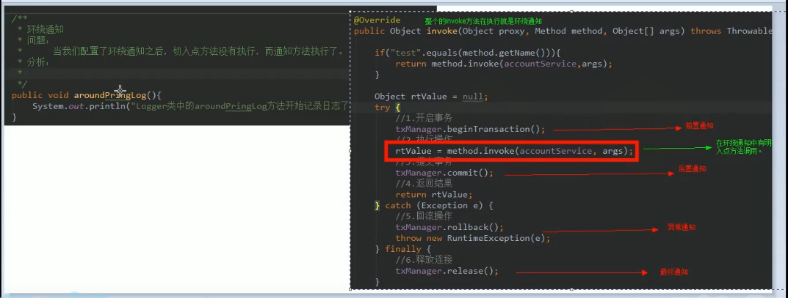

xml中的配置配法

```xml
<aop:around method="aroundPrintLog" pointcut-ref="pt1"></aop:around>
```

### 注解方式实现

bean.xml中加入

```xml
<!--配置spring容器时候要扫描的包-->
<context:component-scan base-package="com.itheima"></context:component-scan>
   <!--配置spring开启注解AOP的支持-->
    <aop:aspectj-autoproxy></aop:aspectj-autoproxy>
```

切面类中更改

```java
package com.itheima.utils;

import org.aspectj.lang.ProceedingJoinPoint;
import org.aspectj.lang.annotation.*;
import org.springframework.stereotype.Component;

/**
 * 用于记录日志的工具类, 它里面提供了公共的代码
 */
@Component("logger")
@Aspect//表示当前类是一个切面类
public class Logger {
    @Pointcut("execution(public void com.itheima.service.impl.AccountServiceImpl.saveAccount())")
    private void pt1(){}
    /**
     *前置通知
     */
    @Before("pt1()")
    public void beforePringLog(){
        System.out.println("Logger类中的beforePrintLog方法开始记录日志了....");
    }
    /**
     *后置通知
     */
    @AfterReturning("pt1()")
    public void afterReturnPringLog(){
        System.out.println("Logger类中的afterReturnPringLog方法开始记录日志了....");
    }
    /**
     *异常通知
     */
    @AfterThrowing("pt1()")
    public void afterThrowingPringLog(){
        System.out.println("Logger类中的afterThrowingPringLog方法开始记录日志了....");
    }
    /**
     *最终通知
     */
    @After("pt1()")
    public void afterPringLog(){
        System.out.println("Logger类中的afterPrintLog方法开始记录日志了....");
    }

    /**
     * 环绕通知
     * 问题:
     *      当配置了环绕通知之后, 切入点方法没有执行 ,而通知方法执行了
     * 原因: 通过对比动态代理中的环绕通知代码, 发现动态代理的环绕通知有明确的切入点方法调用,
     *          而我们的代码中没有
     * 解决: spring框架中, 为我们提供了一个接口,ProceedingJoinPoint, 该接口有一个方法proceed(),
     *          此方法相当于明确调用切入点方法
     *          该接口可以作为环绕通知的方法参数, 在程序执行中, spring框架会为我们提供该接口的实现类供我们使用
     *spring中的环绕通知
     *       他是spring框架为我们提供的一种可以在代码中手动控制增强方法合适执行的方式
     */
//    @Around("pt1()")
//    public Object aroundPrintLog(ProceedingJoinPoint pjp ){
//        Object rtValue=null;
//        try {
//            Object[] args=pjp.getArgs();// 得到方法执行所需的参数
//            System.out.println("Logger类中的arroundPrintLog方法开始记录日志了.....前置");
//           rtValue= pjp.proceed(args);//明确调用业务层方法,也叫切入点方法
//            System.out.println("Logger类中的arroundPrintLog方法开始记录日志了.....后置");
//            return rtValue;
//        } catch (Throwable throwable) {
//            System.out.println("Logger类中的arroundPrintLog方法开始记录日志了.....异常");
//            throw new RuntimeException(throwable);
//        }finally {
//            System.out.println("Logger类中的arroundPrintLog方法开始记录日志了.....最终");
//        }
//
//
//    }
}
```

会出现问题:

​	前置最终通知和后置通知的顺序颠倒了

​		**spring在基于注解的时候AOP调用会有这种问题**

解决: 使用**环绕通知**可以解决


## day04 spring中jdbcTemplate的使用

### 概述


需要导入spring-jdbc和spring-tx(事务相关)

### 作用:

​	用于和数据库交互, 实现对表的crud操作

### 如何创建:

1. 配置bean.xml

```xml
<?xml version="1.0" encoding="UTF-8"?>
<beans xmlns="http://www.springframework.org/schema/beans"
       xmlns:xsi="http://www.w3.org/2001/XMLSchema-instance"
       xsi:schemaLocation="http://www.springframework.org/schema/beans http://www.springframework.org/schema/beans/spring-beans.xsd">

    <!--配置jdbcTemplate-->
    <bean id="jdbcTemplate" class="org.springframework.jdbc.core.JdbcTemplate">
        <property name="dataSource" ref="dataSource"></property>

    </bean>
    <!--配置数据源-->
    <bean id="dataSource" class="org.springframework.jdbc.datasource.DriverManagerDataSource">
        <property name="driverClassName" value="com.mysql.jdbc.Driver"></property>
        <property name="url" value="jdbc:mysql://localhost:3306/eesy"></property>
        <property name="username" value="root"></property>
        <property name="password" value="123456"></property>
    </bean>

</beans>

```

2. 使用容器(与之前的IOC使用方法一致)

   ```java
   /**
    * jdbcTemplate的最基本用法
    */
   public class JdbcTemplateDemo3 {
       public static void main(String[] args) {
           //1. 获取容器
           ApplicationContext ac=new ClassPathXmlApplicationContext("bean.xml");
           //2. 获取对象
           JdbcTemplate jt=ac.getBean("jdbcTemplate",JdbcTemplate.class);
           //3. 执行操作
               //保存
           //jt.update("insert into account(name,money) values(?,?)", "eee",3333f);
               //更新
          // jt.update("update account set name=?, money=? where id=?","test",4567,8);
               //删除
   //        jt.update("delete from account where id=?",8);
               //查询所有
           //List<Account> accounts= jt.query("select * from account where money > ?",new AccountRowMapper(),1000);
           //或者用spring提供的beanPropertyHandler(开发中常用方式)
   //        List<Account> accounts= jt.query("select * from account where money > ?",new BeanPropertyRowMapper<Account>(Account.class),1000);
   //        for (Account account: accounts) {
   //            System.out.println(account);
   //        }
   
   
               //查询一个
   //        List<Account> accounts= jt.query("select * from account where id =??",new AccountRowMapper(),1);
   //        System.out.println(accounts.isEmpty()?"没有内容":accounts.get(0));
               //查询返回一行一列(使用聚合函数, 但是不加group by子句)
         Long count=  jt.queryForObject("select count(*) from account where money > ?",Long.class,1000f);
           System.out.println(count);
   
       }
   }
   
   /**
    * 定义Account的封装策略
    */
   class AccountRowMapper implements RowMapper<Account>{
       /**
        * 把结果集的数据封装到Account中, 然后由spring把每个Account加到集合追随
        * @param rs
        * @param rowNum
        * @return
        * @throws SQLException
        */
       @Override
       public Account mapRow(ResultSet rs, int rowNum) throws SQLException {
           Account account=new Account();
           account.setId(rs.getInt("id"));
           account.setName(rs.getString("name"));
           account.setMoney(rs.getFloat("money"));
           return account;
       }
   }
   
   ```

### 在dao中使用jdbcTemplate

1. 定义持久层接口

   ```java
   /**
    * 账户的持久层接口
    */
   public interface IAccountDao {
       /**
        * 根据id查询账户
        * @param accountId
        * @return
        */
       Account findAccountById(Integer accountId);
   
       /**
        * 根据账户名查询账户
        * @param accountName
        * @return
        */
       Account findAccountByName(String accountName);
   
       /**
        * 更新账户
        * @param account
        */
       void updateAccount(Account account);
   }
   ```

2. 定义持久层实现类

   ```java
   /**
    * 账户的持久层实现类
    */
   public class AccountDaoImpl implements IAccountDao {
       private JdbcTemplate jdbcTemplate;
   
       public void setJdbcTemplate(JdbcTemplate jdbcTemplate) {
           this.jdbcTemplate = jdbcTemplate;
       }
   
       @Override
       public Account findAccountById(Integer accountId) {
         List<Account> accounts= jdbcTemplate.query("select * from account where id=?", new BeanPropertyRowMapper<Account>(Account.class),accountId);
         return accounts.isEmpty()?null:accounts.get(0);
       }
   
       @Override
       public Account findAccountByName(String accountName) {
           List<Account> accounts= jdbcTemplate.query("select * from account where name=?", new BeanPropertyRowMapper<Account>(Account.class),accountName);
           if(accounts.isEmpty()){
               return null;
           }
           if(accounts.size()>1){
               throw new RuntimeException("结果集不唯一");
           }
           return accounts.get(0);
   
       }
   
       @Override
       public void updateAccount(Account account) {
           jdbcTemplate.update("update account set name=?, money=? where id=?",account.getName(),account.getMoney(),account.getId());
       }
   }
   ```

3. main函数使用

   ```java
   /**
    * jdbcTemplate的最基本用法
    */
   public class JdbcTemplateDemo4 {
       public static void main(String[] args) {
           //1. 获取容器
           ApplicationContext ac=new ClassPathXmlApplicationContext("bean.xml");
           //2. 获取对象
           IAccountDao accountDao=ac.getBean("accountDao",IAccountDao.class);
           Account account=accountDao.findAccountById(1);
           System.out.println(account);
           account.setMoney(10000f);
           accountDao.updateAccount(account);
   
       }
   }
   ```

### JdbcDaoSupport的使用以及Dao的两种编写方式

问题: AccountDaoImpl中还会有部分重复代码

```java
private JdbcTemplate jdbcTemplate;

public void setJdbcTemplate(JdbcTemplate jdbcTemplate) {
    this.jdbcTemplate = jdbcTemplate;
}
```

实际开发中,上面的重复代码可以用JdbcDaoSupport来抽取出来, 让真正的实现类去继承这一个类


 

```java
/**
 * 此类用于抽取Dao中的重复代码
 */
public class JdbcDaoSupport {
    private JdbcTemplate jdbcTemplate;

    public void setJdbcTemplate(JdbcTemplate jdbcTemplate) {
        this.jdbcTemplate = jdbcTemplate;
    }
    //额外提供的get方法(子类中用jdbcTemplate属性的方法)
    public JdbcTemplate getJdbcTemplate() {
        return jdbcTemplate;
    }


    //jdbcTemplate为空的时候用datasource创建JdbcTemplate
    public void setDataSource(DataSource dataSource) {
        if(jdbcTemplate==null){
            jdbcTemplate=createJdbcTemplate(dataSource);
        }
    }
private  JdbcTemplate createJdbcTemplate(DataSource dataSource){
        return new JdbcTemplate(dataSource);
}
}
```

实际上, spring已经为我们实现了以上的功能,  s**pring提供了一个JdbcDaoSupport, 不需要我们手写上面的代码**(上面的是源码实现)

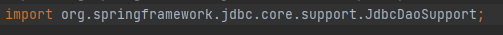

我们只需要在dao实现类中继承这个类, 然后再bean.xml中配置jdbcTemplate或者dataSource就行

```xml
<?xml version="1.0" encoding="UTF-8"?>
<beans xmlns="http://www.springframework.org/schema/beans"
       xmlns:xsi="http://www.w3.org/2001/XMLSchema-instance"
       xsi:schemaLocation="http://www.springframework.org/schema/beans http://www.springframework.org/schema/beans/spring-beans.xsd">

    <!--配置账户的持久层-->
    <bean id="accountDao" class="com.itheima.dao.impl.AccountDaoImpl">
<!--        <property name="jdbcTemplate" ref="jdbcTemplate"></property>-->
        <property name="dataSource" ref="dataSource"></property>
    </bean>


<!--    &lt;!&ndash;配置jdbcTemplate&ndash;&gt;
    <bean id="jdbcTemplate" class="org.springframework.jdbc.core.JdbcTemplate">
        <property name="dataSource" ref="dataSource"></property>

    </bean>-->
    <!--配置数据源-->
    <bean id="dataSource" class="org.springframework.jdbc.datasource.DriverManagerDataSource">
        <property name="driverClassName" value="com.mysql.jdbc.Driver"></property>
        <property name="url" value="jdbc:mysql://localhost:3306/eesy"></property>
        <property name="username" value="root"></property>
        <property name="password" value="123456"></property>
    </bean>

</beans>
```


### 基于xml的事务支持实现

1.线程绑定

```java
/**
 * 连接的工具类,它用于从数据源中获取一个连接并且实现和线程的绑定
 */
public class ConnectionUtils {
    private ThreadLocal<Connection> tl =new ThreadLocal<Connection>();
    private DataSource dataSource;

    public void setDataSource(DataSource dataSource) {
        this.dataSource = dataSource;
    }

    public ThreadLocal<Connection> getTl() {
        return tl;
    }
    /**
     * 获取当前线程上的连接
     */
    public Connection getThreadConnection()  {
        //1. 先从ThreadLocal上获取
        Connection conn=tl.get();
        //2. 判断当前线程上是否有连接
        if(conn==null){
            //3. 从数据源中获取一个连接, 并且存入ThraedLocal中
            try {
                conn=dataSource.getConnection();
                tl.set(conn);
            }
            catch (Exception e) {
                throw new RuntimeException(e);

            }
        }


        //返回当前线程上的连接
        return  conn;
    }
    //把连接和线程解绑
    public void removeConnection(){
        tl.remove();
    }
}
```

2. 事务管理工具类(织入的方法)

   ```java
   /**
    * 事务管理相关的工具类, 里面包含了 开启事务 提交事务 回滚事务 和释放连接
    */
   public class TransactionManager {
       private ConnectionUtils connectionUtils;
   
       public void setConnectionUtils(ConnectionUtils connectionUtils) {
           this.connectionUtils = connectionUtils;
       }
   
       //开启事务
       public void beginTransaction(){
           try {
               connectionUtils.getThreadConnection().setAutoCommit(false);
           } catch (Exception e) {
               e.printStackTrace();
           }
       }
       //提交事务
       public void commit(){
           try {
               connectionUtils.getThreadConnection().commit();
           } catch (Exception e) {
               e.printStackTrace();
           }
       }
       //回滚事务
       public void rollback(){
           try {
               connectionUtils.getThreadConnection().rollback();
           } catch (Exception e) {
               e.printStackTrace();
           }
       }
       //释放连接
       public void release(){
           try {
               connectionUtils.getThreadConnection().close(); //close()只是还回连接池中(线程和连接仍然还是绑定的)
               connectionUtils.removeConnection();//线程和连接解绑
           } catch (Exception e) {
               e.printStackTrace();
           }
       }
   
   }
   ```

4. 配置切面和切面表达式

   ```xml
   <?xml version="1.0" encoding="UTF-8"?>
   <beans xmlns="http://www.springframework.org/schema/beans"
          xmlns:xsi="http://www.w3.org/2001/XMLSchema-instance" xmlns:cache="http://www.springframework.org/schema/cache"
          xmlns:aop="http://www.springframework.org/schema/aop"
          xsi:schemaLocation="http://www.springframework.org/schema/beans http://www.springframework.org/schema/beans/spring-beans.xsd http://www.springframework.org/schema/cache http://www.springframework.org/schema/cache/spring-cache.xsd http://www.springframework.org/schema/aop http://www.springframework.org/schema/aop/spring-aop.xsd">
   
       <!--配置Service-->
       <bean id ="accountService" class="com.itheima.service.impl.AccountServiceImpl">
           <!--注入dao-->
           <property name="accountDao" ref="accountDao">
           </property>
   
       </bean>
       <!--配置Dao对象-->
       <bean id="accountDao" class="com.itheima.dao.impl.IAccountDaoImpl">
               <property name="runner" ref="runner"></property>
               <!--注入connectionUtils-->
               <property name="connectionUtils" ref="connectionUtils"></property>
       </bean>
   
       <!--配置QueryRunner-->
       <bean id="runner" class="org.apache.commons.dbutils.QueryRunner" scope="prototype">
           <!--注入数据源-->
           <constructor-arg name="ds" ref="dataSource"></constructor-arg>
       </bean>
   
       <!--配置数据源-->
       <bean id="dataSource" class="com.mchange.v2.c3p0.ComboPooledDataSource">
           <!--注入连接数据库的必备信息-->
           <property name="driverClass" value="com.mysql.jdbc.Driver"></property>
           <property name="jdbcUrl" value="jdbc:mysql://localhost:3306/eesy"></property>
           <property name="user" value="root"></property>
           <property name="password"   value="123456"></property>
   
       </bean>
       <!--配置connection的工具类-->
       <bean id="connectionUtils" class="com.itheima.utils.ConnectionUtils">
           <!--注入数据源-->
           <property name="dataSource" ref="dataSource"></property>
       </bean>
       <!--配置事务管理器-->
       <bean id="txManager" class="com.itheima.utils.TransactionManager">
           <!--注入connectionUtils-->
           <property name="connectionUtils" ref="connectionUtils"></property>
       </bean>
       <!--配置AOP-->
       <aop:config>
           <!--配置通用切入点表达式-->
           <aop:pointcut id="pt1" expression="execution(* com.itheima.service.impl.*.*(..))"/>
           <aop:aspect id="txAdvice" ref="txManager">
               <!--配置前置通知:开启事务-->
               <aop:before method="beginTransaction" pointcut-ref="pt1"></aop:before>
               <!--配置后置通知:提交事务-->
               <aop:after-returning method="commit" pointcut-ref="pt1"></aop:after-returning>
               <!--配置异常通知:回滚事务-->
               <aop:after-throwing method="rollback" pointcut-ref="pt1"></aop:after-throwing>
               <!--配置最终通知:释放连接-->
               <aop:after method="release" pointcut-ref="pt1"></aop:after>
           </aop:aspect>
   
       </aop:config>
   </beans>
   ```

### 基于注解的事务支持实现

其余xml的配置改注解(dao, service等),然后在织入方法类中加入注解方式配置

```java
package com.itheima.utils;

import org.aspectj.lang.annotation.*;
import org.springframework.beans.factory.annotation.Autowired;
import org.springframework.stereotype.Component;

import java.sql.Connection;
import java.sql.SQLException;

/**
 * 事务管理相关的工具类, 里面包含了 开启事务 提交事务 回滚事务 和释放连接
 */
@Component("txManager")
@Aspect
public class TransactionManager {
    @Autowired
    private ConnectionUtils connectionUtils;
    @Pointcut("execution(* com.itheima.service.impl.*.*(..))")
    private  void pt1(){};

    public void setConnectionUtils(ConnectionUtils connectionUtils) {
        this.connectionUtils = connectionUtils;
    }

    //开启事务
    @Before("pt1()")
    public void beginTransaction(){
        try {
            connectionUtils.getThreadConnection().setAutoCommit(false);
        } catch (Exception e) {
            e.printStackTrace();
        }
    }
    //提交事务
    @AfterReturning("pt1()")
    public void commit(){
        try {
            connectionUtils.getThreadConnection().commit();
        } catch (Exception e) {
            e.printStackTrace();
        }
    }
    //回滚事务
    @AfterThrowing("pt1()")
    public void rollback(){
        try {
            connectionUtils.getThreadConnection().rollback();
        } catch (Exception e) {
            e.printStackTrace();
        }
    }
    //释放连接
    @After("pt1()") //
    public void release(){
        try {
            connectionUtils.getThreadConnection().close(); //close()只是还回连接池中(线程和连接仍然还是绑定的)
            connectionUtils.removeConnection();//线程和连接解绑
        } catch (Exception e) {
            e.printStackTrace();
        }
    }

}
```

web.xml中开启注解支持和aop支持

```xml
<?xml version="1.0" encoding="UTF-8"?>
<beans xmlns="http://www.springframework.org/schema/beans"
       xmlns:xsi="http://www.w3.org/2001/XMLSchema-instance" xmlns:cache="http://www.springframework.org/schema/cache"
       xmlns:aop="http://www.springframework.org/schema/aop"
       xmlns:context="http://www.springframework.org/schema/context"
       xsi:schemaLocation="http://www.springframework.org/schema/beans http://www.springframework.org/schema/beans/spring-beans.xsd http://www.springframework.org/schema/cache http://www.springframework.org/schema/cache/spring-cache.xsd http://www.springframework.org/schema/aop http://www.springframework.org/schema/aop/spring-aop.xsd http://www.springframework.org/schema/context http://www.springframework.org/schema/context/spring-context.xsd">
    <!--配置spring创建容器的时候要扫描的包-->
    <context:component-scan base-package="com.itheima"></context:component-scan>


    <!--配置QueryRunner-->
    <bean id="runner" class="org.apache.commons.dbutils.QueryRunner" scope="prototype">
        <!--注入数据源-->
        <constructor-arg name="ds" ref="dataSource"></constructor-arg>
    </bean>

    <!--配置数据源-->
    <bean id="dataSource" class="com.mchange.v2.c3p0.ComboPooledDataSource">
        <!--注入连接数据库的必备信息-->
        <property name="driverClass" value="com.mysql.jdbc.Driver"></property>
        <property name="jdbcUrl" value="jdbc:mysql://localhost:3306/eesy"></property>
        <property name="user" value="root"></property>
        <property name="password"   value="123456"></property>

    </bean>

    <!--开启spring对注解AOP的支持-->
    <aop:aspectj-autoproxy></aop:aspectj-autoproxy>
 
</beans>
```

会有问题: 先执行最终通知, 在执行后置或者异常通知, 故会报错(先释放了连接, 导致commit无效)

如图:


解决办法:使用环绕通知

```java
/**
 * 事务管理相关的工具类, 里面包含了 开启事务 提交事务 回滚事务 和释放连接
 */
@Component("txManager")
@Aspect
public class TransactionManager {
    @Autowired
    private ConnectionUtils connectionUtils;
    @Pointcut("execution(* com.itheima.service.impl.*.*(..))")
    private  void pt1(){};

    public void setConnectionUtils(ConnectionUtils connectionUtils) {
        this.connectionUtils = connectionUtils;
    }

    //开启事务

    public void beginTransaction(){
        try {
            connectionUtils.getThreadConnection().setAutoCommit(false);
        } catch (Exception e) {
            e.printStackTrace();
        }
    }
    //提交事务

    public void commit(){
        try {
            connectionUtils.getThreadConnection().commit();
        } catch (Exception e) {
            e.printStackTrace();
        }
    }
    //回滚事务

    public void rollback(){
        try {
            connectionUtils.getThreadConnection().rollback();
        } catch (Exception e) {
            e.printStackTrace();
        }
    }
    //释放连接

    public void release(){
        try {
            connectionUtils.getThreadConnection().close(); //close()只是还回连接池中(线程和连接仍然还是绑定的)
            connectionUtils.removeConnection();//线程和连接解绑
        } catch (Exception e) {
            e.printStackTrace();
        }
    }
    @Around("pt1()")
    public Object aroundAdvice(ProceedingJoinPoint pjp){
        Object rtValue=null;
        try{
            //1. 获取参数
            Object[] args=pjp.getArgs();
            //2. 开启事务
            this.beginTransaction();
            //3. 执行方法
            rtValue= pjp.proceed(args);
            //4.提交事务
            this.commit();
            return rtValue;
        }catch (Throwable e){
            //5. 回滚事务
            this.rollback();
            throw  new RuntimeException(e);
        }finally {
            //6. 释放资源
            this.release();
        }

    }
}
```

### spring事务控制要明确的

1. javaee中事务处于 **业务层**
2. spring给我们提供了一组事务管理的接口, 在 spring-tx的包中
3. spring事务控制是基于AOP的, 可以编程实现也可配置实现, **重点是配置的方式实现**


- PlatformTransationManager接口:**spring提供的对Dao事务控制的接口**

  ​		实现类:DataSourceTransationManager

- TransationDefinition: spring提供的事务定义信息

  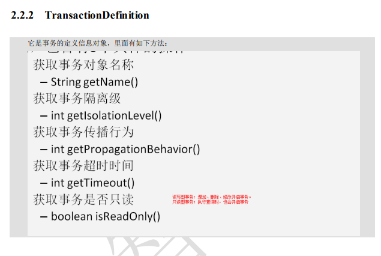

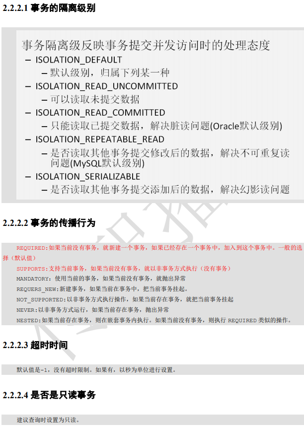

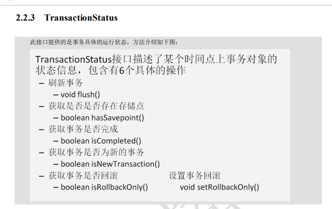


### 基于xml**的声明式事务管理**

```xml
<?xml version="1.0" encoding="UTF-8"?>
<beans xmlns="http://www.springframework.org/schema/beans"
       xmlns:xsi="http://www.w3.org/2001/XMLSchema-instance"
       xmlns:aop="http://www.springframework.org/schema/aop"
       xmlns:tx="http://www.springframework.org/schema/tx"
       xsi:schemaLocation="
        http://www.springframework.org/schema/beans
        http://www.springframework.org/schema/beans/spring-beans.xsd
        http://www.springframework.org/schema/tx
        http://www.springframework.org/schema/tx/spring-tx.xsd
        http://www.springframework.org/schema/aop
        http://www.springframework.org/schema/aop/spring-aop.xsd">
    <!--配置账户的持久层-->
    <bean id="accountDao" class="com.itheima.dao.impl.AccountDaoImpl">
        <property name="dataSource" ref="dataSource"></property>
    </bean>

    <!--配置业务层-->
    <bean id="accountService" class="com.itheima.service.Impl.AccountServiceImpl">
        <property name="accountDao" ref="accountDao"></property>
    </bean>


    <bean id="dataSource" class="org.springframework.jdbc.datasource.DriverManagerDataSource">
        <property name="driverClassName" value="com.mysql.jdbc.Driver"></property>
        <property name="url" value="jdbc:mysql://localhost:3306/eesy"></property>
        <property name="username" value="root"></property>
        <property name="password" value="123456"></property>
    </bean>
    <!--spring中基于xml声明式事务控制配置步骤
        1. 配置事务管理器
        2. 配置事务的通知
            此时需要导入事务的约束, tx的名称空间约束, 同时也需要aop的
            使用tx:advice标签配置事务通知
                属性:
                    id: 给事务通知起一个唯一标志
                    transaction-manager: 给事务通知提供一个事务管理器引用
        3. 配置aop中的通用切入点表达式
        4. 建立事务通知和切入点表达式的对应关系
        5. 配置事务的属性
                是在事务的通知标签的内部
                    isolation: 指定事务的隔离级别, 默认值是DEFAULT表示使用数据库的隔离级别
                    propagation: 用于指定事务的传播行为, 默认值是REQUIRED, 表示一定会有事务, 增删改的选择, 查询方法可以选SUPPORTS
                    read-only: 用于指定事务是否只读, 只有查询方法才能设置为true, 默认值为false, 表示读写
                    rollback-for: 用于指定一个异常,当产生该异常的时候事务回滚, 产生其他异常时事务不回滚,没有默认值,表示任何异常都回滚
                    no-rollback-for:用于指定一个异常, 长生异常时, 事务不回滚, 产生其他异常时候事务回滚,没有默认值, 表示任何异常都回滚
                    timeout:用于指定事务的超时时间,默认值为-1, 表示永不超时,如果指定了数值,以秒为单位
    -->
    <!--配置事务管理器-->
     <bean id="transactionManager" class="org.springframework.jdbc.datasource.DataSourceTransactionManager">
         <property name="dataSource" ref="dataSource"></property>
     </bean>
    <!--配置事务的通知-->

    <tx:advice id="txAdvice"  transaction-manager="transactionManager" >
        <!--配置事务的属性-->
        <tx:attributes>
            <tx:method name="transfer" propagation="REQUIRED" read-only="false"></tx:method>
            <tx:method name="find*" propagation="REQUIRED" read-only="true"></tx:method> <!--使用通配符-->
            
        </tx:attributes>
    </tx:advice>

    <!--配置aop-->
    <aop:config>
        <!--配置切入点表达式-->
        <aop:pointcut id="pt1" expression="execution(* com.itheima.service.Impl.*.*(..))"/>
        <!--建立切入点表达式和事务通知的对应关系-->
        <aop:advisor advice-ref="txAdvice" pointcut-ref="pt1"></aop:advisor>
    </aop:config>
</beans>
```

### 基于注解的声明式事务管理

```xml
<?xml version="1.0" encoding="UTF-8"?>
<beans xmlns="http://www.springframework.org/schema/beans"
       xmlns:xsi="http://www.w3.org/2001/XMLSchema-instance"
       xmlns:aop="http://www.springframework.org/schema/aop"
       xmlns:tx="http://www.springframework.org/schema/tx"
       xmlns:context="http://www.springframework.org/schema/context"
       xsi:schemaLocation="
        http://www.springframework.org/schema/beans
        http://www.springframework.org/schema/beans/spring-beans.xsd
        http://www.springframework.org/schema/tx
        http://www.springframework.org/schema/tx/spring-tx.xsd
        http://www.springframework.org/schema/aop
        http://www.springframework.org/schema/aop/spring-aop.xsd
        http://www.springframework.org/schema/context
        http://www.springframework.org/schema/context/spring-context.xsd">

<!--配置spring创建容器的时候要扫描的包-->
    <context:component-scan base-package="com.itheima"></context:component-scan>
    <!--配置jdbcTemplate-->
    <bean id="jdbcTemplate" class="org.springframework.jdbc.core.JdbcTemplate">
        <property name="dataSource" ref="dataSource"></property>
    </bean>

    <bean id="dataSource" class="org.springframework.jdbc.datasource.DriverManagerDataSource">
        <property name="driverClassName" value="com.mysql.jdbc.Driver"></property>
        <property name="url" value="jdbc:mysql://localhost:3306/eesy"></property>
        <property name="username" value="root"></property>
        <property name="password" value="123456"></property>
    </bean>

    <!--spring中基于注解的声明式事务控制配置步骤
            1. 配置事务管理器
            2. 开启spring对注解事务的支持
            3. 在需要事务支持的地方使用@Transactional注解
    -->


    <!--配置事务管理器-->
     <bean id="transactionManager" class="org.springframework.jdbc.datasource.DataSourceTransactionManager">
         <property name="dataSource" ref="dataSource"></property>
     </bean>

    <!--开启spring对注解事务的支持-->
    <tx:annotation-driven transaction-manager="transactionManager"></tx:annotation-driven>
</beans>
```

```java
/**
 * 账户的业务层实现类
 * 事务控制都是在业务层
 */
@Service("accountService")
@Transactional(propagation = Propagation.SUPPORTS,readOnly = true)//只读型事务配置,
public class AccountServiceImpl implements IAccountService {
```

基于纯注解的声明式事务控制

1. 建立SpringConfiguration.java

   ```java
   /**
    * spring的配置类, 相当于bean.xml
    */
   @Configuration
   @ComponentScan("com.itheima")
   @Import({JdbcConfig.class,TransactionConfig.class})
   @PropertySource("jdbcConfig.properties")
   @EnableTransactionManagement
   public class SpringConfiguration {
   }
   ```

2. 建立JdbcConfig.java

   ```java
   /**
    * 和连接数据库相关的数据类
    */
   public class JdbcConfig {
       @Value("${jdbc.driver}")
       private String driver;
       @Value("${jdbc.url}")
       private String url;
       @Value("${jdbc.username}")
       private String username;
       @Value("${jdbc.password}")
       private  String password;
       /**
        * 创建jdbcTemplate对象
        * @param dataSource
        * @return
        */
       @Bean(name="jdbcTemplate")
       public JdbcTemplate createJdbcTemplate(DataSource dataSource){
           return new JdbcTemplate(dataSource);
       }
   
       /**
        * 创建数据源对象
        * @return
        */
       @Bean(name="dataSource")
       public DataSource createDataSource(){
           DriverManagerDataSource ds=new DriverManagerDataSource();
           ds.setDriverClassName(driver);
           ds.setUrl(url);
           ds.setUsername(username);
           ds.setPassword(password);
           return ds;
       }
   }
   ```

3. 建立TransactionConfig.java

   ```java
   /**
    * 和事务相关的配置类
    */
   public class TransactionConfig {
       /**
        * 用于创建事务管理器对象
        * @param dataSource
        * @return
        */
       @Bean(name="transactionManager")
       public PlatformTransactionManager createTransactionManager(DataSource dataSource){
           return  new DataSourceTransactionManager(dataSource);
       }
   }
   ```

4. 建立jdbcConfiguration.properties

   

   ```properties
   jdbc.driver=com.mysql.jdbc.Driver
   jdbc.url=jdbc:mysql://localhost:3306/eesy
   jdbc.username=root
   jdbc.password=123456
   ```

### spring5的新特性

1. 必须要求1.8 才能使用spring5
2. **1.8在new 对象的时候, 和new对象并赋值,**  **反射创建对象比1.7都快超级无敌多**(百倍差距)
3. @NonNull @NotNull注解的使用, 表示可以为空的参数和返回值, 编译的时候处理空值而不是运行时抛出空指针异常

4. 日志记录提供支持
5. 核心容器, 提供自定义spring.components文件的扫描, 通过索引扫描小于200类的没明显差异, 大型项目加载组件消耗更低
6. kotlin语言的支持
7. **响应式编程风格(很火的东西**), 新的响应式堆栈WEB框架, 是非阻塞的, 使用与循环风格处理, 可进行少量线程拓展
8. Junit5的支持

9. 类库的支持