# SpringMVC

## 1. 三层架构和MVC

1. ### 表现层(SpringMVC)

   主要跟我们的浏览器(客户端交互)

   M: model 模型(**bean对象**, 封装数据)

   V: view (**jsp/html**, 显示结果)

   C: controller (**Servlet**,处理请求)

   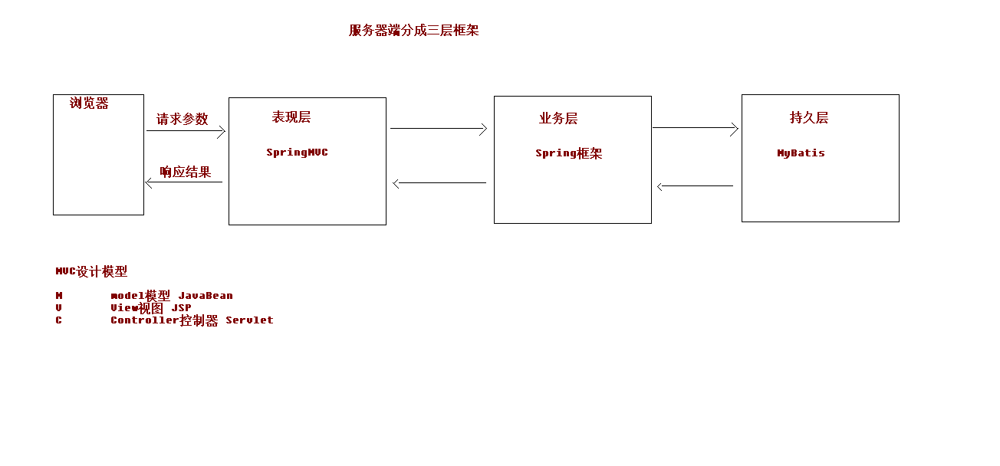

2. ### 业务层(Spring)

   

3. ### 持久层(Mybatis)

## 2. 什么是SpringMVC

基于java实现的mvc设计模型的请求驱动类型的轻量级web框架, 属于spring的后续产品, 是一个主流框架, 超越Struct2, 支持restFul编程风格

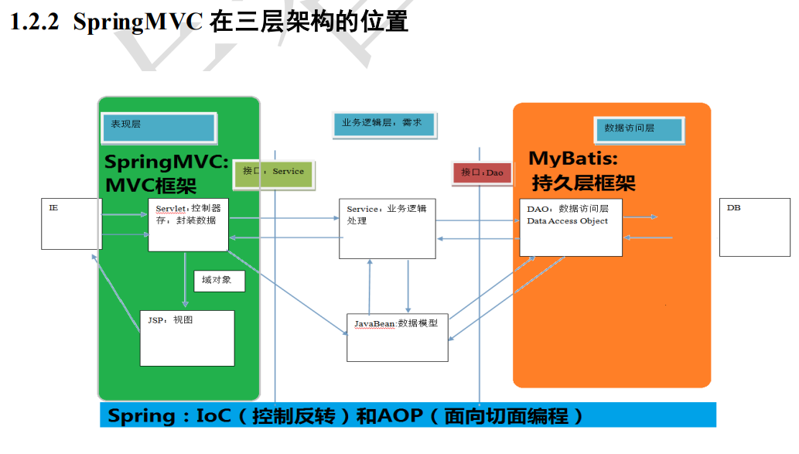


### 优势:

	1. 清晰角色划分
	2. 分工明确易拓展
	3. 命令对象就是一个POJO, 可使用命令对象直接作为业务对象
	4. 和spring其他框架无缝连接
	5. .....

### 和Strut2的优劣分析

1. **共同:**

   - 都是表现层框架,基于MVC模型设计开发的

   - 底层离不开ServerletAPI
   - 处理请求的机制都是一个核心控制器

   

2. **区别:**

   - SpringMVC入口是Servlet, Strut2是Filter

   - SpringMVC是基于方法设计的, Struts2是基于类设计的(多例的), Struts2每次执行都会创建一个动作类, 所以**SpringMVC比Struts2快一些**

   - springMVC使用更加简洁, 同时支持jsr303, 处理ajax请求更方便

     (jsr303是一套JavaBean的参数校验标准, 定义了很多常用的校验注解, 可以直接将这些注解加在javaBean上, 需要的时候就可以校验)

   - Struts2的OGNL表达式让页面开发效率比SpringMVC高一些, 但是执行效率和JSTL差不多, 


## 3. 入门程序

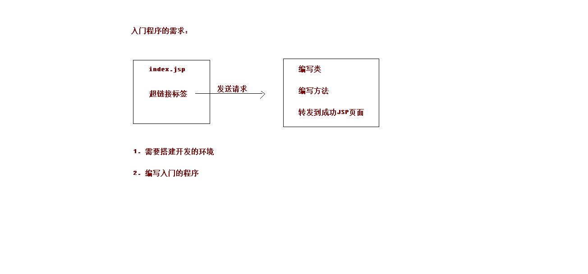

1. ### 环境搭建

   - 导入依赖坐标(pom.xml)

     ```xml
     <?xml version="1.0" encoding="UTF-8"?>
     
     <project xmlns="http://maven.apache.org/POM/4.0.0" xmlns:xsi="http://www.w3.org/2001/XMLSchema-instance"
       xsi:schemaLocation="http://maven.apache.org/POM/4.0.0 http://maven.apache.org/xsd/maven-4.0.0.xsd">
       <modelVersion>4.0.0</modelVersion>
     
       <groupId>cn.itcast</groupId>
       <artifactId>springmvc_day01_01_quickStart</artifactId>
       <version>1.0-SNAPSHOT</version>
       <packaging>war</packaging>
     
       <name>springmvc_day01_01_quickStart Maven Webapp</name>
       <!-- FIXME change it to the project's website -->
       <url>http://www.example.com</url>
     
       <properties>
         <project.build.sourceEncoding>UTF-8</project.build.sourceEncoding>
         <maven.compiler.source>1.8</maven.compiler.source>
         <maven.compiler.target>1.8</maven.compiler.target>
         <!--版本锁定-->
         <spring.version>5.0.2.RELEASE</spring.version>
       </properties>
     
       <dependencies>
         <dependency>
           <groupId>org.springframework</groupId>
           <artifactId>spring-context</artifactId>
           <version>${spring.version}</version>
         </dependency>
         <dependency>
           <groupId>org.springframework</groupId>
           <artifactId>spring-web</artifactId>
           <version>${spring.version}</version>
         </dependency>
         <dependency>
           <groupId>org.springframework</groupId>
           <artifactId>spring-webmvc</artifactId>
           <version>${spring.version}</version>
         </dependency>
         <dependency>
           <groupId>javax.servlet</groupId>
           <artifactId>servlet-api</artifactId>
           <version>2.5</version>
           <scope>provided</scope>
         </dependency>
         <dependency>
           <groupId>javax.servlet.jsp</groupId>
           <artifactId>jsp-api</artifactId>
           <version>2.0</version>
           <scope>provided</scope>
         </dependency>
       </dependencies>
     
     
       <build>
         <finalName>springmvc_day01_01_quickStart</finalName>
         <pluginManagement><!-- lock down plugins versions to avoid using Maven defaults (may be moved to parent pom) -->
           <plugins>
             <plugin>
               <artifactId>maven-clean-plugin</artifactId>
               <version>3.1.0</version>
             </plugin>
             <!-- see http://maven.apache.org/ref/current/maven-core/default-bindings.html#Plugin_bindings_for_war_packaging -->
             <plugin>
               <artifactId>maven-resources-plugin</artifactId>
               <version>3.0.2</version>
             </plugin>
             <plugin>
               <artifactId>maven-compiler-plugin</artifactId>
               <version>3.8.0</version>
             </plugin>
             <plugin>
               <artifactId>maven-surefire-plugin</artifactId>
               <version>2.22.1</version>
             </plugin>
             <plugin>
               <artifactId>maven-war-plugin</artifactId>
               <version>3.2.2</version>
             </plugin>
             <plugin>
               <artifactId>maven-install-plugin</artifactId>
               <version>2.5.2</version>
             </plugin>
             <plugin>
               <artifactId>maven-deploy-plugin</artifactId>
               <version>2.8.2</version>
             </plugin>
           </plugins>
         </pluginManagement>
       </build>
     </project>
     ```

- 配置前端控制器(web.xml)

  ```xml
  <!DOCTYPE web-app PUBLIC
   "-//Sun Microsystems, Inc.//DTD Web Application 2.3//EN"
   "http://java.sun.com/dtd/web-app_2_3.dtd" >
  
  <web-app>
    <display-name>Archetype Created Web Application</display-name>
    <!--配置前端控制器-->
    <servlet>
      <servlet-name>dispatcherServlet</servlet-name>
      <servlet-class>org.springframework.web.servlet.DispatcherServlet</servlet-class>
  
    </servlet>
    <servlet-mapping>
      <servlet-name>dispatcherServlet</servlet-name>
      <url-pattern>/</url-pattern>
    </servlet-mapping>
  </web-app>
  ```

- 配置Controller类, 加上注解, 表示要跳转到此方法内

  ```java
  /**
   * 控制器类
   */
  @Controller
  public class HelloController {
  
         @RequestMapping(path = "/hello")
          public String sayHello(){
              System.out.println("hello SpringMVC");
              //返回的字符串对应的是一个jsp的文件
              return "success";
          }
  
  }
  ```

- 建立跳转到的jsp文件(succeess.jsp)

  ```jsp
  <%@ page contentType="text/html;charset=UTF-8" language="java" %>
  <html>
  <head>
      <title>Success</title>
  </head>
  <body>
      <h3>入门成功了</h3>
  </body>
  </html>
  ```

- 配置springMVC.xml,(开启注解扫描, 配置视图解析等)

  ```xml
  <?xml version="1.0" encoding="UTF-8"?>
  <beans xmlns="http://www.springframework.org/schema/beans"
         xmlns:mvc="http://www.springframework.org/schema/mvc"
         xmlns:context="http://www.springframework.org/schema/context"
         xmlns:xsi="http://www.w3.org/2001/XMLSchema-instance"
         xsi:schemaLocation="
          http://www.springframework.org/schema/beans
          http://www.springframework.org/schema/beans/spring-beans.xsd
          http://www.springframework.org/schema/mvc
          http://www.springframework.org/schema/mvc/spring-mvc.xsd
          http://www.springframework.org/schema/context
          http://www.springframework.org/schema/context/spring-context.xsd"> 
      <!--开启注解的扫描-->
      <context:component-scan base-package="cn.itcast"></context:component-scan>
      <!--配置视图解析器: 用来根据返回值字符串跳转页面-->
      <bean id="internalResourceViewResolver" class="org.springframework.web.servlet.view.InternalResourceViewResolver">
          <!--配置文件解析跳转的位置-->
          <property name="prefix" value="/WEB-INF/pages/"></property>
          <!--文件的后缀名-->
          <property name="suffix" value=".jsp"></property>
      </bean>
  
      <!--开启springMVC框架注解-->
      <mvc:annotation-driven></mvc:annotation-driven>
  </beans>
  ```

- 配置web.xml, 指定初始化springMVC.xml

  

```xml
<!DOCTYPE web-app PUBLIC
 "-//Sun Microsystems, Inc.//DTD Web Application 2.3//EN"
 "http://java.sun.com/dtd/web-app_2_3.dtd" >

<web-app>
  <display-name>Archetype Created Web Application</display-name>
  <!--配置前端控制器-->
  <servlet>
    <servlet-name>dispatcherServlet</servlet-name>
    <servlet-class>org.springframework.web.servlet.DispatcherServlet</servlet-class>
  <init-param>
    <!--初始化加载springMVC配置文件的(不在web.xml配置就不会加载spring的配置,就不能开启注解)-->
    <param-name>contextConfigLocation</param-name>
    <param-value>classpath:springMVC.xml</param-value>
  </init-param>
    <!--启动服务器就创建-->
    <load-on-startup>1</load-on-startup>
  </servlet>
  <servlet-mapping>
    <servlet-name>dispatcherServlet</servlet-name>
    <url-pattern>/</url-pattern>
  </servlet-mapping>
</web-app>
```

- 视图(index.jsp)内href使用相对路径指定controller转发

  ```jsp
  <%@ page contentType="text/html;charset=UTF-8" language="java" %>
  <html>
  <head>
      <title>Title</title>
  </head>
  <body>
      <h3>入门程序</h3>
      <a href="/hello">入门程序</a>
  </body>
  </html>
  ```

  入门程序分析

  - 简单分析

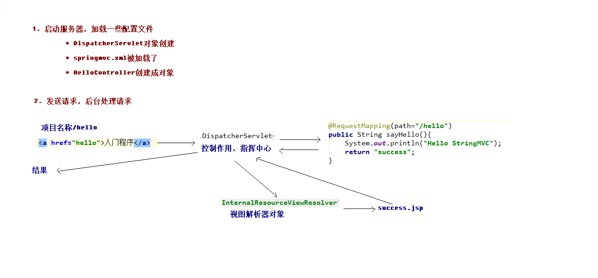

- 详细分析

  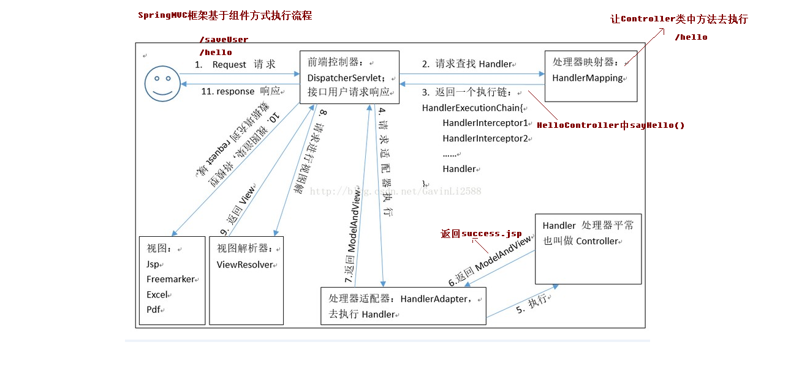

**DispatcherServlet：**

​	前端控制器 用户请求到达前端控制器，它就相当于 mvc 模式中的 c，dispatcherServlet 是整个流程控制的中心，由 它调用其它组件处理用户的请求，dispatcherServlet 的存在降低了组件之间的耦合性。

**HandlerMapping：**

​	处理器映射器 HandlerMapping 负责根据用户请求找到 Handler 即处理器，SpringMVC 提供了不同的映射器实现不同的 映射方式，例如：配置文件方式，实现接口方式，注解方式等。

**Handler：**

​	处理器 它就是我们开发中要编写的具体业务控制器。由 DispatcherServlet 把用户请求转发到 Handler。由 Handler 对具体的用户请求进行处理。

 **HandlAdapter：**

​	处理器适配器 通过 HandlerAdapter 对处理器进行执行，这是适配器模式的应用，通过扩展适配器可以对更多类型的处理 器进行执行。

​	 View Resolver：视图解析器 View Resolver 负责将处理结果生成 View 视图，View Resolver 首先根据逻辑视图名解析成物理视图名 即具体的页面地址，再生成 View 视图对象，最后对 View 进行渲染将处理结果通过页面展示给用户。

**View：**

​	视图 SpringMVC 框架提供了很多的 View 视图类型的支持，包括：jstlView、freemarkerView、pdfView 等。我们最常用的视图就是 jsp。 一般情况下需要通过页面标签或页面模版技术将模型数据通过页面展示给用户，需要由程序员根据业务需求开 发具体的页面。

**<mvc:annotation-driven>说明:**

​	在 SpringMVC 的各个组件中，处理器映射器、处理器适配器、视图解析器称为 SpringMVC 的三大组件。 使 用  自动加载 RequestMappingHandlerMapping （处理映射器） 和 RequestMappingHandlerAdapter （ 处 理 适 配 器 ） ， 可 用 在 SpringMVC.xml 配 置 文 件 中 使 用 替代注解处理器和适配器的配置。

### @requestMapping注解

**作用:** 

​	建立请求url和请求处理方法之间的对应关系

```  java
@RequestMapping(path = "/hello")
        public String sayHello(){
            System.out.println("hello SpringMVC");
            //返回的字符串对应的是一个jsp的文件
            return "success";
        } 
```


**属性:** 

- **value**与path一样, 为指定的url

- **method:**用于指定请求的方式
- **params:**用于限制请求参数的条件。它支持简单的表达式。要求请求参数的 key 和 value 必须和 配置的一模一样。 例如： params = {"accountName"}，表示请求参数必须有 accountName params = {"moeny!100"}，表示请求参数中 money 不能是 100。 headers：用于指定限制请求消息头的条件。 注意： 以上四个属性只要出现 2 个或以上时，他们的关系是与的关系。

## 请求参数的绑定

(拿到表单等传来的数据)

- 满足传来的key和方法参数名字一致就可以实现(SpringMVC自动进行绑定)
- 支持基本/bean/list集合等类型

用法: 

 1. 建立一个controller 填写参数

    ```java
    public String testParam(String username,String password){
        System.out.println("执行了...");
        System.out.println(username);
        System.out.println(password);
        return "success";
    }
    ```

2. 页面中拼接传入相应数值

   ```jsp
   <%--请求参数绑定--%>
   <a href="/param/testParam?username=hehe&password=dddd">请求参数绑定</a>
   ```

- 封装bean类型: name属性必须和javabean的属性名称有一致(springMVC通过寻找同名的属性的set方法封装)

  ```
  <form action="/param/saveAccount"  method="post"/>
      姓名:<input type="text" name="username"/><br/>
      密码:<input type="text" name="password"/><br/>
      金额:<input type="text" name="money"/><br/>
      <input type="submit" value="提交"/>
  </form>
  ```

- 添加方法中直接传入这个bean对象(bean对象的属性要一致,要有getset方法)

  ```java
  /**
   * 请求参数绑定
   * 把数据封装到javaBean的类中
   */
  @RequestMapping("/saveAccount")
  public String saveAccount(Account account){
      System.out.println("执行了...");
      System.out.println(account.toString());
      return "success";
  }
  ```

- 如果bean中还有引用类型

```java
用户姓名:<input type="text" name="user.uname"/><br/>
用户年龄:<input type="text" name="user.age"/><br/>
```


### 解决传入参数中文乱码的问题

- 使用springMVC提供的过滤器

- filter标签要放在servlet前面

  ```xml
  <!--配置解决中文乱码的过滤器-->
  <filter>
    <filter-name>characterEncodingFilter</filter-name>
    <filter-class>org.springframework.web.filter.CharacterEncodingFilter</filter-class>
    <!--初始化参数-->
    <init-param>
      <param-name>encoding</param-name>
      <param-value>UTF-8</param-value>
    </init-param>
  </filter>
  <filter-mapping>
    <filter-name>characterEncodingFilter</filter-name>
    <url-pattern>/*</url-pattern>
  </filter-mapping>
  ```

- **集合类型的参数绑定**

  

```jsp
<%--请求参数绑定(封装到Account中, 类中存在集合类型)--%>
<a href="/param/testParam?username=hehe&password=dddd">请求参数绑定</a>
    <form action="/param/saveAccount"  method="post"/>
        姓名:<input type="text" name="username"/><br/>
        密码:<input type="text" name="password"/><br/>
        金额:<input type="text" name="money"/><br/>

        用户姓名:<input type="text" name="list[0].uname"/><br/>
        用户年龄:<input type="text" name="list[0].age"/><br/>

        用户姓名:<input type="text" name="map['one'].uname"/><br/>
        用户年龄:<input type="text" name="map['one'].age"/><br/>
        <input type="submit" value="提交"/>
    </form>
```

- **特殊情况-- 自定义类型转换器**

  前置知识:　用户传来的所有数据，都是以字符串类型的，ＭＶＣ内部会进行字符串转换

  类似date, 默认转换格式是2020/12/05,如果输入2020-12-05则会出现400-bad request

  

- 方法: 使用convert接口
  1. 写转换类

```java
/**
 * 把字符串转换成日期
 */
public class StringToDateConverter implements Converter<String,Date> {

    /**
     *
     * @param s  传入的字符串
     * @return
     */
    @Override
    public Date convert(String s) {
        //判断
        if(s==null){
            throw  new RuntimeException("请你传入参数");
        }
        DateFormat df= new SimpleDateFormat("yyyy-MM-dd");
        //把字符串转日期
        try {
           return df.parse(s);
        } catch (ParseException e) {
            throw  new RuntimeException("数据类型转换出现错误");
        }

    }
}
```

2. 在springmvc.xml中添加

   ```xml
   <!--配置自定义类型转换器-->
   <bean id="conversionService" class="org.springframework.context.support.ConversionServiceFactoryBean">
       <property name="converters">
           <set>
               <bean class="cn.itcast.utils.StringToDateConverter"></bean>
           </set>
       </property>
   </bean>
   ```

```xml
<!--开启springMVC框架注解-->
<mvc:annotation-driven conversion-service=""></mvc:annotation-driven>
```

### 获取原生servlet API

```java
/**
 *
 * 原生api获取
 * @return
 */
@RequestMapping("/testServlet")
public String testServlet(HttpServletRequest request, HttpServletResponse response){
    System.out.println("执行了...");
    System.out.println(request);
   HttpSession session= request.getSession();
    System.out.println(session);
    ServletContext servletContext= session.getServletContext();
    System.out.println(response);
    return "success";
}
```

## 4. 常用注解

### RequestParam

作用:　把请求中指定名称的参数给控制器中的形参赋值(解决页面中传入参数和controller中的方法传入参数不一致的问题)

属性：value:请求参数中的名称

​			required: 请求参数中是否必须提供此参数, 默认值为true, 表示必须提供, 不提供则报错

```java
/**
 * 常用注解
 */
@Controller
@RequestMapping("/anno")
public class AnnoController {
    @RequestMapping("testRequestParam")
    public String testRequestParam(@RequestParam(name="name") String username){
        System.out.println("执行了");
        System.out.println(username);
        return "success";
    }
}
```

### RequestBody

**作用:** 用于获取请求体内容,直接使用得到key=value&key=value的结构数据, get方法不适用

**属性:** required: 是否必须有请求体, 默认值是true(取值是true时候, get方法报错, 取值为false, get请求得到的是null)

```java
/**
 * 获取到请求体内容
 * @param
 * @return
 */
@RequestMapping("testRequestBody")
public String testRequestBody(@RequestBody String body){
    System.out.println("执行了");
    System.out.println(body);
    return "success";
}
```

### PathVaribale

**作用**： 用于绑定 url 中的占位符。例如：请求 url 中 /delete/{id}，这个{id}就是 url 占位符。 url 支持占位符是 spring3.0 之后加入的。是 springmvc 支持 rest 风格 URL 的一个重要标志。 

**属性：** value：用于指定 url 中占位符名称。 required：是否必须提供占位符。

```java
@RequestMapping("testPathVariable/{sid}")
public String testPathVariable(@PathVariable(name = "sid") String id){
    System.out.println("执行了");
    System.out.println(id);
    return "success";
}
```

```jsp
<form action="/anno/testPathVariable/10"  method="post"/>
    用户姓名:<input type="text" name="username"/><br/>
    用户年龄:<input type="text" name="age"/><br/>
    <input type="submit" value="提交"/>
</form>
```

### RestFul风格

**什么是 rest**： REST（英文：Representational State Transfer，简称 REST）描述了一个架构样式的网络系统， 比如 web 应用程序。它首次出现在 2000 年 Roy Fielding 的博士论文中，他是 HTTP 规范的主要编写者之 一。在目前主流的三种 Web 服务交互方案中，REST 相比于 SOAP（Simple Object Access protocol，简单 对象访问协议）以及 XML-RPC 更加简单明了，无论是对 URL 的处理还是对 Payload 的编码，REST 都倾向于用更 加简单轻量的方法设计和实现。值得注意的是 REST 并没有一个明确的标准，而更像是一种设计的风格。

 它本身并没有什么实用性，其核心价值在于如何设计出符合 REST 风格的网络接口。

 **restful 的优点** 它结构清晰、符合标准、易于理解、扩展方便，所以正得到越来越多网站的采用。

 **restful 的特性：** 

​	**资源（Resources）**：网络上的一个实体，或者说是网络上的一个具体信息。 它可以是一段文本、一张图片、一首歌曲、一种服务，总之就是一个具体的存在。可以用一个 URI（统一 资源定位符）指向它，每种资源对应一个特定的 URI 。要 获取这个资源，访问它的 URI 就可以，因此 URI 即为每一个资源的独一无二的识别符。

​	 **表现层（Representation）**：把资源具体呈现出来的形式，叫做它的表现层 （Representation）。 比如，文本可以用 txt 格式表现，也可以用 HTML 格式、XML 格式、JSON 格式表现，甚至可以采用二 进制格式。 

​	**状态转化（State Transfer）：**每 发出一个请求，就代表了客户端和服务器的一次交互过程。 HTTP 协议，是一个无状态协议，即所有的状态都保存在服务器端。因此，如果客户端想要操作服务器， 必须通过某种手段，让服务器端发生“状态转化”（State Transfer）。而这种转化是建立在表现层之上的，所以 就是 “表现层状态转化”。具体说，就是 HTTP 协议里面，四个表示操作方式的动词：GET 、POST 、PUT、 DELETE。它们分别对应四种基本操作：GET 用来获取资源，POST 用来新建资源，PUT 用来更新资源，DELETE 用来 删除资源。

​	 **restful 的示例：** /account/1 HTTP GET ： 得到 id = 1 的 account

​								 /account/1 HTTP DELETE： 删除 id = 1 的 account  

​								/account/1 HTTP PUT： 更新 id = 1 的 account

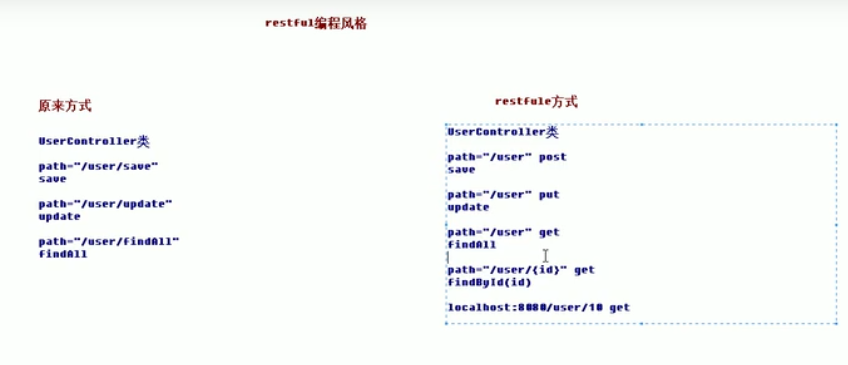

### RequestHeader

作用: 获取请求头信息

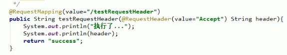

### CookeValue

作用: 用于获得指定名称的cookie的值

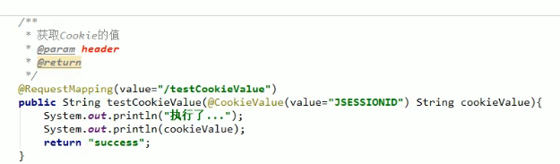

### ModelAttribute

 **作用：** 该注解是 SpringMVC4.3 版本以后新加入的。它可以用于修饰方法和参数。 出现在方法上，表示当前方法会在**控制器的方法执行之前，先执行**。它可以修饰没有返回值的方法，也可 以修饰有具体返回值的方法。 出现在参数上，获取指定的数据给参数赋值。

 **属性：** value：用于获取数据的 key。key 可以是 POJO 的属性名称，也可以是 map 结构的 key。 应用场景： 当表单提交数据不是完整的实体类数据时，保证没有提交数据的字段使用数据库对象原来的数据。

 **例如：** 我们在编辑一个用户时，用户有一个创建信息字段，该字段的值是不允许被修改的。在提交表单数 据是肯定没有此字段的内容，一旦更新会把该字段内容置为 null，此时就可以使用此注解解决问题。

1. 有返回值的情况

```java
/**
 *
 * @return
 */
@RequestMapping("testModelAttribute")
public String testModelAttribute(User user){
    System.out.println("执行了");
    System.out.println(user);
    return "success";
}

/**
 * 该方法会先执行
 *
 */
@ModelAttribute
public User showUser(String uname){
    System.out.println("showUser执行了");
    //通过用户名查数据库(模拟)
    User user=new User();
    user.setUname(uname);
    user.setAge(20);
    user.setDate(new Date());
    return user;
}
```

```jsp
<form action="/anno/testModelAttribute"  method="post"/>
用户姓名:<input type="text" name="uname"/><br/>
用户年龄:<input type="text" name="age"/><br/>
<input type="submit" value="提交"/>
</form>
```

2. 无返回值的情况

   ```java
   /**
    *
    * @return
    */
   @RequestMapping("testModelAttribute")
   public String testModelAttribute(@ModelAttribute("abc") User user){
       System.out.println("执行了");
       System.out.println(user);
       return "success";
   }
   /**
    * 该方法会先执行
    *
    */
   @ModelAttribute
   public void showUser(String uname, Map<String,User> map){
       System.out.println("showUser执行了");
       //通过用户名查数据库(模拟)
       User user=new User();
       user.setUname(uname);
       user.setAge(20);
       user.setDate(new Date());
       map.put("abc",user);
   }
   ```

### SessionAttribute

作用:用于多次执行控制器方法间的参数共享

属性：value:用于指定存入的属性迷宫

​			type:用于指定存入的数据类型

1. 存入到mvc提供的Model中(会存到request域中)

```java
/**
 * testSessionAttributes
 * @return
 */
@RequestMapping("testSessionAttributes")
public String testSessionAttributes(Model model){
    System.out.println("testSessionAttributes执行了");
    //底层会存到request域中
    model.addAttribute("msg", "美美");
    return "success";
}
```

2. 在类前面加注解, 会存一份到Session对象中

```
@SessionAttributes(value = "msg")
```

3. 在session中取值

```
@RequestMapping("getSessionAttributes")
public String getSessionAttributes(ModelMap modelMap){
    System.out.println("getSessionAttributes执行了");
  String msg=(String) modelMap.get("msg");
    System.out.println(msg);
    return "success";
}
```

4. 删除session中的值

   

```java
/**
 * 在session中删除值
 */
@RequestMapping("deleteSessionAttributes")
public String deleteSessionAttributes(SessionStatus status){
    System.out.println("deleteSessionAttributes执行了");
    status.setComplete();//清除session中的

    return "success";
}
```

## 5.响应数据和结果视图

### 1. 返回字符串

```java
@RequestMapping("testString")
public String testString(Model model){
    System.out.println("这个方法执行了...");
    //模拟从数据库中查询出来User对象
    User user =new User();
    user.setUsername("meimei");
    user.setPassword("123");
    user.setAge(20);
    // model对象(存入model对象就会存在request域中)
    model.addAttribute("user",user);
    return "success";
}
```

### 2.返回值为void

- 默认返回与方法名同名的一个jsp页面

  ```java
  /**
   * 返回值类型是void
   * 请求转发是一次请求
   * 不用编写项目的名称
   * 重定向是两次请求
   * @param
   * @return
   */
  @RequestMapping("testVoid")
  public void testVoid(HttpServletRequest request, HttpServletResponse response) throws ServletException, IOException {
      System.out.println("testVoid这个方法执行了...");
      //编写请求转发的程序
     // request.getRequestDispatcher("/WEB-INF/pages/success.jsp").forward(request,response);
     // response.sendRedirect(request.getContextPath()+"/index.jsp");
      //设置中文乱码
      response.setCharacterEncoding("utf-8");
      response.setContentType("text/html;charset=utf-8");
      //直接进行响应
      response.getWriter().print("你好");
      return;
  }
  ```

### 3. 响应值是ModelAndView对象

```java
/**
 * 返回值类型是ModelAndView
 * @param
 * @return
 */
@RequestMapping("testModelAndView")
public ModelAndView testModelAndView(){
    //创建一个ModelAndView对象
    ModelAndView mv=new ModelAndView();
    System.out.println("testModelAndView这个方法执行了...");
    //模拟从数据库中查询出来User对象
    User user =new User();
    user.setUsername("xiao feng");
    user.setPassword("4dfs1");
    user.setAge(20);
    //把user对象存储到mv对象, 底层也会存储到request对象中
    mv.addObject("user", user);
    //跳转到哪个页面
    mv.setViewName("success");
    return mv;
}
```

### 4. 转发和重定向

```java
    /**
     * 使用的是关键字的方式来进行转发和重定向
     * @return
     */
    @RequestMapping("testForwardOrRedirect")
    public String testForwardOrRedirect(){
        System.out.println("testForwardOrRedirect这个方法执行了...");
        //请求的转发
//        return "forward:/WEB-INF/pages/success.jsp";
        return "redirect:index.jsp"; //不用写项目名, 底层已经帮你把项目名加上了
    }
```

### 5. ResponseBody响应json数据

- 异步环境

  1. 导入jquery

  ```jsp
  <script src="js/jquery.min.js"></script>
  ```

2. 编写btn和绑定btn事件

```jsp
<head>
    <title>Title</title>
    <script src="js/jquery.min.js" type="text/javascript"></script>
    <script>
        //页面加载, 绑定点击事件
        $(function () {
            $("#btn").click(function () {
                alert("hello btn");
            })
        })
    </script>
</head>
<body>
    <a href="user/testString">testString</a>
<a href="/user/testVoid">testVoid</a>
    <a href="/user/testModelAndView">testModelAndView</a>
<br>
<a href="user/testForwardOrRedirect">testForwardOrRedirect</a>
<br/>
<button id="btn">发送ajax请求</button>
```

3. 此时还不能访问, web.xml配置的前端控制器会把资源拦截,需要配置放行静态资源(在springMVC.xml中配置)

   

   ```xml
       <!--配置前端控制器放行静态资源-->
       <mvc:resources mapping="/js/**" location="/js/"></mvc:resources>
       <mvc:resources mapping="/images/**" location="/images/"></mvc:resources>
       <mvc:resources mapping="/css/**" location="/css/"></mvc:resources>
   ```

4. 正式发起ajax请求

   ```jsp
       <script>
           //页面加载, 绑定点击事件
           $(function () {
               $("#btn").click(function () {
                   alert("hello btn");
                   //发送ajax请求
                   $.ajax({
                       //编写json格式,设置属性和值
                       url:"user/testAjax",
                       contentType:"application/json;charset=UTF_8",
                       data:'{"username":"hehe","password":"113","age":"12"}',
                       dataType:"json",
                       type:"post",
                       success:function (data) {
                           //data指得是服务器端响应出来的json数据, 进行解析
   
                       }
                   })
   
               })
           })
       </script>
   ```

5. 服务器通过requestbody注解获取请求体内容

   

```jsp
/**
 * 获取ajax请求发送出来的请求体
 * @return
 */
@RequestMapping("testAjax")
public void testAjax(@RequestBody String body){
    System.out.println("testAjaxt这个方法执行了...");
    System.out.println(body);
}
```

6. 封装到bean对象中(只要key值相对应, 就可以自动封装,但是要引入相应jar包)

```xml
<dependency>
  <groupId>com.fasterxml.jackson.core</groupId>
  <artifactId>jackson-databind</artifactId>
  <version>2.8.0</version>
</dependency>
<dependency>
  <groupId>com.fasterxml.jackson.core</groupId>
  <artifactId>jackson-core</artifactId>
  <version>2.8.0</version>
</dependency>
<dependency>
  <groupId>com.fasterxml.jackson.core</groupId>
  <artifactId>jackson-annotations</artifactId>
  <version>2.8.0</version>
</dependency>
```

7. 后端编写代码响应前端的json数据

   ```java
   /**
    * 获取ajax请求发送出来的请求体
    * @return
    */
   @RequestMapping("testAjax")
   public @ResponseBody
   User testAjax(@RequestBody User user){
       System.out.println("testAjaxt这个方法执行了...");
       //客户端发送ajax请求, 传的是json字符串, 后端把json字符串封装到user对象中
       System.out.println(user);
        //模拟查询数据库
       user.setUsername("haha");
       user.setAge(40);
       user.setPassword("fsfs740");
       //做响应(@ResponseBody, mvc自动帮你把user对象转成json字符串传回给客户端)
       return user;
   }
   ```

8. 前端获取服务器响应的json数据

   ```jsp
   <script>
       //页面加载, 绑定点击事件
       $(function () {
           $("#btn").click(function () {
               alert("hello btn");
               //发送ajax请求
               $.ajax({
                   //编写json格式,设置属性和值
                   url:"user/testAjax",
                   contentType:"application/json;charset=UTF_8",
                   data:'{"username":"hehe","password":"113","age":"12"}',
                   dataType:"json",
                   type:"post",
                   success:function (data) {
                       //data指得是服务器端响应出来的json数据, 进行解析
                       alert(data);
                       alert(data.username);
                       alert(data.password);
                       alert(data.age);
                   }
               })
   
           })
       })
   </script>
   ```

## 6.springMVC的文件上传

### 1. 前提

- form的enctype取值必须是: multipart/form-data

- method属性必须是post

- 选择一个文件选择与<input type="file"/>

  

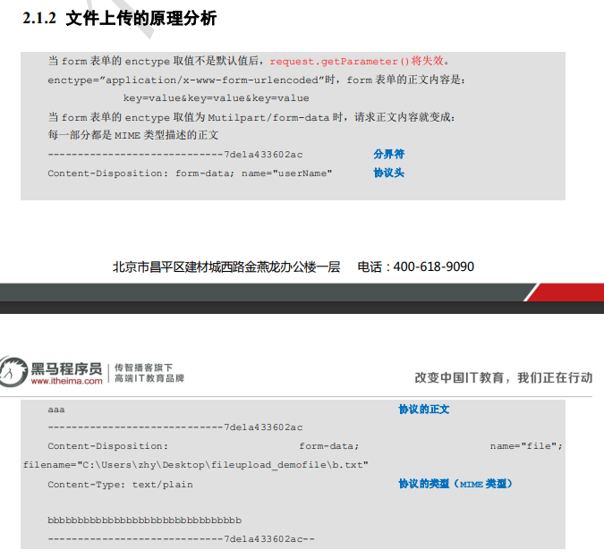

### 2.  commons-fileupload组件可实现文件上传解析功能

- **传统方式**

  1. 导入坐标

     ```xml
     <dependency>
       <groupId>commons-fileupload</groupId>
       <artifactId>commons-fileupload</artifactId>
       <version>1.3.1</version>
     </dependency>
     <dependency>
       <groupId>commons-io</groupId>
       <artifactId>commons-io</artifactId>
       <version>2.4</version>
     </dependency>
     ```

  2. 编写表单

     ```jsp
     <form   action="/user/fileUplaod1" method="post" enctype="multipart/form-data" >
         选择文件:<input type="file" name="upload" /><br>
         <input type="submit" value="上传"/>
     </form>
     ```

  3. 编写控制器

     ```java
     @Controller
     @RequestMapping("user")
     public class UserController {
         /**
          * 文件上传
          * @return
          */
         @RequestMapping("fileUplaod1")
         public String fileUpload1(HttpServletRequest request) throws Exception {
             System.out.println("文件上传");
             //使用fileupload组件帮助我们完成文件上传
             //上传的位置
     
              String  path=  request.getSession().getServletContext().getRealPath("/uploads/");
             //判断该路径是否存在
             File file=new File(path);
             if(!file.exists()){
                 //创建该文件夹
                 file.mkdirs();
             }
             //解析request对象,获取上传文件项
             DiskFileItemFactory factory=new DiskFileItemFactory();
             ServletFileUpload upload=new ServletFileUpload(factory);
             //解析request
             List<FileItem> items= upload.parseRequest(request);
             //遍历
             for (FileItem item:items){
                 // 进行判断,当前item对象是否是上传文件的项
                 if(item.isFormField()){
                     //说明是普通表单项
                 }else {
                     //说明是上传文件项目
                     //获取上传文件的名称
                     String filename=item.getName();
                     //把文件名称设置成唯一值
                     String uuid= UUID.randomUUID().toString().replace("-","");
                     filename=uuid+"_"+filename;
                     //完成文件上传
                     item.write(new File(path,filename));
                     //删除临时文件
                     item.delete();
                 }
             }
             return "success";
         }
     
     }
     ```

- SpringMVC文件上传方式

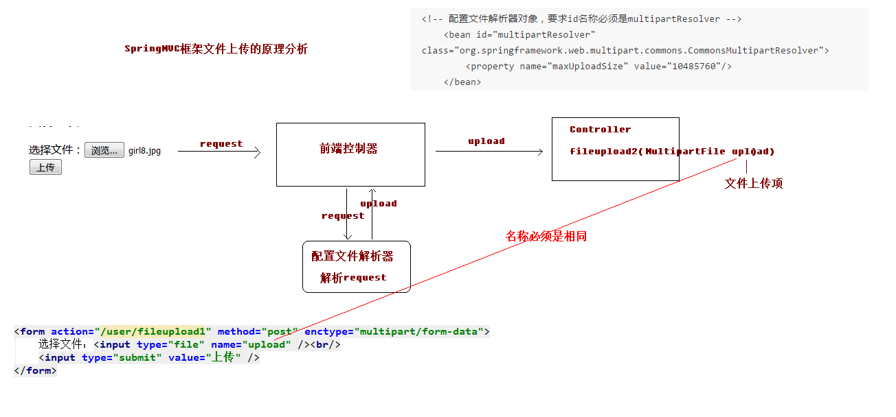

```jsp
<h3>springMVC文件上传</h3>
<form action="/user/fileUplaod2" method="post" enctype="multipart/form-data">
    选择文件:<input type="file" name="upload"/><br/>
    <input type="submit" value="上传">
</form>
```

2. controller代码编写

   ```java
   @Controller
   @RequestMapping("user")
   public class UserController {
       /**
        * SpringMVC方式文件上传
        * @return
        */
       @RequestMapping("fileUplaod2")
       public String fileUpload2(HttpServletRequest request, MultipartFile upload) throws Exception {
           System.out.println("springMVC文件上传");
           //使用fileupload组件帮助我们完成文件上传
           //上传的位置
   
            String  path=  request.getSession().getServletContext().getRealPath("/uploads/");
           //判断该路径是否存在
           File file=new File(path);
           if(!file.exists()){
               //创建该文件夹
               file.mkdirs();
           }
           //获取上传文件的名称
            String filename=  upload.getOriginalFilename();
           String uuid=UUID.randomUUID().toString().replace("-","");
           filename=uuid+"_"+filename;
                   //完成文件上传
                   upload.transferTo(new File(path,filename));
   
           return "success";
       }
   
   }
   ```

- **spring跨服务器文件上传**

  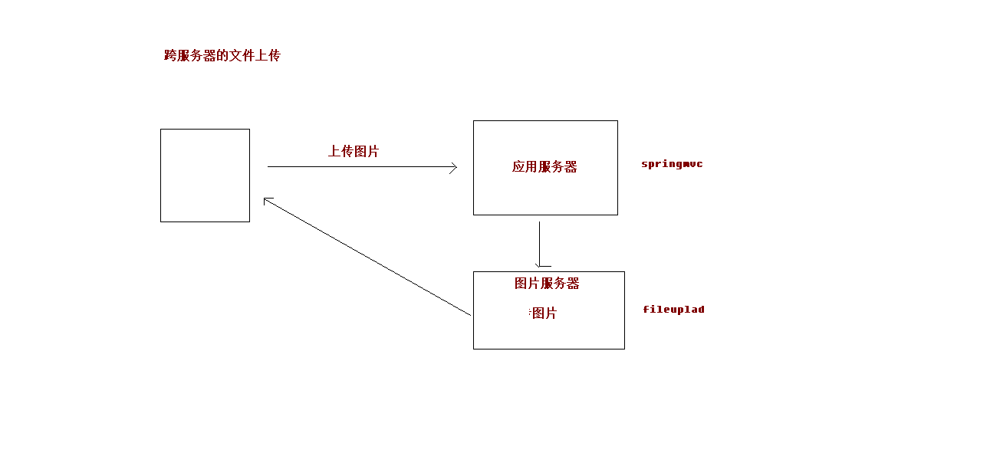

1. 创建新服务器等步骤略..

2. 处理请求的服务器导入jar

   ```xml
   <dependency>
     <groupId>com.sun.jersey</groupId>
     <artifactId>jersey-client</artifactId>
     <version>1.18.1</version>
   </dependency>
   ```

3. 编写上传表单

   ```jsp
   <h3>springMVC跨服务器文件上传</h3>
   <form action="/user/fileUplaod3" method="post" enctype="multipart/form-data">
       选择文件:<input type="file" name="upload"/><br/>
       <input type="submit" value="上传">
   </form>
   ```

4. 编写controller代码

   

```java
@Controller
@RequestMapping("user")
public class UserController {
    /**
     * SpringMVC跨服务器方式文件上传
     * @return
     */
    @RequestMapping("fileUplaod3")
    public String fileUpload3( MultipartFile upload) throws Exception {
        System.out.println("springMVC跨服务器文件上传");
        //定义上传服务器的路径
        String path="https://localhost:9090/uploads/";
        //获取上传文件的名称
         String filename=  upload.getOriginalFilename();
        String uuid=UUID.randomUUID().toString().replace("-","");
        filename=uuid+"_"+filename;
                //跨服务器文件上传
        //创建客户端对象
        Client  client=Client.create();
        //和服务器进行连接
       WebResource webResource= client.resource(path+filename);
        //上传文件
        webResource.put(upload.getBytes());

        return "success";
    }

}
```

## 7.SpringMVC的异常处理

### 1. 思路

1. controller调用service,service调用dao, 异常向上抛出, 最终由DispatcherServlet找到异常处理器进行异常的处理

   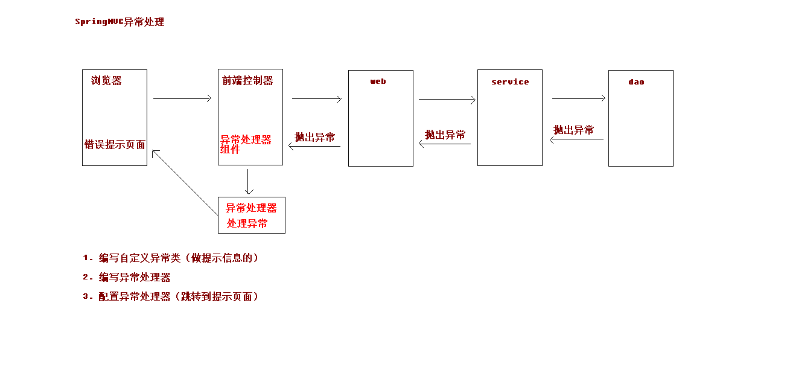

   ### 2. 编写异常代码(做提示信息的)

   ```java
   /**
    * 自定义的一个异常类
    */
   public class SysException extends  Exception{
       //存储提示信息的
       private  String message;
   
       public String getMessage() {
           return message;
       }
   
       public void setMessage(String message) {
           this.message = message;
       }
   
       public SysException(String message) {
           this.message = message;
       }
   }
   
   ```

   - controller中的改造

     ```java
     @Controller
     @RequestMapping("user")
     public class UserController {
         @RequestMapping("testException")
         public String testException() throws SysException {
             System.out.println("testException执行了");
             try {
                 //模拟异常
                 int a=10/0;
             } catch (Exception e) {
                 //控制台打印异常信息
                 e.printStackTrace();
                 //抛出自定义异常信息
                 throw new SysException("查询所有的用户出现了错误");
             }
             return "success";
         }
     
     }
     ```

   ### 3. 编写异常处理器

   ```java
   public class SysExceptionResolver implements HandlerExceptionResolver {
       /**
        * contrller 抛到前端控制器, 此处会捕获到异常, 然后可以进行处理
        * @param httpServletRequest
        * @param httpServletResponse
        * @param o
        * @param e
        * @return
        */
       @Override
       public ModelAndView resolveException(HttpServletRequest httpServletRequest, HttpServletResponse httpServletResponse, Object o, Exception e) {
           //获取到异常对象
           SysException sysException=null;
           if(sysException instanceof SysException){
               sysException=(SysException) e;
           }else  {
               sysException=new SysException("系统正在维护....");
           }
           //创建ModelAndView对象
           ModelAndView modelAndView=new ModelAndView();
           modelAndView.addObject("errorMsg",e.getMessage());
           modelAndView.setViewName("error");
           return modelAndView;
       }
   }
   ```

   ### 4. 配置异常处理器(跳转到友好页面)

   异常页面error.jsp

```jsp
<%@ page contentType="text/html;charset=UTF-8" language="java" isELIgnored="false" %>
<html>
<head>
    <title>Title</title>
</head>
<body>
    <h3>出错了哦兄弟</h3>
    ${errorMsg}
</body>
</html>
```

## 8.SpringMVC中的拦截器

### 1. 作用: 类似于Filter

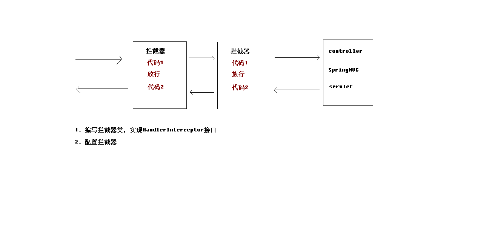

### 2. 拦截器和过滤器的区别

- 过滤器是servlet规范中一部分,任何java web工程能使用
- 拦截器是springMVC自己的, 只有用了springmvc框架才能ys
- 过滤器在url-pattrn中配置了/*, 可以对所有要访问的资源拦截
- **拦截器指挥拦截访问的控制器方法, 如果访问jsp, html,css,image或者js是不会进行拦截的**

### 3. 编写拦截器类(实现HandlerInterceptor接口)

```java
/**
 * 自定义拦截器(接口帮你实现了默认的方法)
 */
public class MyInterceptor1  implements HandlerInterceptor {
    /**
     * 自定义预处理方法, controller方法执行前执行
     * return true则放行, 执行下一个拦截器,如果没有, 则执行controller中的方法
     * return false不放行
     * @param request
     * @param response
     * @param handler
     * @return
     * @throws Exception
     */
    @Override
    public boolean preHandle(HttpServletRequest request, HttpServletResponse response, Object handler) throws Exception {
        System.out.println("MyInterceptor执行了");
        return false;
    }
}
```

### 4. 配置拦截器类

```xml
<!--配置拦截器-->
<mvc:interceptors>
    <mvc:interceptor>
        <!--你要拦截的具体方法-->
        <mvc:mapping path="/user/*"/>
        <!--你不要拦截的那个方法-->
    <!--    <mvc:exclude-mapping path=""/>-->

        <!--配置拦截器对象-->
        <bean class="cn.itcast.interceptor.MyInterceptor1"></bean>
    </mvc:interceptor>
</mvc:interceptors>
```

### 5. 拦截器接口中的三个方法

```java
/**
 * 自定义预处理方法, controller方法执行前执行
 * return true则放行, 执行下一个拦截器,如果没有, 则执行controller中的方法
 * return false不放行
 * @param request
 * @param response
 * @param handler
 * @return
 * @throws Exception
 */
@Override
public boolean preHandle(HttpServletRequest request, HttpServletResponse response, Object handler) throws Exception {
    System.out.println("MyInterceptor执行了");
    request.getRequestDispatcher("/WEB-INF/pages/error.jsp").forward(request,response);
    return false;
}
```

```java
/**
 * 后处理方法,controller方法执行后,success.jsp执行之前
 * @param request
 * @param response
 * @param handler
 * @param modelAndView
 * @throws Exception
 */
@Override
public void postHandle(HttpServletRequest request, HttpServletResponse response, Object handler, ModelAndView modelAndView) throws Exception {
    System.out.println("MyInterceptor执行了...后");
}
```

```java
/**
 * success.jsp执行后, 该方法会执行(这才是最后执行的方法)
 * @param request
 * @param response
 * @param handler
 * @param ex
 * @throws Exception
 */
@Override
public void afterCompletion(HttpServletRequest request, HttpServletResponse response, Object handler, Exception ex) throws Exception {
    System.out.println("最后执行");
}
```

### 6. 整两个拦截器(拦截器顺序按照配置的顺序执行,  代码走的顺序看图)

```xml
<!--配置拦截器-->
<mvc:interceptors>
    <mvc:interceptor>
        <!--你要拦截的具体方法-->
        <mvc:mapping path="/user/*"/>
        <!--你不要拦截的那个方法-->
    <!--    <mvc:exclude-mapping path=""/>-->

        <!--配置拦截器对象-->
        <bean class="cn.itcast.interceptor.MyInterceptor1"></bean>
    </mvc:interceptor>
    <!--配置第二个拦截器-->
    <mvc:interceptor>
        <!--你要拦截的具体方法-->
        <mvc:mapping path="/user/*"/>
        <!--你不要拦截的那个方法-->
        <!--    <mvc:exclude-mapping path=""/>-->

        <!--配置拦截器对象-->
        <bean class="cn.itcast.interceptor.MyInterceptor2"></bean>
    </mvc:interceptor>
```