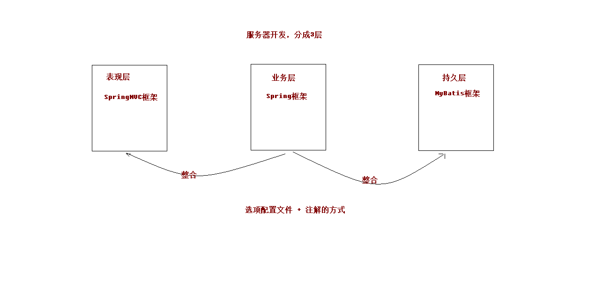
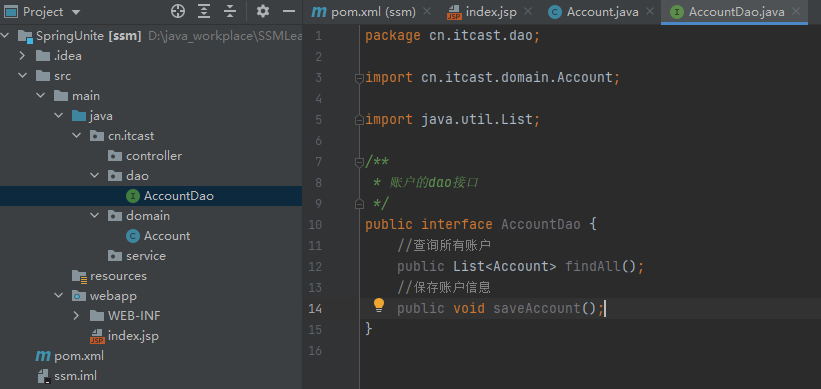
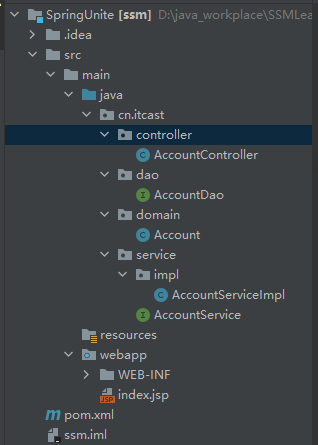
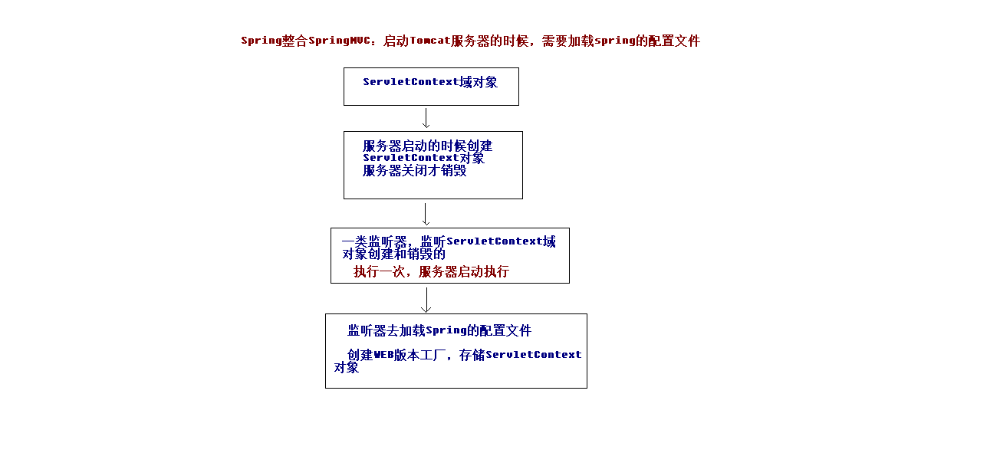

# Spring整合



## 1. 环境搭建

### 1. 建立数据库

```sql
create database ssm;
use ssm;
create table account(
id int primary key auto_increment,
name varchar(20),
money double
);
```

### 2. pom.xml坐标

```xml
<?xml version="1.0" encoding="UTF-8"?>

<project xmlns="http://maven.apache.org/POM/4.0.0" xmlns:xsi="http://www.w3.org/2001/XMLSchema-instance"
  xsi:schemaLocation="http://maven.apache.org/POM/4.0.0 http://maven.apache.org/xsd/maven-4.0.0.xsd">
  <modelVersion>4.0.0</modelVersion>

  <groupId>cn.itcast</groupId>
  <artifactId>ssm</artifactId>
  <version>1.0-SNAPSHOT</version>
  <packaging>war</packaging>

  <name>ssm Maven Webapp</name>
  <!-- FIXME change it to the project's website -->
  <url>http://www.example.com</url>

  <properties>
    <project.build.sourceEncoding>UTF-8</project.build.sourceEncoding>
    <maven.compiler.source>1.8</maven.compiler.source>
    <maven.compiler.target>1.8</maven.compiler.target>
    <spring.version>5.0.2.RELEASE</spring.version>
    <slf4j.version>1.6.6</slf4j.version>
    <log4j.version>1.2.12</log4j.version>
    <mysql.version>5.1.6</mysql.version>
    <mybatis.version>3.4.5</mybatis.version>

  </properties>

  <dependencies>
    <!-- spring -->
    <dependency>
      <groupId>org.aspectj</groupId>
      <artifactId>aspectjweaver</artifactId>
      <version>1.6.8</version>
    </dependency>
    <dependency>
      <groupId>org.springframework</groupId>
      <artifactId>spring-aop</artifactId>
      <version>${spring.version}</version>
    </dependency>
    <dependency>
      <groupId>org.springframework</groupId>
      <artifactId>spring-context</artifactId>
      <version>${spring.version}</version>
    </dependency>
    <dependency>
      <groupId>org.springframework</groupId>
      <artifactId>spring-web</artifactId>
      <version>${spring.version}</version>
    </dependency>
    <dependency>
      <groupId>org.springframework</groupId>
      <artifactId>spring-webmvc</artifactId>
      <version>${spring.version}</version>
    </dependency>
    <dependency>
      <groupId>org.springframework</groupId>
      <artifactId>spring-test</artifactId>
      <version>${spring.version}</version>
    </dependency>
    <dependency>
      <groupId>org.springframework</groupId>
      <artifactId>spring-tx</artifactId>
      <version>${spring.version}</version>
    </dependency>
    <dependency>
      <groupId>org.springframework</groupId>
      <artifactId>spring-jdbc</artifactId>
      <version>${spring.version}</version>
    </dependency>
    <dependency>
      <groupId>junit</groupId>
      <artifactId>junit</artifactId>
      <version>4.12</version><scope>compile</scope>
    </dependency>
    <dependency>
      <groupId>mysql</groupId>
      <artifactId>mysql-connector-java</artifactId>
      <version>${mysql.version}</version>
    </dependency>
    <dependency>
      <groupId>javax.servlet</groupId>
      <artifactId>servlet-api</artifactId>
      <version>2.5</version>
      <scope>provided</scope>
    </dependency>
    <dependency>
      <groupId>javax.servlet.jsp</groupId>
      <artifactId>jsp-api</artifactId>
      <version>2.0</version>
      <scope>provided</scope>
    </dependency>
    <dependency>
      <groupId>jstl</groupId>
      <artifactId>jstl</artifactId>
      <version>1.2</version>
    </dependency>
    <!-- log start -->
    <dependency>
      <groupId>log4j</groupId>
      <artifactId>log4j</artifactId>
      <version>${log4j.version}</version>
    </dependency>
    <dependency>
      <groupId>org.slf4j</groupId>
      <artifactId>slf4j-api</artifactId>
      <version>${slf4j.version}</version>
    </dependency>
    <dependency>
      <groupId>org.slf4j</groupId>
      <artifactId>slf4j-log4j12</artifactId>
      <version>${slf4j.version}</version>
    </dependency>
    <!-- log end -->
    <dependency>
      <groupId>org.mybatis</groupId>
      <artifactId>mybatis</artifactId>
      <version>${mybatis.version}</version>
    </dependency>
    <dependency>
      <groupId>org.mybatis</groupId>
      <artifactId>mybatis-spring</artifactId>
      <version>1.3.0</version>
    </dependency>
    <dependency>
      <groupId>c3p0</groupId>
      <artifactId>c3p0</artifactId>
      <version>0.9.1.2</version>
      <type>jar</type>
      <scope>compile</scope>
    </dependency>
    <dependency>
      <groupId>junit</groupId>
      <artifactId>junit</artifactId>
      <version>4.11</version>
      <scope>test</scope>
    </dependency>
  </dependencies>

  <build>
    <finalName>ssm</finalName>
    <pluginManagement><!-- lock down plugins versions to avoid using Maven defaults (may be moved to parent pom) -->
      <plugins>
        <plugin>
          <artifactId>maven-clean-plugin</artifactId>
          <version>3.1.0</version>
        </plugin>
        <!-- see http://maven.apache.org/ref/current/maven-core/default-bindings.html#Plugin_bindings_for_war_packaging -->
        <plugin>
          <artifactId>maven-resources-plugin</artifactId>
          <version>3.0.2</version>
        </plugin>
        <plugin>
          <artifactId>maven-compiler-plugin</artifactId>
          <version>3.8.0</version>
        </plugin>
        <plugin>
          <artifactId>maven-surefire-plugin</artifactId>
          <version>2.22.1</version>
        </plugin>
        <plugin>
          <artifactId>maven-war-plugin</artifactId>
          <version>3.2.2</version>
        </plugin>
        <plugin>
          <artifactId>maven-install-plugin</artifactId>
          <version>2.5.2</version>
        </plugin>
        <plugin>
          <artifactId>maven-deploy-plugin</artifactId>
          <version>2.8.2</version>
        </plugin>
      </plugins>
    </pluginManagement>
  </build>
</project>
```

### 3.建立如下结构并编写dao接口



```java
/**
 * 账户的dao接口
 */
public interface AccountDao {
    //查询所有账户
    public List<Account> findAll();
    //保存账户信息
    public void saveAccount();
}
```

accountService接口

```java
//查询所有账户
public List<Account> findAll();
//保存账户信息
public void saveAccount();
```

accountService实现类

```java
public class AccountServiceImpl implements AccountService {
    @Override
    public List<Account> findAll() {
        System.out.println("业务层: 查询所有账户...");
        return null;
    }

    @Override
    public void saveAccount() {
        System.out.println("业务层: 保存账户...");
    }
}
```

AccountController

```java
/**
 * Web层账户控制器
 */
public class AccountController {
}
```

环境搭建的最终结构



## 2. 配置applicationContext.xml

```java
<?xml version="1.0" encoding="UTF-8"?>
<beans xmlns="http://www.springframework.org/schema/beans"
       xmlns:xsi="http://www.w3.org/2001/XMLSchema-instance"
       xmlns:context="http://www.springframework.org/schema/context"
       xmlns:aop="http://www.springframework.org/schema/aop"
       xmlns:tx="http://www.springframework.org/schema/tx"
       xsi:schemaLocation="http://www.springframework.org/schema/beans
http://www.springframework.org/schema/beans/spring-beans.xsd
http://www.springframework.org/schema/context
http://www.springframework.org/schema/context/spring-context.xsd
http://www.springframework.org/schema/aop
http://www.springframework.org/schema/aop/spring-aop.xsd2. 在ssm_web项目中编写测试方法，进行测试
http://www.springframework.org/schema/tx
http://www.springframework.org/schema/tx/spring-tx.xsd">
    <!--开启注解扫描, 只处理service和dao,controller不需要spring框架去处理-->
    <context:component-scan base-package="cn.itcast">
        <!--配置哪些注解不扫描-->
        <context:exclude-filter type="annotation" expression="org.springframework.stereotype.Controller"/>
    </context:component-scan>
</beans>
```

accountService配置@Service注解

## 3. Spring整合MVC

### 1. web.xml中配置前端控制器

```xml
<!DOCTYPE web-app PUBLIC
 "-//Sun Microsystems, Inc.//DTD Web Application 2.3//EN"
 "http://java.sun.com/dtd/web-app_2_3.dtd" >

<web-app>
  <display-name>Archetype Created Web Application</display-name>
  <!--配置前端控制器-->
  <servlet>
    <servlet-name>dispatcherServlet</servlet-name>
    <servlet-class>org.springframework.web.servlet.DispatcherServlet</servlet-class>
    <!--加载SpringMVC.xml配置文件-->
  
    <init-param>
      <param-name>contextConfigLocation</param-name>
      <param-value>classpath:springmvc.xml</param-value>
    </init-param>
    <!--启动服务器,创建servlet-->
    <load-on-startup>1</load-on-startup>
  </servlet>
  <servlet-mapping>
    <servlet-name>dispatcherServlet</servlet-name>
    <url-pattern>/</url-pattern>
  </servlet-mapping>
  <!--解决中文乱码的过滤器-->
  <filter>
    <filter-name>characterEncodingFilter</filter-name>
    <filter-class>org.springframework.web.filter.CharacterEncodingFilter</filter-class>
    <init-param>
      <param-name>encoding</param-name>
      <param-value>UTF-8</param-value>
    </init-param>
  </filter>
  <filter-mapping>
    <filter-name>characterEncodingFilter</filter-name>
    <url-pattern>/*</url-pattern>
  </filter-mapping>
</web-app>
```

### 2.springmvc.xml配置

```xml
<?xml version="1.0" encoding="UTF-8"?>
<beans xmlns="http://www.springframework.org/schema/beans"
       xmlns:mvc="http://www.springframework.org/schema/mvc"
       xmlns:context="http://www.springframework.org/schema/context"
       xmlns:xsi="http://www.w3.org/2001/XMLSchema-instance"
       xsi:schemaLocation="
http://www.springframework.org/schema/beans
http://www.springframework.org/schema/beans/spring-beans.xsd
http://www.springframework.org/schema/mvc
http://www.springframework.org/schema/mvc/spring-mvc.xsd
http://www.springframework.org/schema/context
http://www.springframework.org/schema/context/spring-context.xsd">
<!--开启注解扫描, 只扫描Controller注解-->
<context:component-scan base-package="cn.itcast.controller">
    <context:include-filter type="annotation" expression="org.springframework.stereotype.Controller"/>
</context:component-scan>
    <!--配置视图解析器对象-->
    <bean id="internalResourceViewResolver" class="org.springframework.web.servlet.view.InternalResourceViewResolver">
        <property name="prefix" value="/WEB-INF/pages/"></property>
        <property name="suffix" value=".jsp"></property>
    </bean>

    <!--过滤静态资源-->
    <mvc:resources mapping="/css/**" location="/css/"></mvc:resources>
    <mvc:resources mapping="/js/**" location="/js/"></mvc:resources>
    <mvc:resources mapping="/images/**" location="/images/"></mvc:resources>
    <!--开启SpringMVC注解的支持-->
    <mvc:annotation-driven></mvc:annotation-driven>

</beans>
```

### 3. AccountController中添加

```java
/**
 * Web层账户控制器
 */
@Controller
@RequestMapping("account")
public class AccountController {
    @RequestMapping("findAll")
    public String findAll(){
        System.out.println("表现层:查询所有账户....");
        return "list";
    }
```

### 4.提供 list.jsp页面(略)

### 5. spring框架整合mvc的原理



### 6. 在web.xml中配置spring的监听器(加载spring的配置文件)

```xml
<!--配置spring的监听器,默认只加载WEB-INF下的applicationContext.xml配置文件-->
<listener>
  <listener-class>org.springframework.web.context.ContextLoaderListener</listener-class>

</listener>
<!--设置配置文件的路径-->
<context-param>
  <param-name>contextConfigLocation</param-name>
  <param-value>classpath:applicationContenxt.xml</param-value>
</context-param>
```

- accountController类中自动注入和调用业务层方法

  

```java
/**
 * Web层账户控制器
 */
@Controller
@RequestMapping("account")
public class AccountController {
    @Autowired
    private AccountService accountService;
    @RequestMapping("findAll")
    public String findAll(){
        System.out.println("表现层:查询所有账户....");
        //调用service方法
        accountService.findAll();
        return "list";
    }
}
```

## 4. spring整合mybatis

### 1. 搭建mybatis环境

- dao接口

  ```java
  /**
   * 账户的dao接口
   */
  public interface AccountDao {
      //查询所有账户
      @Select("select * from account")
      public List<Account> findAll();
      //保存账户信息
      @Insert("insert into account (name,money) values (#{name},#{money})")
      public void saveAccount();
  }
  ```

- 编写mybatis主配置文件

  ```xml
  <?xml version="1.0" encoding="UTF-8"?>
  <!DOCTYPE configuration
          PUBLIC "-//mybatis.org//DTD Config 3.0//EN"
          "http://mybatis.org/dtd/mybatis-3-config.dtd">
  <configuration>
      <!--配置环境-->
      <environments default="mysql">
          <environment id="mysql">
              <transactionManager type="JDBC"></transactionManager>
              <dataSource type="POOLED">
                  <property name="driver" value="com.mysql.jdbc.Driver"/>
                  <property name="url" value="jdbc:mysql://localhost:3306/ssm"/>
                  <property name="username" value="root"/>
                  <property name="password" value="123456"/>
              </dataSource>
          </environment>
      </environments>
      <!--配置映射配置文件-->
      <mappers>
         <package name="cn.itcast.dao"/>
      </mappers>
  </configuration>
  ```

- 测试mybatis环境

  ```java
  public class TestMybatis {
      @Test
      public void run1() throws IOException {
          //加载mybatis配置文件
          InputStream in= Resources.getResourceAsStream("SqlMapConfig.xml");
          //创建一个SqlSessionFactory对象
          SqlSessionFactory factory= new SqlSessionFactoryBuilder().build(in);
          //创建SqlSession对象
          SqlSession session= factory.openSession();
          //获取代理对象
          AccountDao dao= session.getMapper(AccountDao.class);
          //查询所有数据
          List<Account> list= dao.findAll();
          //遍历数据
          for (Account account : list) {
              System.out.println(account);
          }
          session.close();
          in.close();
      }
  }
  ```

### 2. 整合mybatis

- 在spring的主配置文件中配置连接池/工厂对象/dao接口等内容(sqlMapConfig.xml的内容相当于没有用了, 内容都配给spring用了,交给容器管理了)

  ```xml
  <?xml version="1.0" encoding="UTF-8"?>
  <beans xmlns="http://www.springframework.org/schema/beans"
         xmlns:xsi="http://www.w3.org/2001/XMLSchema-instance"
         xmlns:context="http://www.springframework.org/schema/context"
         xmlns:aop="http://www.springframework.org/schema/aop"
         xmlns:tx="http://www.springframework.org/schema/tx"
         xsi:schemaLocation="http://www.springframework.org/schema/beans
  http://www.springframework.org/schema/beans/spring-beans.xsd
  http://www.springframework.org/schema/context
  http://www.springframework.org/schema/context/spring-context.xsd
  http://www.springframework.org/schema/aop
  http://www.springframework.org/schema/aop/spring-aop.xsd2.
  http://www.springframework.org/schema/tx
  http://www.springframework.org/schema/tx/spring-tx.xsd">
      <!--开启注解扫描, 只处理service和dao,controller不需要spring框架去处理-->
      <context:component-scan base-package="cn.itcast">
          <!--配置哪些注解不扫描-->
          <context:exclude-filter type="annotation" expression="org.springframework.stereotype.Controller"/>
      </context:component-scan>
      <!--spring整合mybatis框架-->
      <!--配置连接池-->
      <bean id="datasource" class="com.mchange.v2.c3p0.ComboPooledDataSource">
          <property name="driverClass" value="com.mysql.jdbc.Driver"/>
          <property name="jdbcUrl" value="jdbc:mysql://localhost:3306/ssm"/>
          <property name="user" value="root"/>
          <property name="password" value="123456"/>
      </bean>
      <!--配置工厂对象-->
      <bean id="sqlSessionFactory" class="org.mybatis.spring.SqlSessionFactoryBean">
          <property name="dataSource" ref="datasource"></property>
      </bean>
      <!--配置接口所在的包-->
      <bean id="mapperScannerConfigurer" class="org.mybatis.spring.mapper.MapperScannerConfigurer">
          <property name="basePackage" value="cn.itcast.dao"></property>
      </bean>
  </beans>
  ```

- dao接口加入@Repository注解交给容器管理

  

- controller给跳转的页面传过去查询的内容

  ```java
  /**
   * Web层账户控制器
   */
  @Controller
  @RequestMapping("account")
  public class AccountController {
      @Autowired
      private AccountService accountService;
      @RequestMapping("findAll")
      public String findAll(Model model){
          System.out.println("表现层:查询所有账户....");
          //调用service方法
         List<Account> list= accountService.findAll();
          model.addAttribute("list",list);
          return "list";
      }
  }
  ```

## 5. 加入事务控制

### 1. 在spring的主配置文件中配置事务管理对象

(如需要配置回滚等操作在事务属性中配置)

    <!--配置Spring框架声明式事务管理-->
    <!--配置事务管理器-->
    <bean id="transactionManager" class="org.springframework.jdbc.datasource.DataSourceTransactionManager">
        <property name="dataSource" ref="dataSource" />
    </bean>
    
    <!--配置事务通知-->
    <tx:advice id="txAdvice" transaction-manager="transactionManager">
        <tx:attributes>
            <tx:method name="find*" read-only="true"/>
            <tx:method name="*" isolation="DEFAULT"/>
        </tx:attributes>
    </tx:advice>
    
    <!--配置AOP增强-->
    <aop:config>
        <aop:advisor advice-ref="txAdvice" pointcut="execution(* cn.itcast.service.impl.*ServiceImpl.*(..))"/>
    </aop:config>