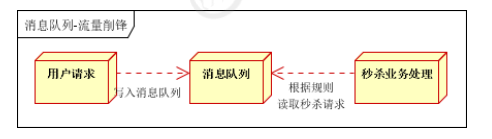

# 1. ActiveMQ简介

1. 场景:
   - 异步处理
   - 应用解耦
   - 流量削峰

## 1. 异步处理:

场景说明:用户注册,需要三个业务逻辑,分别是写入用户表,发送注册邮件,发送注册短信

- ### 串行方式

  将注册消息写入数据库,发送注册邮件,发送注册短信.以上三个任务全部完成后才能返回客户端

  

- ### 并行方式

  将注册信息写入数据库, 发送注册邮件同时发送注册短信,以上三个任务完成后完成给客户端.和串行的差别是,并行的方式会短

  

- ### 异步处理

  引入消息中间件,将部分的业务逻辑,进行异步处理,改造后的架构如下:

  

  以上, 用户响应时间相当于注册消息写入数据库的时间,也就是50ms,注册邮件,发送短信写入消息队列后直接返回, 相当于55ms,因此用户响应时间可能是50ms(忽略5ms).故架构改变后, 系统的吞吐量提高了,比串行高了3倍,并行高了2倍.

## 2. 应用解耦:

场景:用户下单后,订单系统需要通知库存系统

传统的做法: 订单系统调用库存系统的接口,如下图:

传统的模式缺点: 加入库存系统无法访问, 则订单库存将失败,从而导致订单失败,订单系统与库存系统耦合,如何解决以上问题?引入消息队列中间件如下图:

订单系统:用户下单后,订单系统持久化处理,将消息写入队列, 返回用户订单下单成功, 库存系统:订阅队列消息,使用拉/推方式,获取下单方式,库存系统根据下单信息,进行库存操作,假如:在下单的时候库存系统不可用,也不影响正常下单,下单后,订单系统写入消息队列就不再关心其他后续操作了,实现订单系统和库存系统的解耦.

## 3. 流量削峰

一般秒杀抢购系统中应用广泛, 流量过大, 应用挂掉,为解决, 在应用前端加入消息队列.通过加入消息队列完成接下来的内容

- 可控制活动的人数

- 可以缓解短时间内高流量压垮应用

  

  用户请求,服务器接收到了后, 首先写入消息队列,加入消息队列长度超过最大数量, 则直接抛弃用户请求或则跳转到错误页面.猫砂业务根据消息队列中的请求信息做后续的处理.

## 4. JMS协议

java message service 消息中间件利用高效可靠的消息传递机制进行平台无关的数据交流，并基于数据通信来进行分布式系统 的集成。它可以在分布式环境下扩展进程间的通信。对于消息中间件，常见的角色大致也就有 Producer（生产者）、Consumer（消费者）。

消息队列中间件是分布式系统中重要的组件，主要解决应用解耦，异步消息，流量削锋等问题，实现高 性能，高可用，可伸缩和最终一致性架构。 JMS（Java Messaging Service）是Java平台上有关面向消息中间件的技术规范，它便于消息系统中的 Java应用程序进行消息交换,并且通过提供标准的产生、发送、接收消息的接口简化企业应用的开发。 JMS本身只定义了一系列的接口规范，是一种与厂商无关的 API，用来访问消息收发系统。它类似于 JDBC(java Database Connectivity)：这里，JDBC 是可以用来访问许多不同关系数据库的 API，而 JMS 则提供同样与厂商无关的访问方法，以访问消息收发服务。许多厂商目前都支持 JMS，包括 IBM 的 MQSeries、BEA的 Weblogic JMS service和 Progress 的 SonicMQ，这只是几个例子。 JMS 使您能够 通过消息收发服务（有时称为消息中介程序或路由器）从一个 JMS 客户机向另一个 JML 客户机发送消 息。消息是 JMS 中的一种类型对象，由两部分组成：报头和消息主体。报头由路由信息以及有关该消息 的元数据组成。消息主体则携带着应用程序的数据或有效负载。

## 5. jms消息模型

消息中间件一般有两种传递模式：点对点模式(P2P)和发布-订阅模式(Pub/Sub)。

1.  P2P (Point to Point) 点对点模型（Queue队列模型）

2. Publish/Subscribe(Pub/Sub) 发布/订阅模型(Topic主题模型) 

点对点模型点对点模型（Pointer-to-Pointer）：即生产者和消费者之间的消息往来。

每个消息都被发送到特定的消息队列，接收者从队列中获取消息。队列保留着消息，直到他们被消费或 超时。 

### **点对点模型的特点**：

1.  每个消息只有一个消费者（Consumer）(即一旦被消费，消息就不再在消息队列中)；

2. 发送者和接收者之间在时间上没有依赖性，也就是说当发送者发送了消息之后，不管接收者有没有 正在运行，它不会影响到消息被发送到队列； 

3. 接收者在成功接收消息之后需向队列应答成功。

   

### 发布/订阅模型特点:

包含三个角色：主题（Topic），发布者（Publisher），订阅者（Subscriber），多个发布者将消息发 送到topic，系统将这些消息投递到订阅此topic的订阅者

发布者发送到topic的消息，只有订阅了topic的订阅者才会收到消息。topic实现了发布和订阅，当你发 布一个消息，所有订阅这个topic的服务都能得到这个消息，所以从1到N个订阅者都能得到这个消息的 拷贝

**特点:**

1. 每个消息可以有多个消费者；
2.  发布者和订阅者之间有时间上的依赖性（先订阅主题，再来发送消息）。
3.  订阅者必须保持运行的状态，才能接受发布者发布的消息；

## 6. jms核心API

1. ConnectionFactory 创建Connection对象的工厂，针对两种不同的jms消息模型，分别有QueueConnectionFactory和 TopicConnectionFactory两种。
2.  Destination Destination的意思是消息生产者的消息发送目标或者说消息消费者的消息来源。对于消息生产者来 说，它的Destination是某个队列（Queue）或某个主题（Topic）;对于消息消费者来说，它的 Destination也是某个队列或主题（即消息来源）。所以，Destination实际上就是两种类型的对象： Queue、Topic 
3. Connection Connection表示在客户端和JMS系统之间建立的链接（对TCP/IP socket的包装）。Connection可以产 生一个或多个Session 
4. Session Session 是我们对消息进行操作的接口，可以通过session创建生产者、消费者、消息等。Session 提供 了事务的功能，如果需要使用session发送/接收多个消息时，可以将这些发送/接收动作放到一个事务 中。 
5. Producter Producter（消息生产者）：消息生产者由Session创建，并用于将消息发送到Destination。同样，消 息生产者分两种类型：QueueSender和TopicPublisher。可以调用消息生产者的方法（send或publish 方法）发送消息。
6.  ConsumerConsumer（消息消费者）：消息消费者由Session创建，用于接收被发送到Destination的消息。两种 类型：QueueReceiver和TopicSubscriber。可分别通过session的createReceiver(Queue)或 createSubscriber(Topic)来创建。当然，也可以session的creatDurableSubscriber方法来创建持久化 的订阅者。 
7. MessageListener 消息监听器。如果注册了消息监听器，一旦消息到达，将自动调用监听器的onMessage方法。EJB中的 MDB（Message-Driven Bean）就是一种MessageListener。

# 2. ActiveMQ安装

# 3. 原生JMS API操作ActiveMQ

# 4. Sping与ActiveMQ整合

# 5. SpringBoot与ActiveMQ整合

# 6. ActiveMQ消息组成与高级特性

# 7. ActiveMQ企业面试经典问题

