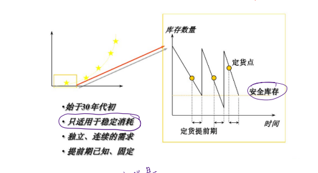
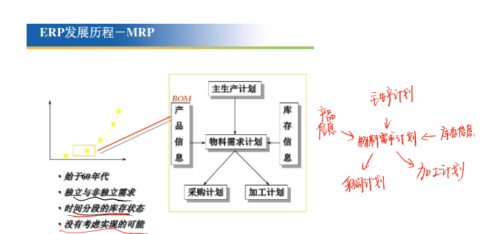
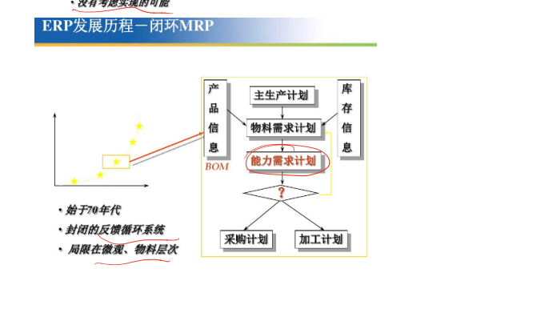
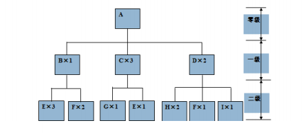
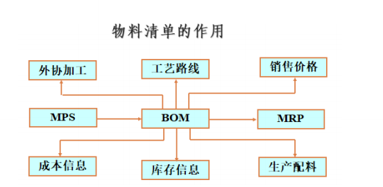
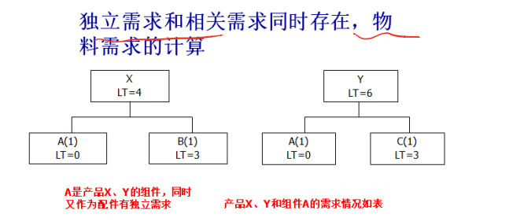
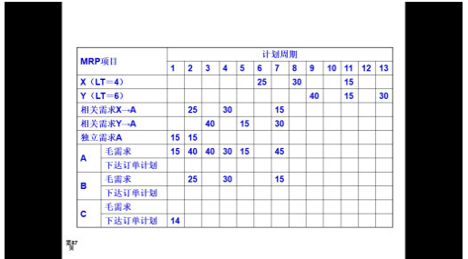
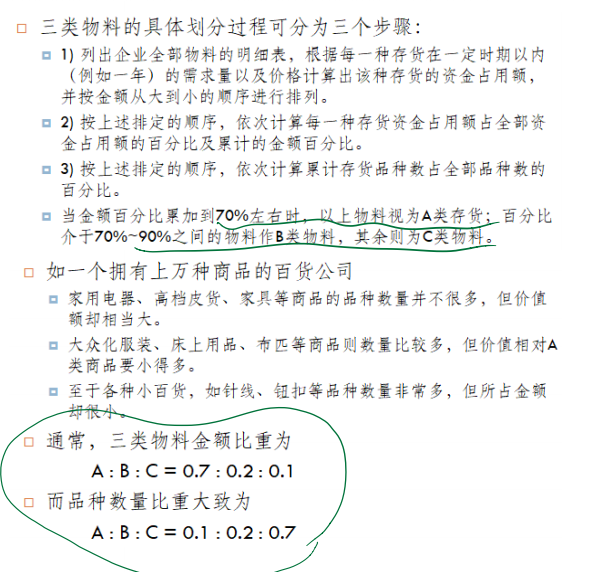
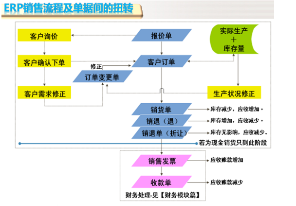
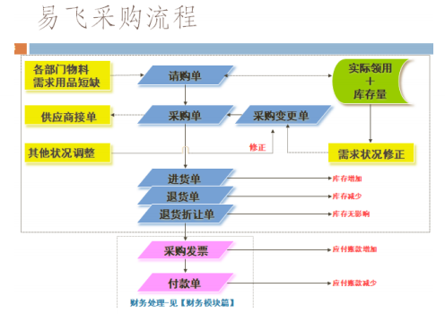

订货点法->MRP->闭环MRP->MRPII->ERP

订货点法: 再安全库存的1/2点进行订货

- 特点: 适用于稳定的消耗

- 适用于独立/连续的需求

- 提前期已知, 固定

  

  

MRP:

- 适合独立和非独立的需求

- 时间分段的库存状态

- 没有考虑实现的可能

  

闭环MRP

- 封闭的反馈循环系统
- 局限在围观/物料层次

MRPII

- 经营规划/销售/和运作规划
- 模拟功能, 
- 局限于企业内部

 物料的含义:

1. 物料是产成品/半产品/在制品/原材料的总称
2. 物料主文件: 物料代码文件, 用来标识和描述生产过程中每一物料的基本属性和业务数据(是生产计划和物料需求计划运算的最基本文件)
3. 物料主文件基本涵盖了企业物料管理活动的各个方面各个角度的信息

### 物料主文件

- 物料技术资料:规格型号等
- 物料库存信息:物料存量等
- 物料计划管理信息: 生产周期等
- 物料采购管理信息: 供应商代码等
- 物料销售管理信息: 默认销售商等
- 物料财务相关信息: 实际成本等
- 物料质量管理信息: 抽检方式等

### BOM(bill of meterials):

是描述产品结构的文件, 表明了产品组件/子件/零件直到原材料之间的结构关系,一级每个组装件所需要的下属部件或者原料数量, 是一种树形结构,称为产品结构树

​	

MPS:主生产计划 

### 物料清单的作用

- 物料清单是生产MRP的基本信息, 是联系MPS和MRP的桥梁

- 可以根据物料清单来生产产品的工艺路线

- 可以为采购外协加工提供依据

- 为生产配料提供依据

- 成本数据根据物料清单来计算, 这一数据是制定销售价格的依据

  给出数量/提前期/组成关系, 会画BOM树形结构图

  

### 低阶码及作用

低阶码是统一物料项目位于不同BOM

阶层中有多个阶层码时候取最底层作为计算该项物料需求量的一种方法

作用:

- 每个物料有且仅有一个低阶码,指出各种物料最早使用时间, 在MRP运算中,使用低阶码简化运算

- 在展开MPS进行物料需求计算时, 对项目的计算先识别低阶码,然后只在最底层上进行运算

- 将可用库存量优先分配给处于最底层物料, 保证时间上最需求的物料先得到分配,避免晚需求的物品提前下达计划并占用库存, 因此, 低阶码是MRP的计算顺序

  ##### 注意

- 物料的低阶码(LLC)是 系统分配给物料清单上的每个物品一个0到N的数字, 在产品结构上, 最上层的低阶码为0,下一层的低阶码则为1, 以此类推

- 一个物品只能由一个MRP低阶码, 当一个物品在多个产品所处的产品结构层次不同或者处于同一个产品结构中但却处于不同产品结构层次时候, 则取在最底层的层级吗作为物品的低阶码, 也就是取数字最大的层级码

 

### 库存的ABC分类

- 库存的ABC分类方法是按照一定标准将存货划分为ABC三类,(分别是重点库存/一般库存/次要库存),实行区别话的e存储控制策略
- 物料ABC分类标准主要有2个:一个是金额标准, 二是品种数量标准,(金额标准是最基本的, 品种数量标准仅作为参考)
- 标准
- - A类:金额巨大,品种数量较少
  - B类: 金额一般, 品种数量相对较多
  - C类:价值金额小, 品种数量繁多

分类步骤

特点:

- A类:重点库存控制对象, 要求记录准确, 严格盘点, 检查数量质量,不定期检查, 密切关注使用和保管状态,应降低A类库存量,合理订货周期和订货量, 杜绝浪费和滞销
- B类: 采取中间政策, 仍然必要管制, 较为A类更迎来搞存货,防止缺料存在
- C类, 较高存量减少管制需要, 但是不是不管制, 因为如果缺了也会影响产品的形成

### 销售管理

概念

- 只把企业生产和经营的产品或服务出售给消费者, 企业获取利润/实现经济和社会价值的的重要手段
- 销售管理是对企业销售人员和活动的计划/组织/领导/协调/控制,从而实现企业目标的过程

ERP需要的基础数据

除了物料主文件和物料清单外, 还需要

- 提前期
- 工艺中心
- 工艺路线
- 时段/时区/时界
- 工厂日历
- 库存记录

**工作中心**的作用:
工作中心是生产资源的描述,是能力计划的基础, 包括设备和人,它不属于固定资产和设备管理范畴

- 作为平衡任务负荷和生产能力的基本单元
- 作为车间作业分配任务和编排生产进度的基本单元

- 作为计算加工成本的基本单元

时区/时段/时界

时段(Time Period) :时间段落, 时间间隔或时间跨度, 标识时间持续的一个长度单位

时区(Time Zone)用于描述产品在某个时刻处于其计划期内的时间位置

时界(Time Fence):

- 两个时区之间的的分解时间点

  时区1和时区2之间的分界点叫需求时界

  时区2和时区3之间的分界点叫计划时界

- 时界是控制计划变化的参考和根据, 用来保持计划的严肃性/稳定性/灵活性
- 需求时界体型计划人员, 早于这个时界的订单已经在总装,不要轻易变动,要保持稳定
- 计划时界体型计划人员, 在这个时界和需求时界之间的计划已经确认, 生产已经投入, 物料和能力资源已经开始消耗

### 订单设计 ETO/ 定单生产 MTO/ 定单组装 ATO/ 现货生产 MTS 的区别

ETO: 面向订单设计:按照客户需求对产品定义和设计, 然后生产

MTO: 面对订单生产: 客户的订单产品设计已完成, 只需采购物料生产

ATO:面向订单装配:可直接用库存中零件来装配

MTS:面向库存生产, 收到客户订单以前, 已经按照计划生产,产品入库后等待用户订单

### 计划管理的五个层次

1. 经营规划
2. 销售和运作规划
3. 主生产计划
4. 物料需求计划
5. 能力需求计划

作用: 这五个层次体现了计划管理从宏观到微观/由战略到战术/从粗到细的深化过程

- 经营规划和销售与运作规划具有宏观性质

- 主生产季候是宏观向围观的过渡性计划

- 物料需求计划从微观计划开始, 是主生产计划的具体化

- 能力需求计划把物料需求转化为能力需求

  

### 经营规划:

是企业的长远战略规划, 确定企业适应市场环境的经营目标和策略,如市场开拓,销售分析和利润预测, 研发,质量管理, 培训等

- 经营规划是计划管理的首要任务, 以货币为单位表述企业销售目标和利润目标
- 经营规划是企业发展的总体目标, 是其他计划的依据和基础

### 销售和运行规划

是一种编制战术规则的决策流程,保证各项业务战术计划和企业的经营规划一致

### 主生产计划

是确定每一个具体产品在每一个具体时间段的生产计划

### 需求能力计划

是对哥哥生产阶段,各工作中心所需的各种资源精确计算,得出人力符合/设备符合等情况, 平衡生产能力和生产负荷

### 工作中心

- 工作中心的**定额生产能力**通常用来一**定时间内完成的工作量表示**

- 工作量一般用标准工时表示

- 工作中心的定额生产能力计算公式**: 定额能力=每日工作班次X每班工时X工作中心利用率X工作中心效率**

  ​					其中: **工作中心利用率=实际投入工时/计划工时**

  ​								**工作中心效率=完成定额工时数/实际投入工时数**

- 为让工作中心定额生产能力保持可靠有效, 应定期和实际能力比较, 用实际能力来修正
- 工作中心实际能力可以用工作重心在若干时间内的平均产出来衡量

### 独立需求和相关需求

独立需求一般由MPS处理/相关需求一般由MRP处理

独立需求

- 一个项目的需求不能从另外一个项目的需求计划得到是称为独立需求,否则相关

相关需求

- 独立需求对立面, 项目需求能从另外一个项目需求计划得到例如

例如: 生产圆珠笔, 笔为独立需求, 需求数量是预测得到的, 构成比的笔芯和弹簧之类的是相关需求, 需求数量是从计划得到的,

编制物料需求计划时,必须认真分析收集独立需求和相关需求

### 能力需求计划目标

目标解决以下三个问题:

1. 各个物料经过哪些工作中心加工?
2. 各个工作中心可用能力是多少?负荷是多少?
3. 工作中心的各个时段可用能力是多少?符合是多少?

需求计划中能力和符合的调整措施

调整能力措施:

1. 加班
2. 增加调整人员
3. 增加设备
4. 提高工作效率
5. 更改工艺路线
6. 作业转包

调整符合的措施

1. 从迭作业
2. 调整生产批量
3. 减少准备提前期
4. 调整订单

### 采购管理

- 采购管理属于ERP执行层

- 主生产计划给出了最终产品的生产计划, 经过物料需求计划按物料清单展开得到:

  - 外购件采购订单

  - 自制件生产订单

    

### 产品成本

产品生产成本=直接成本+制造成本

总成本=生产成本+期间费用

- 产品成本部分说明了直接生产部门收集的成本, 反应了生产单位级别(如车间一级)的成本水平

### ERP实施的困难

- 专业管理水平低, 企业管理基本靠手工, 信息化程度低
- 需求不清晰 甚至互相矛盾
- 系统没继承, 数据没整合
- 用户面临系统不会用, 需要培训

### ERP动态数据和静态数据

静态数据: 静态数据指数据本身和企业日常生产活动关联松散的数据,如物料清单/工艺路线/仓库和货位/会计科目等

动态数据: 生产活动紧密相关的数据,如库存记录/客户合同/一旦建立,需要随时维护

性质分类:

- 静态数据: 相对稳定存在系统各类基础数据(BOM/工作中心)
- 动态数据: 随企业业务操作不断发展变化的信息(库存/生产订单)

#### SCM/CRM/SRM等缩写

CRM: 客户关系管理, 吸引新客户留住老客户

SRM: 供应商关系管理,和供应商建立长期业务,开拓市场

SCM:供应链管理, 包括计划/采购/制造/配送/退货