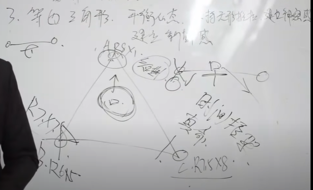

# PopArts

## 第一部分: 课前准备

### 1. 六芒星评判---长期关系或短期关系

- 外在: 

  R(主观繁衍价值): RA RB RC

  ​		主观繁衍价值核心需求(K价值需求)	

  RA: 肉体核心需求(长腿/细腰/丰满/性感/翘臀) 8.5

  RB: 面容核心需求(大眼/尖颌/挺鼻/小 嘴/双眼皮) 7.0 

  RC: 附加核心需求(皮肤白嫩/无体毛/长发/体香/声音好听) 7.5 

  ---------------------

- 内在

  X: 主观内心特质: XA XB XC

  ​	主观内心的核心需求(X价值需求)

  XA: 内在本质特性核心需求(善良/简单/孝顺/聪慧/贤惠顾家) 5

  XB: 互动姿态核心需求(温柔/顺从/宽容/得体/调皮) 3

  XC: 外界生存姿态核心需求(阳光/积极/乐观/活泼/开朗)

  ----

  R价值附加分(A+2 B+1 C0 D-1)    X价值附加分(A-3 B-2 C-1 D0)

  计算得出 A女分数: R平均分8.8+X价值平均分1------>短期目标 就是一个浪女, 典型A类型

  

## 2.客观综合价值评估---决定游戏策略((她>己) 先推后拉或先拉后推(己>她))

1. N1身材(比如7分)

2. N2外貌(比如8分)

3. N3品味/时尚度(比如9分)

4. W1男性社交认可(比如5分)

5. W2女性社交认可(比如8分)

6. W3生存价值以及社会地位(比如6分)

   -----

   计算方式: (7+8+9+5+6)/6=7.13(最终综合价值分数)

   重要度:

   ​	女生: 1>2>3>4>5>6

   ​	男生: 6>5>4>3>1>2

### 3.等边三角形 平衡心态 无形推拉 建立神秘感

### 第二讲: 三大游戏标尺

**第一部分**: **开放度评判从高到低分 A(无脑浪/玩家) B(寂寞女/资源较少) C(家教严/少爱情) D(处女) 四个等级**

具体体现:

 1. 女性社交认可度低下

 2. 男性社交认可度高并且经常以男性社交为重心

 3. 双腿的站姿或坐姿,无意识的时候分开双腿

 4. 社交场所经常主动kino不同男性, 同时很少kino女性

 5. 表情很丰富 很会微笑 偶尔会皱眉, 在娱乐场所喜欢抽烟/有纹身

 6. 表现欲很强, 会主动带领话题, 煽动气氛

 7. 亲密社交无排斥现象, 到了新的社交场合会像蜜蜂一样到处寻找高价值男

 8. 会用手势让男人过来 且经常让男人做一些小事情

 9. 谈到性话题会很兴奋, 虽然有时候会表现出来不感兴趣

 10. 社交场所会频繁回避接电话或者 回信息, 且情绪兴奋

     ----

     以上场景0-3条 属于C D两种类型

     ​				4-5条: 需要测试(试探/观察)

     ​				6条以上: 理性认为她是  浪女

**第二部分: 兴趣指标**		

五种成因呈现(行为决定真假)

1. 想要引起你的注意(解决)
2. 想要了解你(主动探索你)

3. 想要多和你在一起(时间)

4. 想要获得你的好感(服从测试)
5. 想要跟你更深的互动(亲 密的关系)

6. 喜欢你
7. 爱上你

**第三部分: 欠操指标**

1. 被动收集板块: 1颗星

   贴瞪脱漏含摸叫(7字真言)

2. 主动收集板块: 2颗星

   贴摸吻

3. TD邀请板块: 5颗星

   8颗则为欠操

## 第三讲: 搭讪与10连枪

**搭讪核心:** 

​	思维改变(改变传统思维)

​	能量感染(自信/友善/尊重/自然放松)

​	表达顺畅(清除表达自己的意图)

**搭讪心态:**无   所谓/不在乎/不怕失败(脸皮厚,胆子大, 心细)

**十连枪核心:** 改变原本挫男的低姿态,  练就观察女人**一坨屎**的能力

​						瓦解女人自信, 制造出强烈的负面情绪(针对傲慢女)

**一坨屎由浅入深的几个层面:** 外貌---习惯---智商---才能---修养---私生活---人品---人格

## 第四讲: 人偶创建及三大模式

虚拟属性(性格--->行为方式)

**虚拟世界观:**

1. 生活经历(吃喝玩乐/兴趣爱好/见闻八卦和三大模式的浅层次适用)
2. 工作经历(虚拟属性的中层次话题)
3. 情感经历(虚拟属性的中层次话题和三大模式颠覆使用)
4. 童年经历(2号坑使用, 疲惫/隐忍/易碎)
5. 成长挫折(2号坑使用, 疲惫/隐忍/易碎)

---

### 浪子模式:

关于浪子模式正面属性(1号坑展示属性) 个性标签

1. 纯粹的享乐和刺激
2. 拥有浪子的名声(个性标签)
3. 自我放纵 不相信感情(主属性)
4. 懂女人(主属性)
5. 风流倜傥/只需潇洒

关于浪子模式隐藏属性: 痴情纯男 寻找真爱(2号坑隐藏属性)

浪子模式在陷阱中针对AB女性的价值及关键词

1. 挑战性
2. 唯一特殊性(二号坑重点)
3. 在一起有激情(重点)

### 帝王模式:(针对CD女)

关于帝王的正面属性

1. 对女人完全的控制和霸气行为上完全主导(主见)(主属性)
2. 永不止步, 且不走寻常路(上进行与自我)(主属性)
3. 壮志凌云与信念鉴定(创业者姿态)(主属性)
4. 高智商展示(目光高远)
5. 无所畏惧(勇气)

---

关于帝王模式隐藏属性: 孤独的君王, 疲惫的骑士像个孩子孤立无助

关于帝王模式在陷阱中针对CD女提供的价值和关键词

1. 雄性领导气质
2. 高度生存价值的潜力
3. 优良基因
4. 安全感

### 诗人模式(针对ABCD)

关于诗人的正面属性:

1. 逍遥自在/漂泊的心(主属性)
2. 我行我素 世事繁华 漠不关心(主属性)
3. 才华横溢(主属性)
4. 浪漫爱情
5. 吟游诗人永远在路上 永远在缔造故事和传说

关于诗人模式隐藏属性: 渴望安逸 渴望家的人 渴望安定且重感情 并非一切都漠不关心

关于诗人模式在陷阱中ABCD的价值及关键词

1. 轻松自在(毫无杂质的单纯正面情绪)
2. 世外桃源(脱离世俗的"特殊"体验)
3. 花前月下的琴棋诗画
4. 纯净的心, 一尘不染
5. 浪漫多才, 梦幻懂生活

## 第五讲: 好奇陷阱

1号坑构造 角色关键词: 坚强 隐忍 强势 无所谓

​				   角色姿态: 正面情绪 没有情感波动 始终挂着微笑

​				1) 行为方式与众不同(主罕见)

​				2) 世界观 离经叛道(主罕见)

​				3)保持神秘感(主未知)

**浅层次关键:** 根据人偶创建生活记忆展示浪子属性和姿态刺激正向情绪, 建立舒适感

**中层次关键:** 根据人偶虚拟职业工作经历和主动DHV和神秘感 生活经历 情感经历继续展示

**深层次关键:**祭出来离经叛道的世 界观建立好奇

**最后建立强力链接** 虚拟未来展开图 利用人性贪念始终诱惑

### 附加课: 神聊五术

#### 聊天框架: 互动性 /情绪性

**如何让聊天互动:**

1. 描述自身事务后, 反问对方
2. 陈述式诱惑抛出进试探
3. 建立神秘感

**如何使用情绪对话:**

1. 描述对待事物的感受
2. 描述自身的状态的情绪
3. 形成画面感

**聊天五术:**

1. 好奇话术(让女人对话题感兴趣的能力)
2. 多重脉络对话术(让话题无限拓展的能力)
3. 诱导暗示引领话题术(带领话题转移话题的能力)
4. 女性思维镜像对话术(拉近两人关系和距离的能力)
5. 诱导探索话题术(让女人探索你的能力)

## 第六讲:微信流1坑指导 空间布置

### 1. 单兵猎物捕捉方式

1. 1v1单兵遭遇战
2. 攻入外部战场 获取猎物
3. 建立己方战场 请君入瓮

### 2. 微信朋友圈布置

1. 高像素照片
2. 高价值背景合影 
3. 高价值人物合影
4. 高价值事物合影
5. 高价值宠物合影
6. 展示雄性领袖和预选
7. 展示自己的兴趣爱好
8. 展示旅游足迹懂生活
9. 说说展示思维 世界观 情绪和感受(你是怎样的人)

#### 3. 微信流1坑指导

1) 头像及照片设置(罕见+未知+DHV+预选)

2) 个性签名设置(罕见+未知)

3) 虚拟职业设置(罕见+未知)

4) 三大模式开启(罕见+未知)

5) 好奇开场白建立连接

6) 1坑3层次对话(建立舒适度 展示属性 时间管建立好奇)

7) 虚拟未来展开图收尾

## 第七讲: 探索陷阱---虚拟人偶的隐藏属性

隐藏属性的侧面展示四大途径

1) 僚机展示

2) 空间展示

3) 偶然展示

4) 诱导展示

二坑的构造 关键词: 颠覆 唯一特殊性 心疼

角色展示姿态 强烈的感情波动 一个受过伤的傻孩子

1) 达成印象颠覆(隐藏属性释放)

2) 制造唯一特殊性 错觉(建立信任和可得性)

3) 收集心疼指数

​	家庭背景(展示缺爱获取关心)

​	同年经历(家庭暴力 他人欺负获心疼)

​	个人成长经历(得过大病 遭受挫折展示隐忍)

​	为兄大家反被兄弟出卖(展示重轻易)

**自我暴露程度** 广度+深度

第一层: 展示自我兴趣爱好(性格 兴趣 习惯 工作 经历 背景)

第二层: 态度和看法(对人和事物的态度和思想 )

第三层: 自我概念和人机关系(个人缺点和挫折情感和人际关系)

第四层: 隐私和秘密(个体内世界的秘密和生活的隐私)

**自我暴露框架**

第一层: 主动展示(阳光 坚强 隐忍 强势 无所谓)

第二层: 诱导展示(无需求 无所谓的态度)

第三层: 被动诱导侧面展示背面(脆弱一面 孩子的一面 可以信任的一面)

第四层: 逃避以退为进或者酒醉下展示(强烈的信任感) 伴随强烈的情绪波动

 

**心疼指数**(疲惫 隐忍 易碎)

1) 疲惫获取心疼指数: 获取坚强

​	骗取心疼原理: 乐观的背后是强颜欢笑的(心理)

​								拼命生存背后是不为人知的疲惫(生理)

​								获取到的关系 心疼指数: 1  你太累了

2) 隐忍获得心疼指数: 委屈自己 成全别人

​									片区心疼的原理: 埋藏伤痕不愿意他人担心 自我强忍(心理)

​									身体不适 自我隐忍展示伤口诱导探索(生理)

​									心疼指数: 2 你真是个傻孩子

3) 展示易碎的方式: 敏感 获得反应 :保护欲

​									善良容易投入感情信任别人 易受伤 (心理)

​									心疼指数:3 宝贝有我在我不会让你受伤

## 第八讲: 坑内呻吟

一号坑呻吟: 世界上怎么会有这样的男人(好奇心启动)

二号坑呻吟: 

​					1) 我知道其实你一直在伪装自己(隐藏属性颠覆成功)

​					 2) 全世界不懂你, 但我懂你(唯一特殊性开启)

​					3) 你真是一个让人心疼的傻孩子(心疼指数上升6+)

​		全中则带入三号坑

三号坑呻吟: 

​					1) 我确实对你有好感 我喜欢你 我爱你(一坎1号话术暗示表白成功)

​					2) 我想和你在一起一坎3号压迫暗示收尾)

​					3) 我一定不会让你失望(2坎3号障碍制造收尾试用期契约签订)

四号坑呻吟: 

​					1) 委屈心碎

​					2) 自责心碎

五号坑呻吟:

​				1) 我知道你是毒品 但我戒不掉

​				2) 这是我自己的选择 人总该为爱勇敢一回

​				3) 没有你我会死

## 第九讲: 着迷陷阱---让女人对你表白

3坎构造 武器: 暗示技术

两个坎:

​	**第一坎:** 明确话术(感觉明确 唯一特殊性明确 恋爱关系明确)

​	关键是让猎物自己确认对你的感觉(是什么 为什么 怎么办)

​	

​	**第二坎:** 期待

​	关键是让猎物期待和你在一起

​	1) 1号话术导向: 展示强烈正向发展可能性激发猎物博胜利的心理(自我未来展开图)

​	2) 2号话术导向: 了解猎物当下食物需求

​	3) 3号话术导向: 契约签订 达成一个契约或者涉及一个障碍 让猎物履行或克服

​	让猎物期待按照约定会走出陷阱便可得到需求或食物

### 附加课: 约会互动

如何邀约的要点以及技巧(如何应对放鸽子的情况)

1) 了解女人的作息时间

2) 探讨行邀约进行测评是否能够邀约

3) 了解女人的需求所处的环境选择适当邀约场景

4) 提前邀约给与女人足够的准备时间

5) 给与具体邀约信息确定时间地点娱乐内容给与安全感

6) 强势带领给与压力适当时以退为进

7) 应对女人放鸽子的心态与框架

8) 备胎原则

**约会地点的选择**

1) 方便女人和你出行的地点

2) 能够给与女人安全感和舒适性的地点

3) 可以正常聊天互动的地点

4) 能够满足女人虚荣心的地点

**速推流程:**

第一步: 咖啡厅/奶茶吧/迷失逃脱(建立舒适感)

第二部: 静吧/九八/夜宵(服从测试和进挪)

第三步: 带领TD(强势带领)

**五步流程:**

第一次约会: (建立正面属性)

​	1) 展示自己(属性 姿态 性格)

​	2) 话术和对话升温

​	3) 服从测试(收集兴趣指标)

第二次约会:(反转人偶进行颠覆)

​	1) 情绪刺激(情绪感染)

​	2) 反转人偶展示隐藏属性

​	3) 收集心疼 (疲惫 隐忍 易碎)

​	4) 暗示表白进入3坑

**现场暧昧话术升温**(情绪刺激)

1. 调侃女人能量刺激 (眼神交流 情绪感染)
2. 角色游戏自然刺激

**现场行动升温**(关系升温)

1. 贴搂摸吻(收集欠操指标)
2. 胆大心细脸皮厚

**私密空间转入要点以及技巧**:

1) 直接式(直接要求女人去)

2) 间接式(通过第三方理由让女人去)

3) 哄骗式

**私密空间如何打破理性和尴尬的气氛**

1. 转移注意法
2. 能量情绪感染法

**私密空间的详细操作流程**

1. 进挪管理(旋转游戏, 眼睛发光)
2. 真心话大冒险
3. 鬼故事
4. 角色游戏
5. 关灯调节气氛
6. 模式进挪

**如何破解女人的ASD**

1. 从浅到深
2. 只做不说
3. 嘴上妥协,行为继续
4. 冷冻

**性诱惑以及流程解析**

1. 女人的感受敏感度解析
2. 如果快脱女人裤子
3. 性技巧讲解

## 第十讲: 自尊摧毁陷阱				

### 1. 四号坑的构造

​	四号坑的关键词: 摧毁 甩尾

​		角色姿态: 失望 极端鄙视 冷酷无情

​		坑内武器: 

​				假性误解	

​				放大镜

​				负面头衔

​				情感指责

​				血腥心锚

### 2. 四号坑的摧毁步骤

1) 用放大镜给猎物强加一个负面头衔进行假设误解

2) 开启情感指责模式

3) 在停靠坑底出现 "委屈心碎和自责心碎"的呻吟后, 继续进行强力摧毁植入血腥心锚

## 第十一讲: 情感操控

摧毁后拉回来

1. 误解澄清
2. 心软放生
3. 逆向情感职责(自我职责, 列出她的付出清单, 表明她付出这么多说明她爱)