# UML统一建模语言

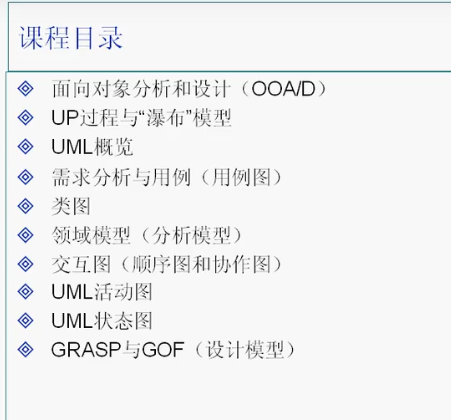

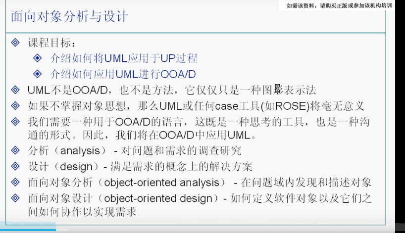

## 快速开始例子

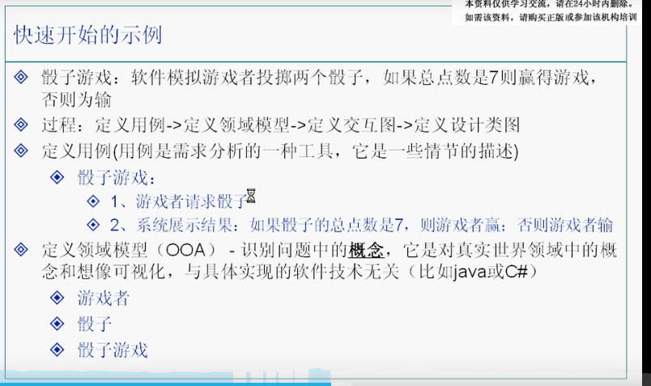

### 类图:

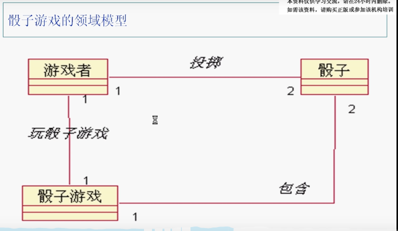

### 顺序图:

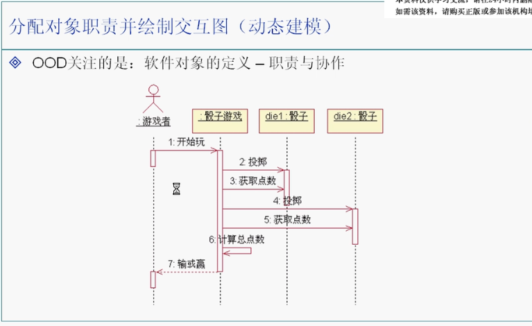

### 定义设计类图:(静态建模)

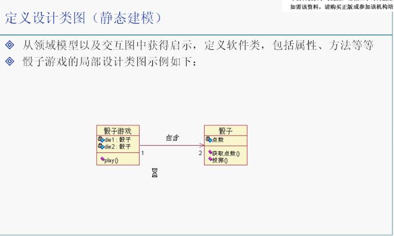

### 总结UML

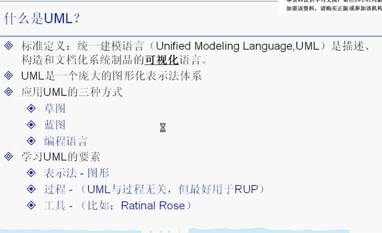

## UP和瀑布模型

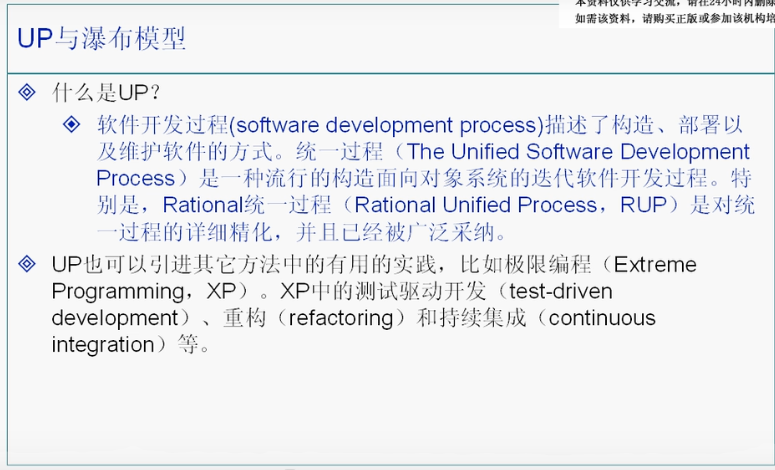

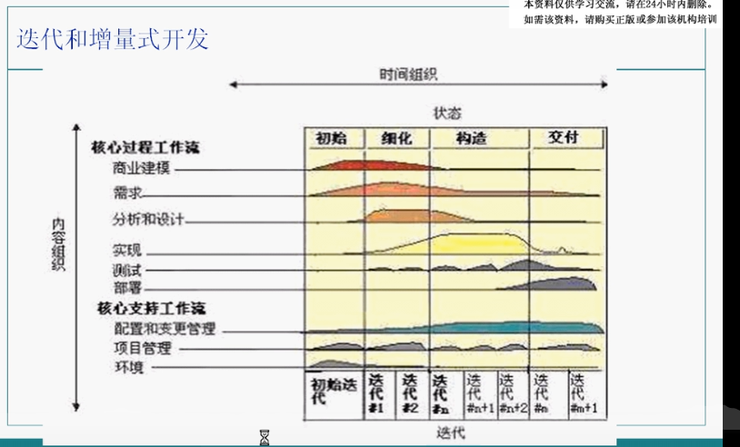

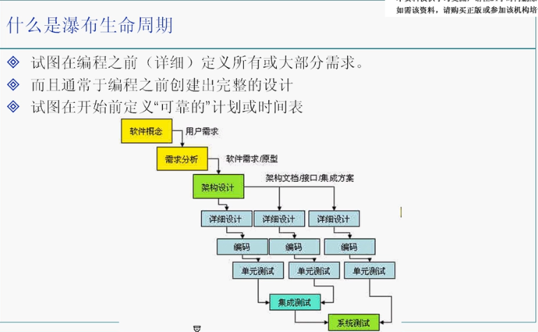

## UML概述

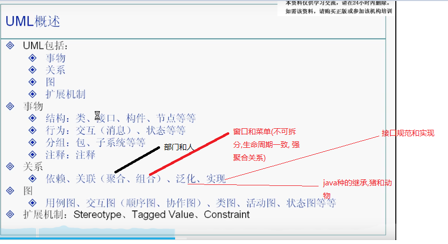

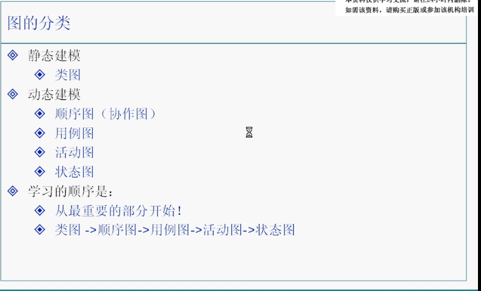

### 重要的概念和图形表示接触(类图)

依赖关系可以部分画出来(取决于你想表达什么)

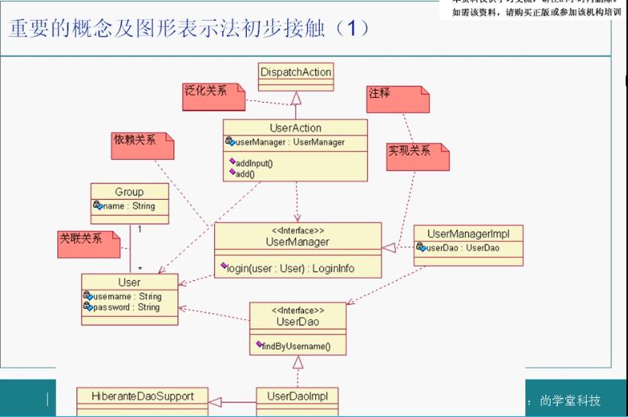

### 重要的概念和图形表示接触(用例图,状态图,活动图)

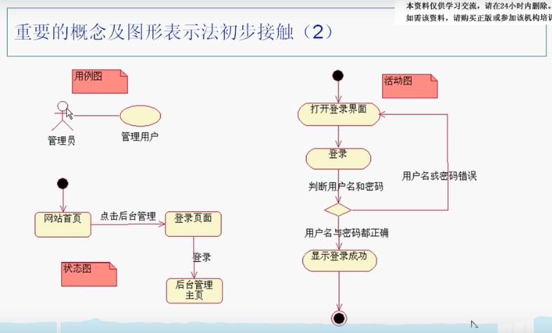

### 依赖:

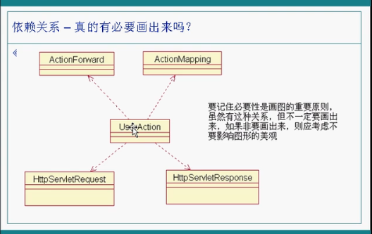

### 关联:

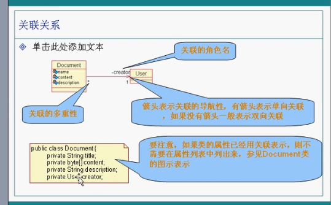

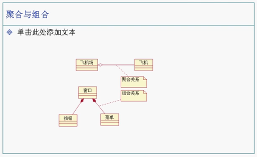

### 泛化:

即extend

### 实现:

即implements

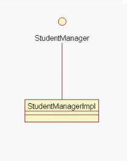

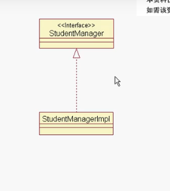

## 正向/逆向工程和MDA

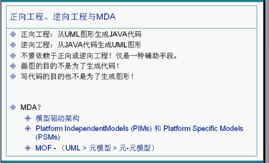

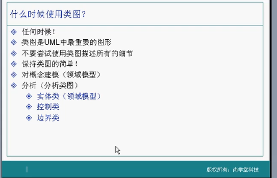

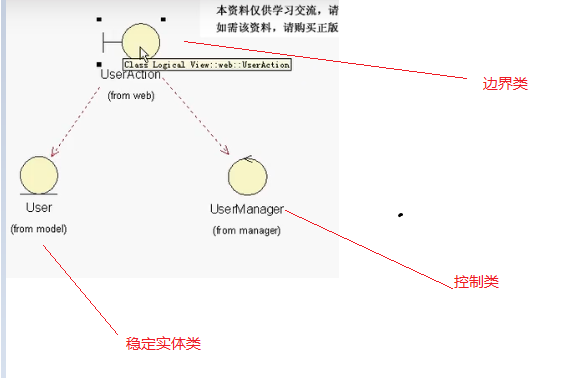

## 领域模型

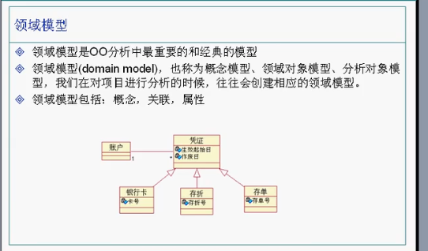

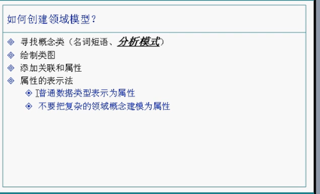

## 顺序图(交互图的一种)

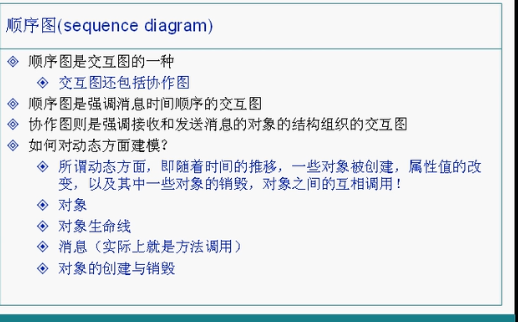

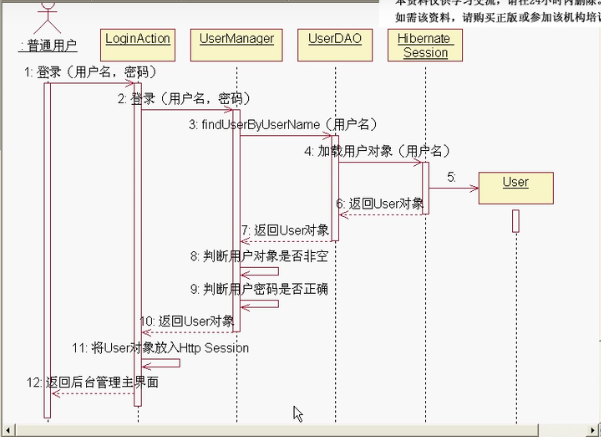

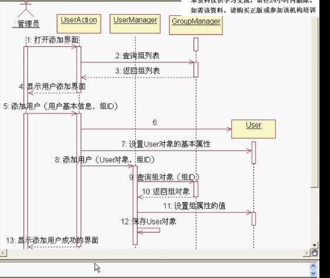

## 协作图(交互图的一种)

顺序图可以直接转化出来协作图(利用软件功能)

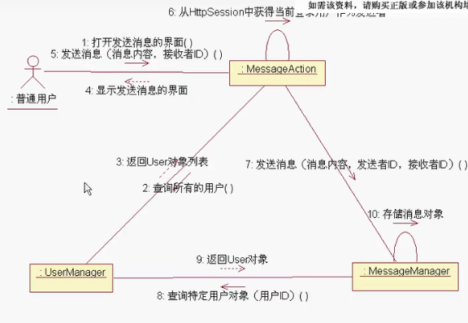

## 用例和用例图

### 用例

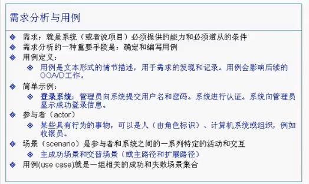

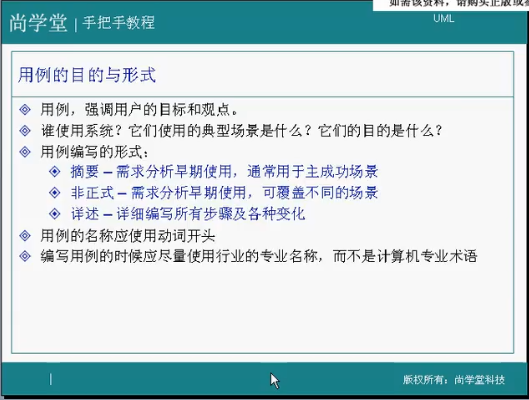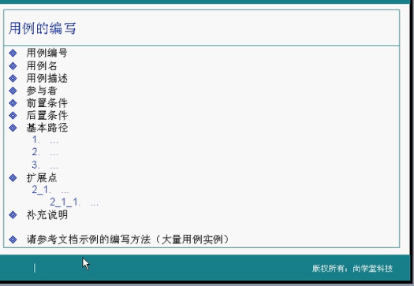

### 用例文本描述：

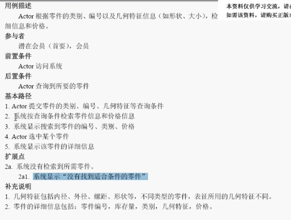

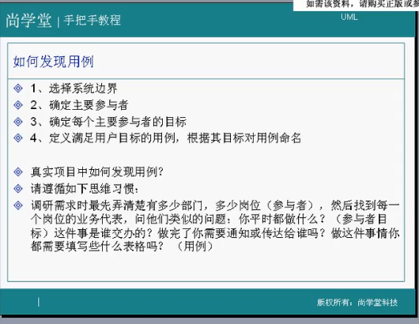

### 用例图:

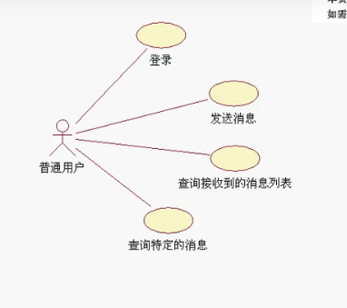

### 用例关联：

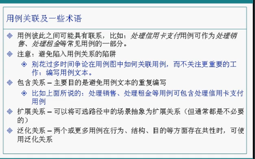

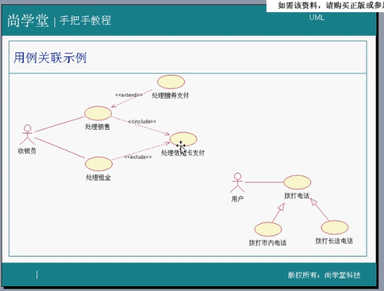

## 状态图：

