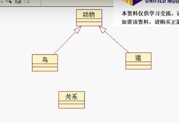

# UML统一建模语言

## 快速开始例子

### 类图:

### 顺序图:

### 定义设计类图:(静态建模)

### 总结UML

## UP和瀑布模型

## UML概述

### 重要的概念和图形表示接触(类图)

依赖关系可以部分画出来(取决于你想表达什么)

### 重要的概念和图形表示接触(用例图,状态图,活动图)

### 依赖:

### 关联:

### 泛化:

即extend

### 实现:

即implements

## 正向/逆向工程和MDA

## 领域模型

## 顺序图(交互图的一种)

## 协作图(交互图的一种)

顺序图可以直接转化出来协作图(利用软件功能)

## 用例和用例图

### 用例

### 用例文本描述：

### 用例图:

### 用例关联：

## 状态图：

