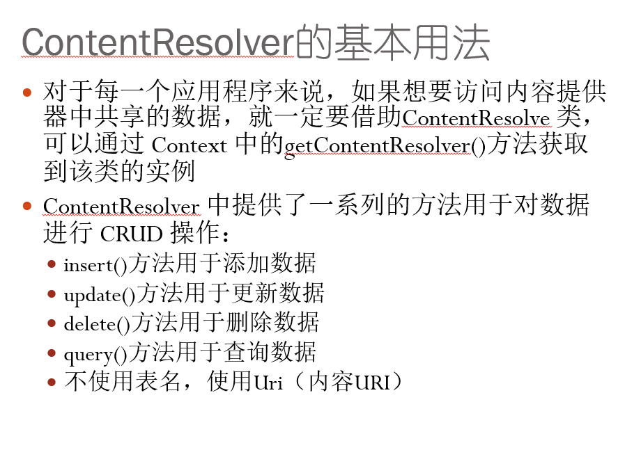

# 1.活动

1. 继承activity类

2. 重写onCreate方法

   加载布局: setContentView(R.layout.first_layout)

   AndroidMainifest中注册 android:name=".FirstActivity"

- 使用Toast

  —    Button button = (Button) findViewById(R.id.**button_1**);
       button.setOnClickListener(**new** View.OnClickListener() {
         @Override
         **public void** onClick(View v) {
           Toast.*makeText*(FirstActivity.**this**, 

  ​         **"****你點擊了按鈕****"**, Toast.**LENGTH_LONG**).show();
  ​       }

- 使用Menu

  <**item**   **android:id****="@+id/****add_item****"
  **   **android:title****="Add"**/>

- 重写onCreateOptionMenu()

  —**public** **boolean** onCreateOptionsMenu(Menu menu) {
     getMenuInflater().inflate(R.menu.**main**, menu);
     **return true**;
   }

- 重写onOptionsItemSelect方法

  —**public** **boolean** onOptionsItemSelected(MenuItem item) {
     **switch** (item.getItemId()) {
       **case** R.id.**add_item**:
         Toast.*makeText*(**this**, **"You clicked Add"**,    

  ​          Toast.**LENGTH_SHORT**).show();
  ​       **break**;
  ​     **case** R.id.**remove_item**:
  ​       Toast.*makeText*(**this**, **"You clicked Remove"**,

  ​        Toast.**LENGTH_SHORT**).show();
  ​       **break**;
  ​     **default**:
     }

     **return** **super**.onOptionsItemSelected(item);
   }

销毁活动: finish()

显式使用Intent

	Intent intent = **new** Intent(FirstActivity.**this**, SecondActivity.**class**);
	 startActivity(intent);
- 隐式使用Intent

  配置androidManiFest.xml

  —<**activity** **android:name****=".****SecondActivity****"**>
     <**intent-filter**>
       <**action** **android:name****="****com.example.activitytest.ACTION_START****"** />
       <**category** **android:name****="****android.intent.category.DEFAULT****"** />
     </**intent-filter**>
   </**activity**>

  使用:

    **public void** onClick(View v) {
       Intent intent = **new** Intent(**"****com.example.activitytest.ACTION_START****"**);
       startActivity(intent);
   }

Intent传递数据:

**intent.putExtra****("****extra_data****", data);**

使用数据:

**Intent** **intent** **=** **getIntent****();**
     **String** **data =** **intent.getStringExtra****("extra_data");**

存放SaveInstance的Bundle类型数据

—**protected void** **onSaveInstanceState****(Bundle** **outState****) {**
   **super.onSaveInstanceState****(****outState****);**
   **String** **tempData** **= "Something you just typed";**
   **outState.putString****("****data_key****",** **tempData****);**
 **}**

获得SaveInstanceState的数据

  **if** **(****savedInstanceState** **!= null) {**
   **String** **tempData** **=** **savedInstanceState.getString****("****data_key****");**
   **Log.d****(TAG****,** **tempData****);**
   **}**

