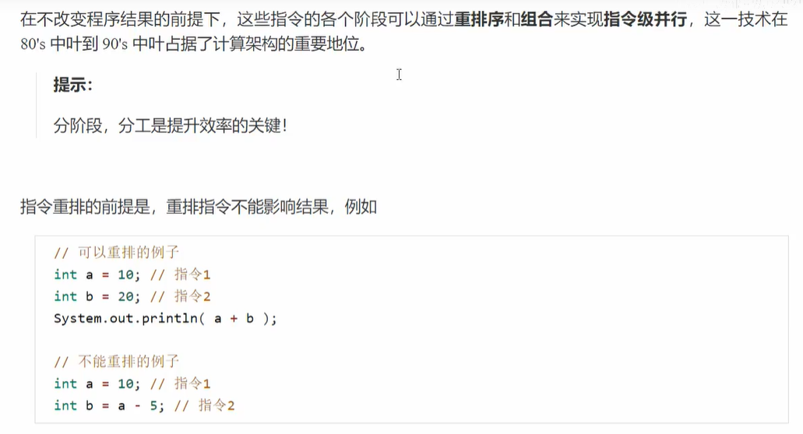
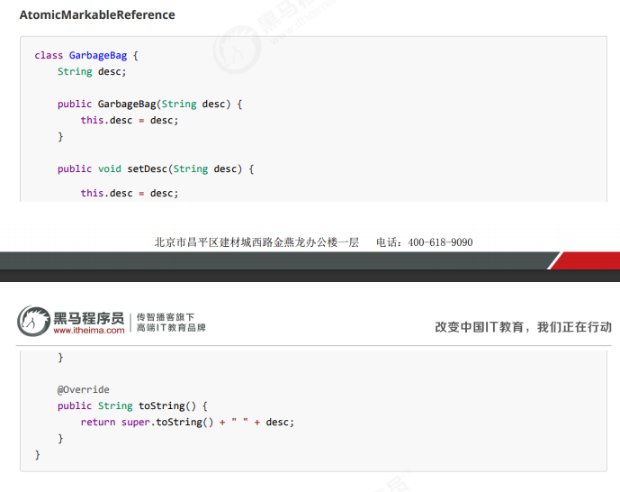

# java泛型?什么是泛型?泛型通配符

泛型提供了 **编译** 时类型检查机制, 允许程序员编译的尚在检测到非法的类型, 泛型的本质是参数化类型,也就是说操作的数据类型呗指定为一个参数.

java的泛型是伪泛型, 这是因为java在编译期间, 所有泛型信息都会被擦掉, 这就是 **类型擦除**

分为1. 泛型类 2. 泛型接口 3. 泛型方法

- ? 不确定泛型
- T type 具体一个java类型
- K V(key value) 分别代表java键值对
- E(element) 代表element

# ==和equals的区别

基本数据类型中, == 比较的是值. 在引用数据类型中, == 比较的是对象地址

<!--因为java只有值传递, 所以== 来说, 不管比较基本数据类型, 还是引用数据类型, 本质都是值, 只是引用数据类型库的值是对象的纸质-->

而equals作用不能用于基本数据类型中, 只能判断两个对象是否相等

equals使用有两种情况:

- **类没覆盖equals()**:等价于==比较, 默认使用Object类的equals()方法
- **类覆盖了equals()**:比较两个对象中属性是否相等

# equals为什么容易报空指针异常

因为equals是非静态方法, null的引用类型变量来调用的话会抛出空指针异常, 为了解决这一问题, 可以使用 `java.util.Objects#equals`工具类来代替

# hashCode()和equals()

## 1) hashCode是什么

hashCode()的作用是获取哈希码, 返回一个int整数, 作用是确定该对象在哈希表中的索引位置. 该方法通常用来将对象的内存地址转化为整数之后返回.

## 2) 为什么要有hashCode

把对象存入hashSet时,根据hashCode来判断存入的位置, 与其他对象为hashCode进行比较, 不同直接加入. 如果有相同hashCode的则用equals()来检查hashCode相等的对象来判断这一个对象是否真的相同. 如果相同,则不再加入hashSet,. 如果不同, 则放进hashSet的其他位置.

### 3) 为什么重写equals需要重写hashCode方法?

​	如果两个对象相等, 那么hashCode则一定相同, 两个对象相等, 两个对象分别调用equals方法都会返回true. 反之, 两个对象有相同的hashCode, 这两个对象不一定相等(hash算法的单向映射,hash碰撞) 故 **equals方法被覆盖过的话, 则hashCode方法也必须得被覆盖**

​	假如重写了equals()但是hashCode()方法没重写过的话, 则这两个对象无论如果都不会相等, 哪怕是属性内容相等的情况下仍然是两个不同的对象.  **可能就会出现两个没有关系的对象equals相同的（因为equal都是根据对象的特征进行重写的），但hashcode确实不相同的。**

# 自动装箱和自动拆箱

- **装箱**：将基本类型用它们对应的引用类型包装起来；
- **拆箱**：将包装类型转换为基本数据类型

# 在一静态方法内调用一个非静态成员为什么是非法的

- 静态方法属于类, 类加载时分配内存, 通过类名访问

- 非静态方法属于对象, 只有实例化后才能存在

  故在静态方法内无法调用到未实例化的对象

  

# 浅拷贝/深拷贝

1. **浅拷贝**：对基本数据类型进行值传递，对引用数据类型进行引用传递般的拷贝，此为浅拷贝。
2. **深拷贝**：对基本数据类型进行值传递，对引用数据类型，创建一个新的对象，并复制其内容，此为深拷贝。


# String StringBuffer 和StringBuilder 的区别是什么? String 为什么是不可变的?

- **String**是使用final 关键字修饰字符数组保存字符串, 所以String对象是不可变的, 适用于少量数据
- **StringBuilder** 可变, 没有对其方法添加同步锁, 所以是线程不安全的,性能稍微高一点,  适用单线程操作大量数据
- **StringBuffer** 可变, 对其方法添加了同步锁, 是线程安全的, 适用多线程操作大量数据

# BigDecimal的注意

- 浮点数的值判断, 基本数据类型不能用==来判断, 包装数据类型不能用equals来判断,(会有精度丢失, 故不能使用值来判断)
- 解决精度丢失需要使用到BigDecimal来定义浮点数的值, 再进行浮点数的运算操作
- 推荐使用BigDecimal(String)来创建对象

# 基本数据类型和包装数据类型的使用标准

- 所有POJO类属性必须使用包装数据类型(**分数0分和null是不一样的**)
- PRC方法的返回值和草书必须使用包装数据类型
- 所有局部变量使用基本数据类型

# Array.asList()的坑

- `Arrays.asList()`将数组转换为集合后,底层其实还是数组，《阿里巴巴Java 开发手册》对于这个方法有如下描述：

方法.png)

- **传递的数组必须是对象数组(包装类)，而不是基本类型。**

  

`Arrays.asList()`是泛型方法，传入的对象必须是对象数组。

```java
int[] myArray = {1, 2, 3};
List myList = Arrays.asList(myArray);
System.out.println(myList.size());//1
System.out.println(myList.get(0));//数组地址值
System.out.println(myList.get(1));//报错：ArrayIndexOutOfBoundsException
int[] array = (int[]) myList.get(0);
System.out.println(array[0]);//1Copy to clipboardErrorCopied
```

当传入一个原生数据类型数组时，`Arrays.asList()` 的真正得到的参数就不是数组中的元素，而是数组对象本身！此时List 的唯一元素就是这个数组，这也就解释了上面的代码。

我们使用包装类型数组就可以解决这个问题。

```java
Integer[] myArray = {1, 2, 3};
```

- **使用集合的修改方法:`add()`、`remove()`、`clear()`会抛出异常。**

```java
List myList = Arrays.asList(1, 2, 3);
myList.add(4);//运行时报错：UnsupportedOperationException
myList.remove(1);//运行时报错：UnsupportedOperationException
myList.clear();//运行时报错：UnsupportedOperationExceptionCopy to clipboardErrorCopied
```

`Arrays.asList()` 方法返回的并不是 `java.util.ArrayList` ，而是 `java.util.Arrays` 的一个内部类,这个内部类并没有实现集合的修改方法或者说并没有重写这些方法。

- 正确使用数组转换未ArrayList

  ```java
  List list = new ArrayList<>(Arrays.asList("a", "b", "c"))
  ```

# 枚举的大坑

## **使用==来比较枚举而不是equals来比较**

由于枚举类型确保JVM中仅存在一个常量实例，因此我们可以安全地使用 `==` 运算符比较两个变量，如上例所示；此外，`==` 运算符可提供编译时和运行时的安全性。

首先，让我们看一下以下代码段中的运行时安全性，其中 `==` 运算符用于比较状态，并且如果两个值均为null 都不会引发 NullPointerException。相反，如果使用equals方法，将抛出 NullPointerException：

```java
Pizza.PizzaStatus pizza = null;
System.out.println(pizza.equals(Pizza.PizzaStatus.DELIVERED));//空指针异常
System.out.println(pizza == Pizza.PizzaStatus.DELIVERED);//正常运行Copy to clipboardErrorCopied
```

对于编译时安全性，我们看另一个示例，两个不同枚举类型进行比较：

```java
if (Pizza.PizzaStatus.DELIVERED.equals(TestColor.GREEN)); // 编译正常
if (Pizza.PizzaStatus.DELIVERED == TestColor.GREEN);      // 编
```

## EnumSet 和 EnumMap

- **EnumSet** 一种专门为枚举类型设计的Set类型

与`HashSet`相比，由于使用了内部位向量表示，因此它是特定 `Enum` 常量集的非常有效且紧凑的表示形式。

它提供了类型安全的替代方法，以替代传统的基于int的“位标志”，使我们能够编写更易读和易于维护的简洁代码。

`EnumSet` 是抽象类，其有两个实现：`RegularEnumSet` 、`JumboEnumSet`，选择哪一个取决于实例化时枚举中常量的数量。

在很多场景中的枚举常量集合操作（如：取子集、增加、删除、`containsAll`和`removeAll`批操作）使用`EnumSet`非常合适；如果需要迭代所有可能的常量则使用`Enum.values()`。

- **EnumMap**是一个专门化的映射实现，用于将枚举常量用作键。与对应的 `HashMap` 相比，它是一个高效紧凑的实现，并且在内部表示为一个数组:

  ```java
  EnumMap<Pizza.PizzaStatus, Pizza> map;
  ```

# Java容器

能装对象的对象, 根接口是Collection 接口

## List

- 线性结构, 可变长度
- 列表可存储重复数据, 按顺序存储
- ArrayList: 底层以类似Objec[]形式实现,查询效率高,线程不安全
- Vector: 底层用Object[]存储,线程安全
- LinkList: 底层以循环链表的形式实现, 增加删除效率高,线程不安全

## set

- 集合, 非线性, 去除重复
- hashSet: 无序存放,底层是HashMap
- LinkHashSet: HashSet的子类, 根据添加顺序来排序
- treeSet: 默认进行排序, 底层使用红黑树结构

## map

- 映射, 存储的时以key-value的形式存储数据
- 放相同key, 数据会被覆盖
- HashMap:无序, 非线程安全的
- HashTable:线程安全(但基本不用, 用ConcurrentHashMap来保障线程安全),相对HashMap来说不支持null存储
- ConcurrenHashMap:底层采用分段数组+链表/红黑二叉树实现
- TreeMap:根据key排序

## 迭代器Iterator

- 用来遍历数据
- next()
- hasNext(): 配合while循环

## Collection工具类

- Collections.min/max
- Collections.sort
- Collections.shuffle 打乱列表
- Collection.addAll 

## Comparable和Comparator的区别

- `comparable` 接口实际上是出自`java.lang`包 它有一个 `compareTo(Object obj)`方法用来排序

- `comparator`接口实际上是出自 java.util 包它有一个`compare(Object obj1, Object obj2)`方法用来排序

  一般我们需要对一个集合使用自定义排序时，我们就要重写`compareTo()`方法或`compare()`方法，当我们需要对某一个集合实现两种排序方式，比如一个 song 对象中的歌名和歌手名分别采用一种排序方法的话，我们可以重写`compareTo()`方法和使用自制的`Comparator`方法或者以两个 Comparator 来实现歌名排序和歌星名排序，第二种代表我们只能使用两个参数版的 `Collections.sort()`.

  

## 无序性和不可重复性

1、什么是无序性？无序性不等于随机性 ，无序性是指存储的数据在底层数组中并非按照数组索引的顺序添加 ，而是根据数据的哈希值决定的。

2、什么是不可重复性？不可重复性是指添加的元素按照 equals()判断时 ，返回 false，需要同时重写 equals()方法和 HashCode()方法。

## HashSet如何查重

当你把对象加入`HashSet`时，`HashSet` 会先计算对象的`hashcode`值来判断对象加入的位置，同时也会与其他加入的对象的 `hashcode` 值作比较，如果没有相符的 `hashcode`，`HashSet` 会假设对象没有重复出现。但是如果发现有相同 `hashcode` 值的对象，这时会调用`equals()`方法来检查 `hashcode` 相等的对象是否真的相同。如果两者相同，`HashSet` 就不会让加入操作成功。

# 并发编程

## 进程和线程

- 进程

  程序有指令和数据组成, 程序加载进内存准备被cpu执行, 则开启了一个进程

- 线程

  一个进程可分为多个线程, 一个线程为一个指令流, 交给cpu执行, 线程是调度的最小单位, 进程是资源分配的最小单位

- 对比
  1. 进程相互独立, 线程存在进程内, 进程的子集
  2. 进程有共享资源, 有内存空间, 供线程共享
  3. 进程通信较为复杂(同计算机IPC协议, 不同计算机网络)
  4. 线程通信相对简单, 可共享进程内存
  5. 线程更轻量, 线程上下文切换成本比进程上下文切换低

## 并行和并发

- 并行(parallel)

  多核cpu可以同时处理多任务

- 并发(concurrent)

  单核cpu, 线程实际是 **串行执行**的, 操作系统把时间片分配给线程使用, 给人类感觉是同时运行的, 总结为 **微观串行, 宏观并行**

## 异步调用

- 同步: 要等结果才能继续运行
- 异步:不需要等结果就能继续运行
- 场景: 视频格式转换, tomcat中setvlet, ui程序开线程进行其他操作

## 多线程

- 单核cpu, 多线程并不能实际提高运行效率, 只是为了任务切换, 不至于一个线程总占用cpu
- 多核cpu, 任务可拆分,并行执行,  可提高效率

- IO操作不占用cpu, 只是一般操作拷贝使用 **阻塞IO**, 相当于不占用cpu, 但是需要等待IO结束, 没能充分利用线程(有非阻塞IO/异步IO优化)

## 创建和运行线程

1. new 一个Thread对象, 然后start
2. 创建runnable对象, 新建Thread对象(传Runnable对象),启动
3. Lambda简化
4. Tread和Rnnable的接口的关系:
   - 方法1是把线程和任务合并在一起 方法2是把线程和任务分开了(更推荐)
   - 用Runnable更容易和线程池等高级API结合
   - 用Runnable可以让任务脱离Thread集成体系, 更灵活

5. 第三种方法: FutureTask配合Thread
   - 创建FutureTask <返回类型>
   - 重写call()
   - 创建Thread对象, 传入FutureTask对象
   - start线程

6. 查看进程和线程
   - `ps -fe` 查看所有进程, 一般配合 `| grep java`使用
   - `ps -fT -p <PID>` 重看某个进程所有线程
   - `kill` 杀死进程
   - `top` 按大写H切换是否显示线程
   - `top -H -p <PID>` 查看某个进程(PID)的线程
   - `jps`查看java进程

- JConsole远程查看java进程

  略

## 线程运行原理分析

### 栈和栈帧(Frame)

jvm中有堆/栈/方法区, 其中栈是给线程使用的

- 每个栈由多个栈帧组成, 对应每次调用所占的内存

- 每个线程只能有一个活动栈帧, 对应当前正在执行的那个方法

  

### 线程上下文切换(Thread Context Switch)

因为cpu时间片用完了, 运行的线程发生切换

- cpu时间片用完了
- 垃圾回收
- 更高优先级的线程需要运行
- 线程自己调用了sleep/yield/wait/park/sychronized/lock方法

当Context Switch发生, 需要操作系统保存当前线程状态, 并回复中上一个线程状态,java中对应程序计数器, 作用是记住下一条jvm指令的执行状态, 是线程私有的

- 状态包括程序计数器, 虚拟机栈中每个栈帧的信息(局部变量/操作数栈/返回地址等)
- Context Switch频繁发生会影响性能


## 线程常见方法

- start()  启动线程, 进入**就绪状态**,启动线程必须用start()

- run() 新线程启动后调用的方法, 直接用不是新线程用的

- **join()** 等待线程运行结束

  - 可传入n, 为有时效的等待

- getId() 获得线程id

- get/setName() 名称

- get/setPriority() 优先级

- getState() 状态

- **isInterrupted()** 判断是否打断,**不会清除打断标记**

- isAlive() 死了没

- **interupt()** 打断,打断后会有打断标记, (sleep,wait.yeild不会有打断标记)

  - 其他线程执行interupt()后, 线程其实并没有停止, 是否停止要靠线程看打断标记来决定是否停止

  - 处于阻塞的线程:抛出异常, 转换称为非阻塞状态(打断阻塞) 会清除打断标记
  - 处于运行的线程:不会抛出异常, 线程也不会退出(除非线程用打断标志决定退出)

- **interupted()**打断并**清除标记**

- currentThread() 获取当前线程

- **sleep()** 睡觉, 放弃时间片使用

  - 调用sleep()会让线程从running进入 time waiting状态
  - 其他线程可以用**interrupt**方法打断正在睡眠的线程,, 这时sleep会抛出interruptedException
  - 睡眠醒来后不一定能得到执行
  - 建议使用TimeUnit的sleep代替Thread的sleep来获得更好的可读性

- **yield()** 让出使用权

  - 从Running进入到Runnable**就绪状态**, 然后调度执行其他线程
  - 具体实现依赖操作系统的任务调度器

## 线程优先级

- 优先级,(hint),调度器会优先考虑调度这个线程,

- 如果cpu忙, 优先级高(靠近10)会获得更多时间片,cpu闲则优先级几乎没有作用

  

## 同步

- 需要等待,叫同步

- 不需等待, 叫异步

  

## 多线程模式(基于interrupt())

- ### 两阶段终止模式

  一个线程T1中优雅停止线程T2?这里优雅指的是给T2一个料理后事的机会

  


## 不推荐使用的方法

- stop() 停止线程
- suspend() 挂起(暂停)运行
- resume() 恢复线程运行

## 主线程和守护线程

默认情况下, java进程要等所有线程运行结束才会结束, 有一种特殊的线程叫做守护线程, 只要其他非守护线程运行结束了, 即使守护线程的代码没有执行完, 也会强制结束.

t.setDaemon()

- 垃圾回收期器就是一种守护进程
- tomcat中的Acceptor和Poller线程都是守护线程, 所以tomcat接收到了shutdown命令后, 不会等待他们出来完所有当前请求

## 线程的状态


- 初始: 创建对象,但是还没和操作系统相关联
- 可运行(就绪): 可以cpu调度
- 运行: 在cpu中
  - 时间片用完会从运行转换为可运行, 会导致线程上下文切换
- 阻塞: 调用了阻塞API如BIO读写, 用不到cpu, 会导致线程上下文切换
  - BIO操作完后, 操作系统环形阻塞线程的, 转换为 可运行状态
  - 和可运行对比, 阻塞状态只要一直不环形, 调度器就一直不会考虑调度他们
- 终止状态: 表示线程易已经执行完毕, 生命周期已经结束, 不会转换为其他状态


1. NEW: 线程被创建没调用start()
2. RUNNABLE:调用start()后 注意,涵盖了 **操作系统** 的可运行状态/运行状态/阻塞状态(由于BIO导致的线程阻塞, 在java中无法区分,仍然认为是可运行状态)
3. BLOCKED,WAITING,TIME_WAITING是javaAPI层面的阻塞状态划分
4. TERMINATED 当线程代码运行结束

## 共享模型之管程

多线程下变量的共享会出现问题

- **临界区:**

  - 一个程序运行多个线程本身没有问题
  - 问题出在多个线程 **共享访问资源**
    - 多个线程 **共享资源**其实也没有问题
    - 多个线程对 **共享资源**读写操作是发生指令交错, 就会出现问题
  - 一段代码中如果存在 **共享资源** 的多线程读写操作, 称这段代码为 **临界区**

  

### 解决方案

- 阻塞解决方案: synchronized/Lock
- 非阻塞解决方案: 原子变量

synchronized是对象锁, 采用互斥的方式保证同一时刻只能有一个线程持有对象锁, 其他线程想获取这个对象锁的时候就会被阻塞住


synchronized实际是用了 **对象锁** 保证了 **临界区代码的原子性**, 临界区内的代码对外是不可分割的, 不会被线程切换所打断

- 方法上的synchronized 


- 线程八锁

  略

## 变量的线程安全分析

### 成员变量和静态的变量是否线程安全

- 没有共享, 线程安全
- 共享了
  - 只有读操作, 线程安全
  - 有都读写操作, 则这段代码是临界区, 则需要考虑线程安全

### 局部变量是否线程安全

- 局部变量是线程安全的(**只在方法局部作用,每一个线程栈帧中都有一份局部变量, 其他线程无法访问该线程方法的局部变量**)
- 但是局部变量引用变量则未必
  - 如果该对象没有逃离方法的作用范围, 它是线程安全的
  - 如果该对象逃离了方法的作用范围, 则需要考虑线程安全问题(创建了子类新建线程访问了用了某个局部变量)

## 创建线程安全类

- String

- Interger

- StringBuffer

- Random

- Vector

- HashTable

- java.util.concurrent包下的类

  

这里说的他们是线程安全的指的是,多个线程调用他们同一个实例的某个方法时, 是线程安全的

- 他们的每个方法都是原子的
- 但注意他们的**多个方法的组合不是原子的**(非线程安全)

### 不可变类线程安全性

String Interger 是不可变类, 因为内部状态不可变, 所以他们都是线程安全的

- replace/substring等修改字符串的方法不是使用共享变量(使用的是复制变量的方式), 所以没有涉及到共享变量的问题

## Monitor对象头


### Monitor

Monitor被称为 **监视器** 或 **管程**

每个java对象可以关联一个Monitor对象, 如果使用synchronized给对象上锁(重量级)之后, 该对象头的Mark Work中就被设置指向Monitor对象的指针

Monitor结构如下


- 刚开始Monitor中Owner为null
- 当Thread-2执行synchronized(obj)会将Monitor所有者Owner置为Thread-2,Monitor中只有一个Owner
- 在Thread-2上锁的过程中, 如果Thread-3, Thread-4,Thread-5也来执行synchronized(obj),就会进入EntryList BLOCKED

注意:

- synchronized必须进入同一个对象的monitor才会有上述效果
- 不加synchronized的对象不会关联监视器, 不遵守上述规则

## 轻量级锁

轻量级锁的使用场景: 如果一个对象虽然有多线程访问, 但是多线程访问的时间是错开的,(也就是没有竞争), 那么可以使用轻量级锁来优化

轻量级锁对使用者来说是透明的 **语法仍是synchronized**


## 锁膨胀

如果尝试加轻量级锁的过程中, cas操作失败了, 这时一种情况就是其他线程为这个对象加上了轻量级锁(有竞争), 这时需要进行锁膨胀, 将轻量级锁编程重量级锁


## 自旋优化

重量级锁竞争的时候, 还可以使用自旋来进行优化, 如果当前线程自旋成功(这时持锁线程已经退出了同步块,释放了锁), 这时候当前线程可以避免阻塞(比较适合多核cpu的优化)


- java 6以后自旋锁是自适应的, 比如对象刚刚一次自旋操作成功后, 那么认为这次自旋可能性会高, 就会多自旋几次. 反之, 就少自旋甚至不自旋, 总之, 比较智能
- 自旋会占用cpu时间, 单核cpu自旋就是浪费, 多喝cpu自旋才能发挥优势
- java7 之后不能控制是否开启自旋功能

## 偏向锁

轻量级锁在没有竞争的时候(就自己这个线程), 每次重入仍然需要执行cas操作

java5 引入了偏向锁来做进一步优化, 只有第一次使用cas将线程设置到对象的Mark Word头, 之后发现这个线程ID是自己的就表示没有竞争, 不用重新cas, 以后只要不发生竞争, 这个对象锁就归线程所有


## 偏向状态


一个对象创建时

- 如果开启了偏向锁(默认开启), 那么对象创建后, Mark Word值为0x05即最后3为为101, 这时候它的thread/ epoch/ age都是0
- 偏向锁默认是延迟的, 不会再程序启动时立即生效, 如果想避免延迟, 可以加入VM参数 -xx:BiasedLockingStartupDelay=0 来**禁用**延迟
- 如果没有开启偏向锁, 那么对象创建后, Mark Word 值为0x01, 即最后3位为001, 这时它的hashCode/age/都为0, 第一次用到hashCode时才会赋值

- 如果调用了hashCode方法, 会把偏向状态撤销到正常状态.

## 偏向锁撤销

- 当有其他线程使用偏向锁对象的时候, 会将偏向锁升级为轻量级锁

- 调用wait/notify

## 批量重偏向

如果对象虽然被多个线程访问, 但是没有竞争, 这时偏向了线程T1的对象仍有机会重新偏向T2, 重偏向会重置对象的Thread ID

当撤销偏向锁阈值超过20次后, jvm会这样觉得, 我是不是偏向错了, 于是会再给这些对象加锁时重新偏向到加锁线程

## 批量撤销

当撤销偏向锁阈值超过40次后, jvm会这样觉得, 自己确实是偏向错了, 根本就不该偏向, 于是整个类的所有对象都会变为不可偏向, 新建的对象也是不可偏向的

## 锁消除

java JIT (即使编译器) 对其中一些热点代码进行优化, 把没有必要的锁消除了, 可以获得性能的提升. 默认是开启的. 可以手动关闭.

## wait/notify


- Owner 线程发现条件不满足, 调用wait方法, 即可进入WaitSet变为WAITING状态
- BLOCKED和WAITING的线程都处于阻塞状态, 不占用cpu时间片
- BLOCKED线程会在Owner线程释放锁唤醒
- WAITING线程会在Owner线程调用notify或notifyAll时唤醒, 但唤醒后并不意味着立刻获得锁, 仍需要进入EntryList重新竞争

### api介绍

- `obj.wait()`让进入object监视器的线程到waitSet等待
- `obj.wait(n)`等待特定时间后结束等待
- `obj.notify()`再object上正在waitSet等待的线程中挑一个唤醒
- `obj.notifyAll()`让object上正在waitSet等待的线程全部唤醒

他们都是线程中进行协作的手段, 都属于Object对象的方法, **必须获得此对象的锁(synchronized内),** 才能调用这几个方法

### sleep和wait的区别

1. sleep()是Thread的方法, wait是Object的方法
2. sleep不需要强制和synchronized使用, 但是wait必须和synchronized配合使用
3. sleep在睡眠的同时, 不会释放对象锁. 但是wait在等待的时候会释放对象锁
4. sleep和wait的进入状态都是一样的, 都是TIME_WAITING

### wait和notify使用套路

```java
synchronized(loock){
    while(条件不成立){
        lock.wait();
    }
    //干活
}
//另一个线程
synchronized(lock){
    lock.notifyAll();
}
```

## 同步模式保护性暂停

### 定义

及Guarded Suspension , 用在一个线程等待另一个线程的执行结果

要点

- 有一个结果需要从一个线程传递到另一个线程, 让他们关联同一个GuardedObject

- 如果有结果不断从一个线程到另一个线程那么可以使用消息队列(生产者/消费者)

- JDK中, join的实现, Future的实现, 从用的就是这个模式

- 因为要等待另一方的结果, 因此归类到同步模式

  

## Join原理

就是使用了保护性暂停模式来设计

## 异步模式: 生产者/消费者模式

要点

- 和前面的保护性暂停中的GuardObject不同, 不需要产生结果和消费结果的线程一一对应
- 消费队列可以用来平衡生产和消费的线程资源
- 生产者仅负责产生结果数据, 不关心数据如何处理, 而消费者专心处理结果数据
- 消息队列是有容量限制的, 满了不会再加入数据, 空的时候不会再消耗数据
- JDK中各种阻塞队列,采用的就是这种模式


## Park/Unpark

他们是LockSupport类中的方法

和wait/notify对比

- wait/notify和notifyAll必须配合Object Monitor一起使用, 而unpark不必
- park/unpark是以线程为单位来 **阻塞** 和 **唤醒** 线程, 而notify只能随机唤醒一个等待线程, notifyAll是唤醒所有等待线程, 就不必那么 **精确**
- park/unpark可以先unpark, 而wait/notify不能先notify

### 原理

每个线程都有自己的一个Parker对象, 由三部分组成,_counter, _cond, 和 _mutex打个比喻

- 线程就像一个旅人, Parker就像他随身携带的背包, 条件变量就好比背包中的帐篷, _counter就好比背包中的备用干粮(0为耗尽, 1为充足)
- 调用park就是要看需不需要停下来歇息
  - 如果备用干粮耗尽, 那么进帐篷歇息
  - 如果备用干粮充足, 那么不需要停留, 继续前进
- 调用unpark, 就好比让干粮充足
  - 如果这时线程还在帐篷, 就唤醒让他继续前进
  - 如果这时线程还在运行, 那么下次他调用park时候, 仅消耗**备用**(_counter补充的)干粮, 不许停留继续前进
    - 因为背包空间有效, 多次调用unpark仅会补充**一份**备用干粮


1. 当前线程调用Unsafe.park()方法
2. 检查_counter, 本情况为0, 这时, 获得 _mutex互斥锁
3. 线程进入 _cond条件变量阻塞
4. 设置 _counter=0


1. 调用Unsafe.unpark(Thread_0)方法, 设置 _counter为1
2. 唤醒 _cond条件变量中的 Thread_0
3. Thread_0恢复运行
4. 设置 _counter为0

## 重新理解线程状态转换


1. 情况1 NEW->RUNNABLE
   - 当调用t.start()方法时, 由NEW-->RUNNABLE

2. 情况2 RUNNABLE-->WAITING

   - 线程用synchronized(obj) 获取对象锁后

     - 调用obj.wait()方法后, 1线程从RUNNABLE-->WAITING

     - 调用obj.notify()/obj.notifyAll(),t.interrupt()时

       - 竞争锁成功, t线程从WAITING-->RUNNABLE

       - 竞争锁失败, t线程从WAITING-->BLOCKED

         

3. 情况3: RUNNABLE-->WAITING
   - **当前线程**来调用t.join()方法时候**, 当前线程** 从RUNNABLE-->WAITING
     - 注意是**当前线程**在t线程对象的监视器上等待
   - **t线程**运行结束后, 或调用了**当前线程**的interrupt()时, **当前线程**从WAITING-->RUNNABLE

4. 情况4: RUNNABLE-->WAITING
   - 当前线程调用LockSupport.park()方法会让当前线程从RUNNABLE-->WAITING
   - 调用LockSupport.unpark(目标线程)或调用了线程的interrupt(), 会让目标线程从WAITING-->RUNNABLE


5. 情况5: RUNNABLE-->TIMED_WAITING

   **t线程**用synchronized(obj)获取对象锁后,

   - 调用obj.wait(long n) 方法后, **t线程**从RUNNABLE-->TIMED_WAITING
   - **t线程**等待时间超过了n毫秒, 或调用obj.notify()/obj.notifyAll(),t.interrupt()时
     - 竞争锁成功, t线程从 TIMED_WAITING-->RUNNABLE
     - 竞争锁失败, t线程从TIMED_WAITING-->BLOCKED

6. 情况 6 RUNNABLE <--> TIMED_WAITING

   - 当前线程调用 t.join(long n) 方法时，当前线程从 RUNNABLE --> TIMED_WAITING 
     - 注意是当前线程在t 线程对象的监视器上等待 
   - **当前线程**等待时间超过了 n 毫秒，或t 线程运行结束，或调用了当前线程的 interrupt() 时，当前线程从 TIMED_WAITING --> RUNNABLE 

7. 情况 7 RUNNABLE <--> TIMED_WAITING 

   - 当前线程调用 Thread.sleep(long n) ，当前线程从 RUNNABLE --> TIMED_WAITING 
   - 当前线程等待时间超过了 n 毫秒，当前线程从 TIMED_WAITING --> RUNNABLE 

8. 情况 8 RUNNABLE <--> TIMED_WAITING 

   - 当前线程调用 LockSupport.parkNanos(long nanos) 或 LockSupport.parkUntil(long millis) 时，当前线 程从 RUNNABLE --> TIMED_WAITING 

   - 调用 LockSupport.unpark(目标线程) 或调用了线程 的 interrupt() ，或是等待超时，会让目标线程从 TIMED_WAITING--> RUNNABLE 

9. 情况 9 RUNNABLE <--> BLOCKED

   - t 线程用 synchronized(obj) 获取了对象锁时如果竞争失败，从 RUNNABLE --> BLOCKED 
   - 持 obj 锁线程的同步代码块执行完毕，会唤醒该对象上所有 BLOCKED 的线程重新竞争，如果其中 t 线程竞争 成功，从 BLOCKED --> RUNNABLE ，其它失败的线程仍然 BLOCKED 

10. 情况 10 RUNNABLE <--> TERMINATED 

    - 当前线程所有代码运行完毕，进入 TERMINATED

## 多把锁

一间房子由两个功能,睡觉/学习, 互不相关

现在小南要学习 小女要睡觉, 但是如果只用一间屋子(**一个对象锁**)的话, 那么并发度很低, 

解决方法是准备多个房间, 多个对象锁

- 锁的粒度细分
  - 好处: 可以提高并发度
  - 坏处:如果一个线程需要同时获取多把锁, 就容易发生死锁

## 线程活跃性

### 死锁

有这样的情况: 一个线程需要同时获取多把锁, 这时容易发生死锁

如: **t1对象**获取 **A对象锁**, 接下来想获取 **B对象锁**

​		**t2线程**获取 **B对象锁**, 接下来想获取 **A对象锁**

- 哲学家就餐问题

  有五位哲学家, 围在桌子边

  - 只做两件事, 思考和吃饭, 思考一会吃口饭, 吃完饭后思考

  - 吃饭两根筷子吃, 桌上5根筷子, 每位哲学家左右手各有一根筷子

  - 如果筷子被旁边人拿着, 自己就得等待

    


### 活锁

两个线程互相改变对方的结束条件, 最后谁也无法就结束,

例如: 针对一个共享变量, 一个线程不断减少count, 一个线程不断增加count, 一个<0结束, 一个>20结束. 导致两个线程一直无法结束.

### 饥饿

饥饿的定义为, 一个线程的优先级太低, 始终不得到cpu的调度执行,读写锁的时候在会涉及饥饿问题


顺序加锁这样可以解决死锁, 但是其他线程(不止1/2两个线程)优先级都比线程2高,那么线程2会出现**饥饿问题**(线程2一直无法拥有锁)

## ReentrantLock(可重入锁)

- 可中断
- 可以设置超时时间
- 可以设置公平锁
- 支持多个条件变量
- 支持多个条件变量

和synchronized一样, 都支持可重入(自己反复加锁)

### 可重入

可重入指的是**一个线**程首次获得这把锁, 那么因为它是这种锁的拥有者, 因此有权利**再次**获得这把锁

### 可打断

用lockInterruptbily()而不是lock方法即可实现可被打断功能

### 锁超时

超时释放锁

lock.tryLock(timeout, TimeUnit), 返回的是布尔类型, 会立即返回, 如果返回false不会持有锁

用tryLock方法可以解决哲学家进餐问题

### 公平锁

ReentranLock默认是不公平(不按照阻塞队列获取锁)的

但是可以通过构造函数传入true变成公平锁

公平锁一般没有必要, 会降低并发度

### 条件变量

synchronized中也有条件变量, 就是waitSet休息室, 当条件不满足时进入waitSet等待, 

ReentrantLock的条件变量比synchronized强大之处在于, 它是支持多个条件变量的, 这就好比

- synchronized是哪些不满足条件的线程都在一间休息室等待消息
- 但是ReentrantLock支持多间休息室, 有专门的休息室, 专门等待早餐的休息室, 唤醒的时候也按照休息室来唤醒

使用流程

- await前需要获得锁 new 一个ReentrantLock, 然后用锁建立Condition对象(lock.newCondition())
- await执行后, 会释放锁, 进入conditionObject等待
- await的线程被换唤醒(signal()或者singnaAll())或打断/或超时)重新竞争lock锁
- 竞争lock锁成功后, 从await后继续执行

## 共享模型之内存

Monitor主要关注问题是访问共享变量的时候, 保证临界区代码的原子性

下面深入学习共享变量再多线程的 **可见性**问题和多条指令执行的 **有序性**问题

## java内存模型

JMM就是java memory model , 它定义了主存/工作内存抽象概念, 底层对应着cpu寄存器/缓存/硬件内存/cpu指令优化等

JMM体现在以下几个方面

- 原子性 -保证指令不会收到线程上下文切换的影响
- 可见性 - 保证指令不会收到cpu缓存的影响
- 有序性 - 保证指令不会收到cpu指令并行优化的影响

### 可见性


(其实synchronized也可以解决,但是不如volatile好, synchronized太重量级了性能不太好)

### volatile(易变关键字)

可以修饰成员变量和静态成员变量, 可以避免线程从工作缓存中查找变量的值, 必须到主存中查找值, 线程操作volatile变量都是直接操作主存

### 可见性VS原子性

前面例子体现的是可见性, 保证多个线程之间一个线程volatile变量修改对另一个线程可见, 不保证原子性, 仅用在一个写线程, 多个读线程的情况

```
getstatic run // 线程 t 获取 run true 
getstatic run // 线程 t 获取 run true 
getstatic run // 线程 t 获取 run true 
getstatic run // 线程 t 获取 run true 
putstatic run // 线程 main 修改 run 为 false， 仅此一次
getstatic run // 线程 t 获取 run false 
```

比较以下之前的线程安全例子: 两个线程一个i++,一个i--, 只能保证看到最新值,不能解决指令交错

```
// 假设i的初始值为0 
getstatic i // 线程2-获取静态变量i的值 线程内i=0 

getstatic i // 线程1-获取静态变量i的值 线程内i=0 
iconst_1 // 线程1-准备常量1 
iadd // 线程1-自增 线程内i=1 
putstatic i // 线程1-将修改后的值存入静态变量i 静态变量i=1 

iconst_1 // 线程2-准备常量1 
isub // 线程2-自减 线程内i=-1 
putstatic i // 线程2-将修改后的值存入静态变量i 静态变量i=-1 

```

注意: 

synchronized语句块既可以保障代码块的原子性, 也可以保障代码带变量的可见性, 但是缺点是synchronized属于重量级操作, 性能相对较低

volatile只能保障可见性, 不能保障原子性

## 两阶段终止模式(基于停止标记)

利用停止标记

```java
// 停止标记用 volatile 是为了保证该变量在多个线程之间的可见性
// 我们的例子中，即主线程把它修改为 true 对 t1 线程可见
class TPTVolatile {
 private Thread thread;
 private volatile boolean stop = false;
 public void start(){
 thread = new Thread(() -> {
 while(true) {
 Thread current = Thread.currentThread();
 if(stop) {
 log.debug("料理后事");
 break;
 }
 try {
 Thread.sleep(1000);
 log.debug("将结果保存");
 } catch (InterruptedException e) {
北京市昌平区建材城西路金燕龙办公楼一层 电话：400-618-9090
调用
结果
11:54:52.003 c.TPTVolatile [监控线程] - 将结果保存
11:54:53.006 c.TPTVolatile [监控线程] - 将结果保存
11:54:54.007 c.TPTVolatile [监控线程] - 将结果保存
11:54:54.502 c.TestTwoPhaseTermination [main] - stop 
11:54:54.502 c.TPTVolatile [监控线程] - 料理后事
案例：JVM 内存监控
线程安全单例
单例模式有很多实现方法，饿汉、懒汉、静态内部类、枚举类，试分析每种实现下获取单例对象（即调用
getInstance）时的线程安全，并思考注释中的问题
饿汉式：类加载就会导致该单实例对象被创建
懒汉式：类加载不会导致该单实例对象被创建，而是首次使用该对象时才会创建
1. 饿汉单例
 }
 // 执行监控操作
 }
 },"监控线程");
 thread.start();
 }
 public void stop() {
 stop = true;
 thread.interrupt();
 }
}

```

调用

```java
TPTVolatile t = new TPTVolatile();
t.start();
Thread.sleep(3500);
log.debug("stop");
t.stop();

```

```
11:54:52.003 c.TPTVolatile [监控线程] - 将结果保存
11:54:53.006 c.TPTVolatile [监控线程] - 将结果保存
11:54:54.007 c.TPTVolatile [监控线程] - 将结果保存
11:54:54.502 c.TestTwoPhaseTermination [main] - stop 
11:54:54.502 c.TPTVolatile [监控线程] - 料理后事

```

## 同步模式之Balking

### 定义

Balking(犹豫)模式用在一个线程发现另一个线程或本线程已经做了某一件相同的事, 那么本线程无需再做了, 直接结束返回

### 实现

```java
public class MonitorService {
 // 用来表示是否已经有线程已经在执行启动了
 private volatile boolean starting;
 public void start() {
 log.info("尝试启动监控线程...");
 synchronized (this) {
 if (starting) {
 return;
 }
 starting = true;
 }
 
 // 真正启动监控线程...
 }
}

```

当前端页面多次点击按钮调用 start 时 输出

它还经常用来实现线程安全的单例

```java
public final class Singleton {
 private Singleton() {
 }
 private static Singleton INSTANCE = null;
 public static synchronized Singleton getInstance() {
 if (INSTANCE != null) {
 return INSTANCE;
 }
 
 INSTANCE = new Singleton();
 return INSTANCE;
 }
}
```

对比一下保护性暂停模式：保护性暂停模式用在一个线程等待另一个线程的执行结果，当条件不满足时线程等待。

## 有序性

JVM在不影响正确性的前提下, 可以调整语句的执行顺序 , 称之为指令重排(会影响多线程)

### 指令重排优化

事实上, 现代处理器会设置一个时钟周期完成一条执行时间最长的cpu指令, 为什么这么做呢?可以想到指令还可以再划分为一个个更小的阶段, 例如, 每条指令都可以划分为:**取指令->指令译码->执行指令->内存访问->数据写回**这5个阶段




诡异的结果

```java
int num=0
 boolean ready = false;
// 线程1 执行此方法
public void actor1(I_Result r) {
 if(ready) {
 r.r1 = num + num;
 } else {
 r.r1 = 1;
 }
}
// 线程2 执行此方法
public void actor2(I_Result r) { 
 num = 2;
 ready = true; 
}
   
```

I_Result 是一个对象，有一个属性 r1 用来保存结果，问，可能的结果有几种？ 

有同学这么分析 

- 情况1：线程1 先执行，这时 ready = false，所以进入 else 分支结果为 1 

- 情况2：线程2 先执行 num = 2，但没来得及执行 ready = true，线程1 执行，还是进入 else 分支，结果为1 

- 情况3：线程2 执行到 ready = true，线程1 执行，这回进入 if 分支，结果为 4（因为 num 已经执行过了） 

但我告诉你，结果还有可能是 0 😁😁😁，信不信吧！ 这种情况下是：线程2 执行 ready = true，切换到线程1，进入 if 分支，相加为 0，再切回线程2 执行 num = 2 相信很多人已经晕了 😵😵😵 这种现象叫做指令重排，是 JIT 编译器在运行时的一些优化，这个现象需要通过大量测试才能复现：

如何解决: 使用voatile修饰ready 禁止之前的代码指令重排(num不需要加)

## Volatile原理

底层为内存屏障(Memory Barrier)

- 对volatile变量写指令会加入写屏障
- 对volatile变量读指令会加入读屏障

### 如何保证可见性

- 写屏障(sfence)保证再该屏障之前, 对共享变量的改动, 都同步到主存中

  

- 而读屏障(lfence)在保证在该屏障之后对共享变量的读取, 加载的是主存中的最新数据

  


### 如何保证有序性

- 写屏障会确保指令重排时候,不会讲写屏障之前的代码排在写屏障之后

  

- 读屏障会确保指令重排时, 不会将读屏障之后的代码排在读屏障之前

  


## double-checked locking问题


但是在多线程环境下, 上面代码是有问题的, 会发生指令重排序(INSTANE的读写不全在synchronized的控制下)


## happens-before规则

规定了对共享变量的写操作对其他线程的读操作可见, 它是可见性和有序性的一套规则总结, 抛开以下happen-before规则, JMM冰柱能保证一个线程对共享变量的写,对于其他线程对该共享变量的读可见

- 线程解锁之前对变量的写, 对于接下来对m加锁的其他线程对该变量读可见(类型主存中读)

  ```java
  static int x;
  static Object m = new Object();
  new Thread(()->{
   synchronized(m) {
   x = 10;
    }
  },"t1").start();
  new Thread(()->{
   synchronized(m) {
   System.out.println(x);
   }
  },"t2").start();
  ```

- 线程对volatile变量的写, 对接下来其他线程对该变量的读可见(主存中读)

  ```java
  volatile static int x;
  new Thread(()->{
   x = 10;
  },"t1").start();
  new Thread(()->{
   System.out.println(x);
  },"t2").start();
  ```

- 线程start()前对变量的写, 对该线程开始后对该变量的读可见

  ```java
  static int x;
  x = 10;
  new Thread(()->{
   System.out.println(x);
  },"t2").start();
  
  ```

  

- 线程结束前对变量的写, 对其他线程得知它结束后的读可见(比如其他线程调用t1.isAlive()或t1.join()等待它结束)

  ```java
  static int x;
  Thread t1 = new Thread(()->{
   x = 10;
  },"t1");
  t1.start();
  t1.join();
  System.out.println(x);
  
  ```

- 线程 t1 打断 t2（interrupt）前对变量的写，对于其他线程得知 t2 被打断后对变量的读可见（通过 t2.interrupted 或 t2.isInterrupted）

  ```java
  static int x;
  public static void main(String[] args) {
   Thread t2 = new Thread(()->{
   while(true) {
   if(Thread.currentThread().isInterrupted()) {
   System.out.println(x);
   break;
   }
   }
   },"t2");
   t2.start();
   new Thread(()->{
   sleep(1);
   x = 10;
   t2.interrupt();
   },"t1").start();
   while(!t2.isInterrupted()) {
   Thread.yield();
   }
   System.out.println(x);
  }
  
  ```

- 对变量默认值（0，false，null）的写，对其它线程对该变量的读可见 具有传递性，-

- 如果 x hb-> y 并且 y hb-> z 那么有 x hb-> z ，配合 volatile 的防指令重排，有下面的例子

```java
volatile static int x;
static int y;
new Thread(()->{ 
 y = 10;
 x = 20;
},"t1").start();
new Thread(()->{
 // x=20 对 t2 可见, 同时 y=10 也对 t2 可见
 System.out.println(x); 
},"t2").start();

```

## 习题


有问题, 有共享变量的读写, 不能保证原子性, 多线程下会有指令交错问题, 应用同步代码块保护


问题1: 怕子类继承改写不适当方法破坏单例

问题2: 应该加入 public Object readResovle(){return INSTANCE}方法, 反序列化自动用这个方法返回对象,防止生成新的对象

问题3: 私有防止别的类调用构造方法创建对象破坏单例. 私有不能防止反射创建

问题4: 能保证安全问题, 静态方法在类加载的时候执行, jvm提供了线程安全保证

问题5: 可以提供懒汉式加载,


问题1:枚举有几个, 实例就有几个

问题2:也是静态成员变量, 类创建加载, 不会有线程安全问题

问题3:反射不能破坏

问题4: 反序列化不能破坏

问题5: 属于饿汉式

问题6:写枚举的构造方法


可以保证线程安全, synchronized锁了this对象, 保证了不会出现线程安全问题

但是这样锁的范围有点大(粒度),导致性能较低


问题1: 防止INSTANCE读写的指令重排序, synchronized没有覆盖到前面哪个INSTANCE

问题2: 性能提升了, double check locking缩小了锁的范围, 只会在第一次加载的时候进入同步块, INSTANCE有值了后不会进入同步代码块

问题3: 为了防止首次创建INSTANCE出现线程安全问题,(t1线程进同步代码块, 还没创建完成, 发生上下文切换, t2阻塞了, t1释放锁, t1进去了同步代码块, 如果没有再次判断就重复创建INSTANCE了 )


问题1:属于懒汉式, 用了静态内部类(类总是只是在使用的时候才会被加载)

问题2: 没有线程安全问题, 静态内部类加载有JVM保证线程安全性

## CAS和volatile

### (无锁解决多线程共享变量问题)

compareAndSet简称cas, 它必须是原子操作, 可以在不加锁的情况下保证共享变量的线程安全


注意: 其实cas的底层是lock cmpxhg指令(x86架构), 在单核cpu和多核下都能保证cas的原子性

- 在多核状态下, 某个核执行到带lock指令时, cpu会让总线锁住, 当这个核把这个指令执行完毕, 再开启总线, 这个过程中不会被线程的调度机制打断, 保证了多个线程对内存操作的准确性, 是原子的.

### Volatile

获取共享变量时, 为了保障该变量的可见性, 需要使用volatile修饰

它可以用来修饰成员变量和静态变量 , 他可以避免线程从自己的工资缓存中查找变量的值, 必须到主存中获取它的值, 线程操作volatile变量都是直接操作主存, 即一个线程对volatile变量的修饰, 对另一个线程可见

- 注意: 

  volatile仅仅保证了共享变量的可见性, 让其他线程能够看到最新值, 但不能解决指令交错的问题(不能保证原子性)

CAS必须借助volatile才能读取到共享变量的最新值来实现 **比较并交换**的效果(cas有原子性, volatile有可见性, 所以能线程安全操作共享变量了,实现了无锁)

### 为什么无锁效率高

- 无锁下, ，即使重试失败，线程始终在高速运行，没有停歇，而 synchronized 会让线程在没有获得锁的时 候，发生上下文切换，进入阻塞。打个比喻
- 线程就好像高速跑道上的赛车，高速运行时，速度超快，一旦发生上下文切换，就好比赛车要减速、熄火， 等被唤醒又得重新打火、启动、加速... 恢复到高速运行，代价比较大

- 但无锁情况下，因为线程要保持运行，需要额外 CPU 的支持，CPU 在这里就好比高速跑道，没有额外的跑 道，线程想高速运行也无从谈起，虽然不会进入阻塞，但由于没有分到时间片，仍然会进入可运行状态，还 是会导致上下文切换(所以再多核cpu有优势)

  

### CAS的特点

结合CAS和volatile可以实现无锁并发, 适合线程数较少, 多核cpu场景

- cas基于乐观锁的思想:最乐观的估计, 不怕别的线程来修改共享变量, 就算修改了也没关系, 我吃点亏再重试呗
- synchronized基于悲观锁的思想: 最悲观的估计, 得防着其他线程来修改共享变量, 我上了锁你们都别想改, 我改完了开锁你们才有机会
- cas体现的是无锁并发, 无阻塞并发,
  - 因为没有使用synchronized, 所以线程不会陷入阻塞, 这是提高效率的因素之一
  - 但如果竞争激烈, 可以想到重试必定频繁发生, 反而效率回受到影响

## 使用CAS的例子

### 原子整数

AtomicBoolean

AtomicInterger

AtomicLong


- 类似compareAndSet, 内部封装了很多操作方法,直接调用就好, 无需while(true)循环了comareAndSet了(被封装好了)


### 原子引用

为什么需要原子引用类型? 因为我们保护的共享数据并不都是基本类型, 有可能是引用类型

AtomicReference

AtomicMarkableReference(用布尔变量解决ABA问题)

AtomicStampedReference (用版本号解决ABA问题)


### ABA问题


**ABA问题**:主线程仅能判断出共享变量的值和最初值A是否相同, 不能感知到这种从A改成B又改回A的情况, 如果主线程希望:

只有其他线程 **动过了**共享变量, 那么自己的cas就算失败, 这时, 仅比较值是不够的, 需要再加一个版本号


AtomicStampReference可以给原子引用加上版本号, 追踪整个原子引用的变化过程, 如:

A->B->A->C, 通过AtomicStampReference, 我们可以知道, 引用变量中途被更改了几次

但是有时候, 我们并不关心引用变量更改了几次, 只是单纯关心 **是否被更改过**, 所以就有了AtomicMarkableReference





### 原子数组

- AtomicIntergerArray
- AtomicLongArray
- AtomicReferenceArray


### 字段更新器

AtomicReferenceFieldUpdater //域 字段

AtomicIntergerFieldUpdater

AtomicLongFieldUpdater

利用字段更新器, 可以针对对象的某个域(Field) 进行原子操作, 只能配合volatile修饰的字段使用, 否则会出现异常


### 原子累加器(比AtomicLong等性能要强大)


### Unsafe

Unsafe对象提供了非常底层, 操作内存/线程的方法,Unsafe对象不能直接调用,**只能通过反射**获得

### Unsafe CAS操作


### 模拟实现原子整数


## 不可变对象的使用

SimpleDateFormat类在多线程下会有线程安全问题

解决:


## 不可变类的设计


## 享元模式

### 定义

英文名Flyweight pattern 当需要重用数量有限的同一类对象时

包装类

在JDK Boolean ,Byte, Short, Interger, Long, Character等包装类都提供了valueOf方法, 例如Long的valueOf会缓存-128-127之间的Long对象, 在这个范围之间会重用对象,大于这个范围, 才会新建Long对象


String 串池也使用了享元模式

BigDecimal BigInteger也使用了享元模式

## 享元模式自定义连接池


## Final原理

理解了volatile原理, 再取对比volatile的原理的比较简单了

### 设置final变量的原理


发现final变量的赋值通过putfield指令来完成, 同样在这条指令之后会加入写屏障, 保证在其他线程读到它的值的时不会出现为0的情况

## 无状态

在web学习中, 设计Servlet时为了保证其线程安全, 都会有以下建议, 不要为Servlet设置成员变量, 这种没有任何成员变量的类线程是安全的

- 因为成员变量保存的数据可以称为状态信息, 因此没有成员变量就称之为无状态