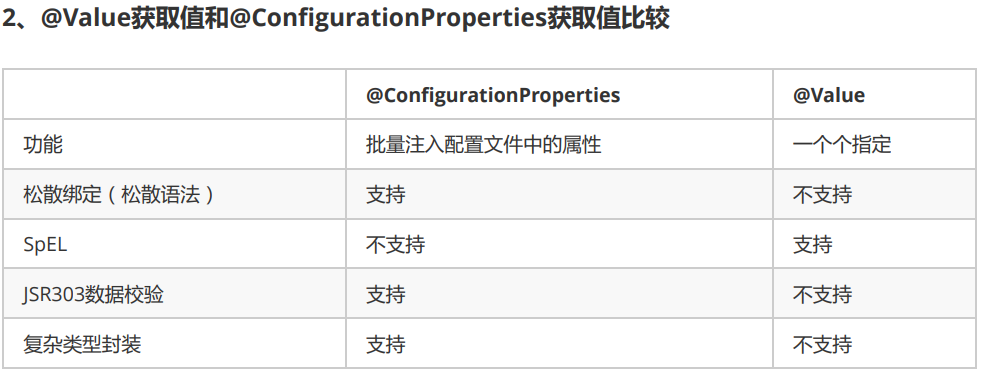
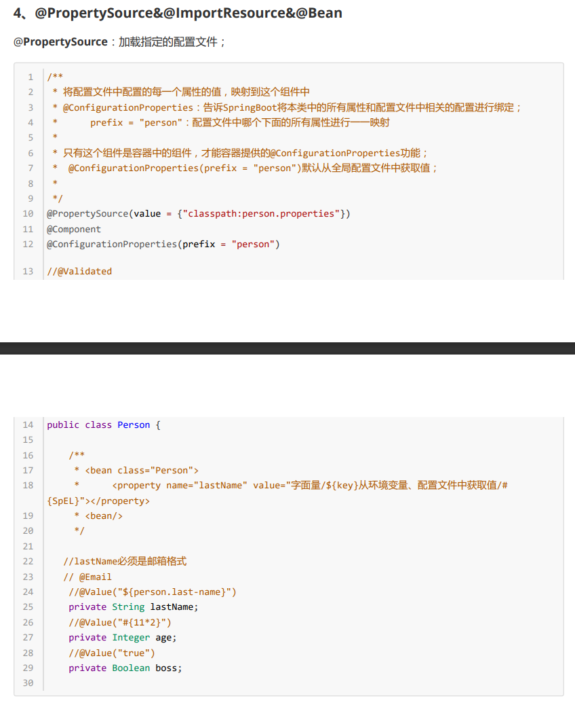
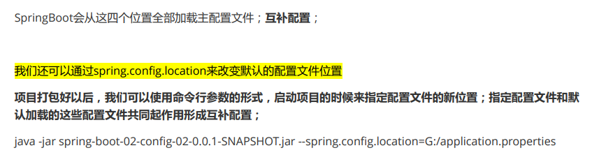
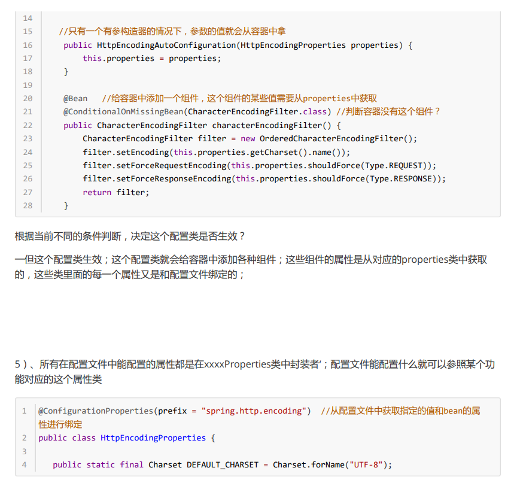
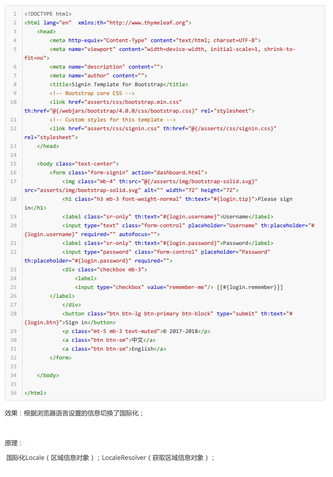
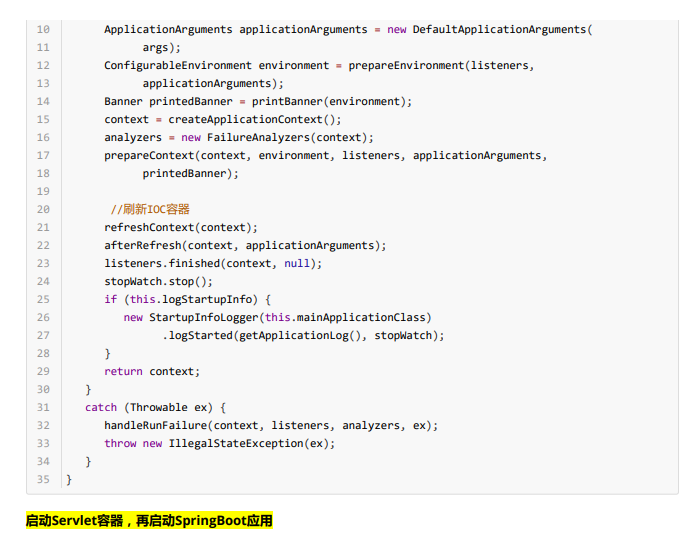
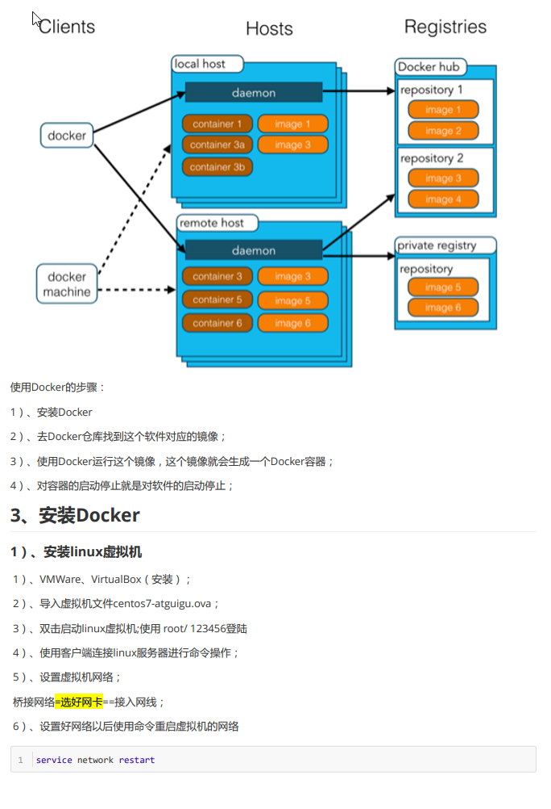

# 1. springboot入门

## 简介

简化spring开发的一个框架

整个spring技术栈的一个大整合

j2ee开发的一站式解决方案

## 微服务

架构风格

一个应用是一组小型服务; 可以通过http的方式进行互通

单体应用: all in one

微服务: 跨服务的功能元素的动态组合(每一个功能元素都是一个可独立替换和独立升级的复制)

## POM文件

### 1. 父项目

springboot的版本仲裁中心

以后我们导入依赖默认的是不需要写版本(没在dependences的要写)

### 2. 导入的依赖

spring-boot-starter-web

starter就是springboot的场景启动器; 帮我们导入了web模块正常运行所依赖的组件

springboot将索要的功能场景抽取出来, 做成一个的starter(启动器) ,只需要引入启动器, 依赖就会导入进来. 需要用什么就导入什么启动器

## 主程序类:

@SpringBootApplication: 标注在某个类上说明这个类是SpringBoot的主配置类, SpringBoot就应该运行这个类的main方法来启动SpringBoot应用

@SpringBootConfiguration: SpringBoot的配置类;

​	标注在某个类上, 标识这是一个SpringBoot的配置类

​	@Configuration:配置类上来标注这个

​		配置类=====配置文件: 配置类也是容器中的一个组件: @Component

@EnableAutoConfiguration: 开启自动配置功能'

​	以前我们要配置, SpringBoot帮我们自动配置; 这个注解可以告诉SpringBoot开启自动配置功能; 这样的自动配置才能成功;

@AutoConfigurationPackage: 自动配置包

​	@Import(AutoConfigurationPackage.Registrar.class)

​		spring的底层注解@import, 给容器导入一个组件; 导入的组件由AutoConfigurationPackage.Registrar.class

​			**将主要配置类(@SpringBootApplication标注的类)的所在包下面的所有子包里面的所有组件扫描到Spring容器**

​	@import(EnableAutoConfigurationImportSelector.class);

​		给容器导入组件?

​		EnableAutoConfigurationImportSelector: 导入那些选择器  

​			将所有需要导入的咱们以全类名的方式返回; 这些组件就会被添加到容器中;

​			会给容器中导入非常多的自动配置类(xxxxxAutoConfiguration);就是给容器中导入这个场景所需要的所有组件, 并配置好这些组件

有了自动配置类, 免去了我们手动编写配置注入功能组件等工作

​		SpringFactoriesLoader.loadFactoryNames(EnableAutoConfiguration.class,错啦ssLoade);

​		**从类路径下的META-INF/spring.factories中获取EnableConfiguration指定的值, 将这些值作为自动配置类导入到容器中, 自动结尾之类就生效, 帮我们自动配置工作;** 以前我们需要自己配置的东西, 自动配置类帮我们做了.

J2EE的整体整合解决方案和自动配置都在spring-boot-AutoConfiguration-1.5.9.RELEASE.jar里面

# 2. springboot配置

## 1. 配置文件

全局配置文件(以下两种, 文件名固定)

- application.properties
- application.yml

配置文件的使用: 修改SpringBoot自动配置的默认值;     

## 配置文件值注入使用:

将配置文件中配置的每一个属性的值, 映射到这个组件中

**@ConfigurationProperties:** 告诉SpringBoot将本类的所有属性和配置文件中相关的配置进行绑定(只有这个组件是容器中的组件, 才能使用容器提供的@ConfigurationProperties功能)

导入了配置文件处理器jar包, 就

可以在写yml配置文件的时候会出现提示

配置文件yml还是properties都能获取到配置文件的值

1. 如果业务逻辑要获取某一项的值, 就用@Value
2. 如果专门编写一个jav aBean来映射配置文件值, 就直接顺颂@ConfigurationProperties

## Profile文件

给不同环境提供不同的配置支持(开发/运行/测试)

### 1. 多Profile文件

在主配置文件编写的时候, 文件名可以是 application-{profile}.yml

默认使用application.yml配置

### 2. YML多文档块方式

### 3.激活配置文件

1. 在配置文件中指定 spring.profiles.active=dev

2. 命令行:

   java -jar spring-boot-02-config-0.0.1-SNAPSHOT.jar --spring.profiles.active=dev;

   可以在测试的时候, 配置传入命令行参数

3. 虚拟机参数

   -Dspring.profile.active=dev

   

   

   

   ## 自动配置原理

   配置文件到底能写什么?怎么写? 自动配置原理;

   配置文件能配置的属性参考官方文档

   ### 原理:

   1. springboot启动的时候加载了主配置类, 开启了自动配置功能 **@EnableAutoConfiguration**

   2. @EnableAutoConfiguration的作用:

      - 利用EnableAutoConfigurationImportSelector给容器中导入一些组件

      - 可以查看selectImports()方法的内容:

      - List<String> Configuration=getCandidateConfigurations(annotationMetadata, attributes);获取候选的配置

      

      

      

      

      

      ### **我的理解:** 

      springboot启动时候用**@EnableAutoConfiguration**, 里面有底层注解使用了**SpringFactoryLoad.loadFactoryNames**扫描所有依赖的jar包                                                                                                                                                                                                                                                                                                          下的**META-INF/spring.factories**找到其中写有可以自动配置的类名, 封装成一个大的properties文件, 再从properties文件中逐个将这些**配置类**名对应的值加入到容器中

      #### 	**加入过程如下:** 

      	1. 加载与properties类绑定了的**配置类**--->2. 找到绑定了的**properties类**-->properties类与application.yml有映射关系(读取了配置里面的值), 然后第一个**配置类**进行了给spring容器添加组件的操作

# 3. Springboot与日志

## 1. 日志框架

## 2. SLF4j使用

1. ### 如何在系统中使用SLF4j

   开发时候, 日志记录方法调用, 不应该直接调用日志的实现类, 而是应该调用日志抽象层里面的方法, 

   给系统里面导入slf4j的jar和logback实现jar

   

   

   2. ### 遗留问题

      

      

      

      

      

## 4. 日志使用

# 4. springboot与web开发

使用springboot

1. 创建springboot应用, 选中我们需要的模块

2. springboot默认配置好了场景, 只需要再配置文件中指定少量配置就可运行起来

3. 自己编写业务代码

   

   

   

   

   

   

   

   

   

   

   

   

   

   

   

   

   

    

   

   

   

   

   

   

   

   

   

   

   

   

   

   

   

   

   

   

   

   

   

   

   

   

   

   

   

   

   

# 5. springboot与docker

# 6. springboot与数据访问

# 7. springboot启动配置原理

# 8. springboot自定义starters

#

