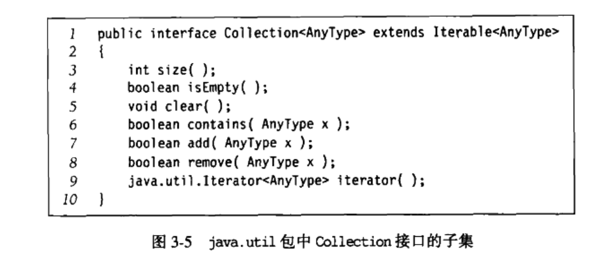
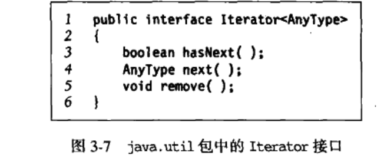
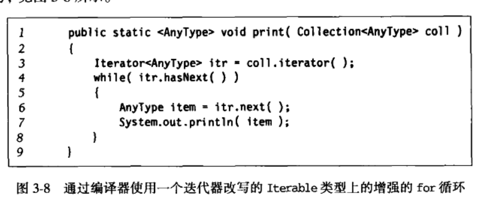
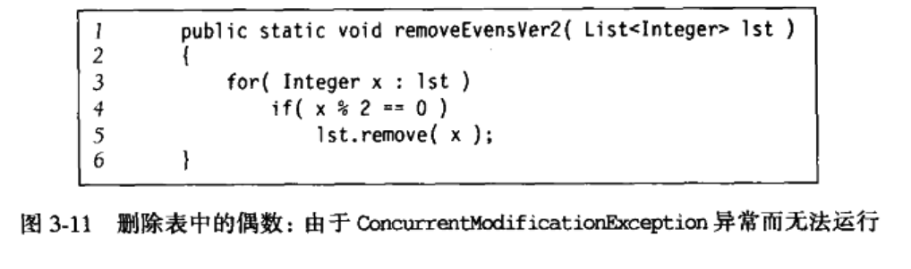
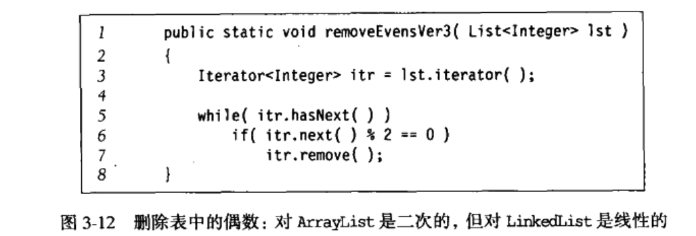
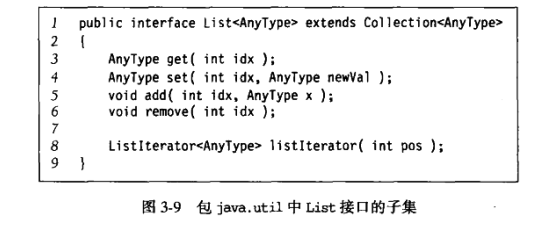
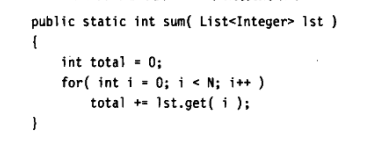
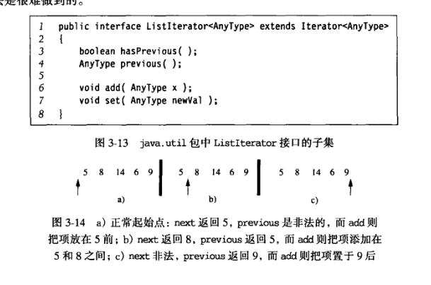

# 1、表、栈、队列

## 1) 抽象数据类型（ADT)

带有一组抽象操作的对象，例如集合ADT（collection），可以是有add、remove、contains、find、union等操作。

### 1、java Collections的API



### 2、迭代器接口

实现Iterator接口的集合必须提供一个称为iterator的方法，该方法返回一个Iterator类的对象，这是一个接口。



迭代的思路是：通过iterator方法，访问集合的下一项，用hasNext()来告诉程序是否有下一项，同时提供了remove()方法来对当前迭代的对象的删除操作。

以下可见增强for循环的的实际执行流程：



对于删除集合中的元素，我们有两种流行的方法进行删除，一个是使用迭代器的remove来进行删除，一个是使用Collection接口的remove来进行删除，一般来说，**使用Iterator的remove会更好**

1. **迭代器删除的效率一般比正常remove()要高**


​	例如上图的程序，ArrayList的话，删除操作是昂贵的（数组重排），对于LinkedList的话，remove()里面必须要用get()寻找下标，所以删除也是昂贵的（二次）


使用迭代器删除的话，对于LinkedList来说，迭代到哪个节点就删除哪个节点就行了，所以效率有了提高，但是对于ArrayList来说，效率仍然是不算高的，因为删除依旧需要重排数组。

2. **使用迭代器删除可以避免数组结构改变的产生的程序异常**



例如这样，使用List的remove()删除了元素，List的结构改变了，那么迭代器其实是找不到当前元素在数组的位置了，无法正常迭代了，会报异常。



但是使用迭代器的remove方法是可以进行正常删除的，因为迭代器的remove方法在当前位置只能调用一个，删除了一个元素后迭代器仍然能够或者一个正确的迭代器。

### 3、List接口、ArrayList和LinkedList

List接口作为一种ADT，其继承了Collection接口，包含Collection接口的所有方法，外加其他一些其他的方法。



对List接口而言，ArrayList和LinkedList的区别如下：

1. 对于插入元素，ArrayList效率一般比LinkedList低，因为需要进行数组的整体挪动（头插或者随机插入）

2. 对于循环遍历然后get，ArrayList的效率比LinkedList高，因为LinkedList的get()操作是N（使用迭代器可以优化到和ArrayList效率一样高）

   

### 4、ListIterator接口

ListIterator接口拓展了List的Iterator功能。具有previous()和hasPrevious()让表的往前遍历称为了可能。



### 5、手写ArrayList

```java
package Collections;

import java.util.Iterator;
import java.util.NoSuchElementException;

/**
 * @author xiaojq
 * @date 2022/11/21 10:16
 * @description 手写ArrayList
 */
public class MyArrayList<T> implements Iterable<T> {
    private static final int DEFAULT_CAPACITY = 10;

    private int theSize;
    private T[] theItems;

    public MyArrayList() {
        clear();
    }

    public void clear() {
        theSize = 0;
        ensureCapacity(DEFAULT_CAPACITY);
    }

    public int size() {
        return theSize;
    }

    public boolean isEmpty() {
        return size() == 0;
    }

    public T get(int idx) {
        if (idx < 0 || idx >= size()) {
            throw new ArrayIndexOutOfBoundsException();
        }
        return theItems[idx];
    }

    public T set(int idx, T newVal) {
        if (idx < 0 || idx >= size()) {
            throw new ArrayIndexOutOfBoundsException();
        }
        T old = theItems[idx];
        theItems[idx] = newVal;
        return old;
    }

    private void ensureCapacity(int newCapacity) {
        if (newCapacity < theSize) {
            return;
        }
        T[] old = theItems;
        theItems = (T[]) new Object[newCapacity];
        for (int i = 0; i < size(); i++) {
            theItems[i] = old[i];
        }
    }

    public boolean add(T x) {
        add(size(), x);
        return true;
    }

    public void add(int idx, T x) {
        if (theItems.length == size()) {
            ensureCapacity(size()*2+1);
        }
        for (int i=theSize;i>idx;i--){
            theItems[i]=theItems[i-1];
        }
        theItems[idx]=x;
        theSize++;
    }
    public T remove(int idx){
        T removeItem=theItems[idx];
        for(int i=idx;i<size()-1;i++){
            theItems[i]=theItems[i+1];
        }
        theSize--;
        return removeItem;
    }

    @Override
    public Iterator<T> iterator() {
        return new ArrayListIterator();
    }
    private class ArrayListIterator implements Iterator<T>{
        private int current  =0;

        @Override
        public boolean hasNext() {
            return current<size();
        }

        @Override
        public T next() {
            if(!hasNext()){
                throw new NoSuchElementException();
            }
            return theItems[current++];
        }

        @Override
        public void remove() {
            MyArrayList.this.remove(--current);
        }
    }
}
```

### 6、手写LinkedList

对于LinkedList，使用双链表来实现，保留一个头指针节点和一个尾指针节点。

```java
package Collections;

import java.util.ConcurrentModificationException;
import java.util.Iterator;
import java.util.NoSuchElementException;

/**
 * @author xiaojq
 * @date 2022/11/22 9:42
 * @description 手写LinkedList
 */
public class MyLinkedList<T> {
    private int theSize;
    // 提供操作计数，如果和迭代器中的技术不一致则说明出现了LinkedList结构的变动，非法
    private int modCount = 0;
    private Node<T> beginMarker;
    private Node<T> endMarker;

    public MyLinkedList() {
        clear();
    }

    private <T> void clear() {
        beginMarker = new Node<>(null, null, null);
        endMarker = new Node<>(null, beginMarker, null);
        beginMarker.next = endMarker;
        theSize = 0;
        modCount++;
    }

    public int size() {
        return theSize;
    }

    public boolean isEmpty() {
        return size() == 0;
    }

    public boolean add(T x) {
        add(size(), x);
        return true;
    }

    public void add(int idx, T x) {
        addBefore(getNode(idx), x);
    }

    public T get(int idx) {
        return getNode(idx).data;
    }

    public T set(int idx, T newVal) {
        Node<T> p = getNode(idx);
        T oldVal = p.data;
        p.data = newVal;
        return oldVal;
    }

    public T remove(int idx) {
        return remove(getNode(idx));
    }
    // add和remove都将modCount计数加一下
    private void addBefore(Node<T> p, T x) {
        Node<T> newNode = new Node<T>(x, p.prev, p);
        newNode.prev.next = newNode;
        p.prev = newNode;
        theSize++;
        modCount++;
    }
    // add和remove都将modCount计数加一下
    private T remove(Node<T> p) {
        p.next.prev = p.prev;
        p.prev.next = p.next;
        theSize--;
        modCount++;
        return p.data;
    }
    // 或得节点，从头结点遍历或者从尾节点遍历
    private Node<T> getNode(int idx) {
        Node<T> p;
        if (idx < 0 || idx > size()) {
            throw new IndexOutOfBoundsException();
        }
        if (idx < size() / 2) {
            p = beginMarker.next;
            for (int i = 0; i < idx; i++) {
                p = p.next;
            }

        } else {
            p = endMarker;
            for (int i = size(); i > idx; i--) {
                p = p.prev;
            }
        }
        return p;

    }

    public Iterator<T> iterator() {
        return new LinkedListIterator();
    }

    private static class Node<T> {
        public T data;
        public Node<T> prev;
        public Node<T> next;

        public Node(T d, Node<T> p, Node<T> n) {
            data = d;
            prev = p;
            next = n;
        }
    }

    ;

    private class LinkedListIterator implements Iterator {
        private Node<T>  current = beginMarker.next;
        private int expectedModCount =modCount;
        // 保证只能删除一次
        private boolean okToRemove =false;

        @Override
        public boolean hasNext() {
            return current!=endMarker;
        }
        // 迭代器指针往后面移动一个位置后给出
        @Override
        public Object next() {
            if(modCount!=expectedModCount){
                throw new ConcurrentModificationException();
            }
            if(!hasNext()){
                throw new NoSuchElementException();
            }

            T nextItem =current.data;
            current=current.next;
            okToRemove =true;
            return nextItem;
        }
        // 删除需移动迭代器指针，更新okToRemove，更新ModCount
        public void remove(){
            if(modCount!=expectedModCount){
                throw new ConcurrentModificationException();

            }
            if(!okToRemove){
                throw new IllegalStateException();
            }
            MyLinkedList.this.remove(current.prev);
            okToRemove=false;
            expectedModCount++;
        }
    }

}
```