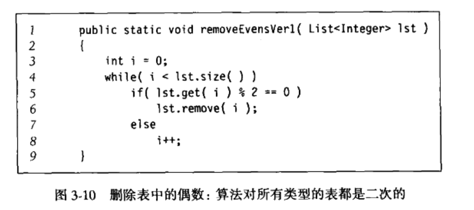
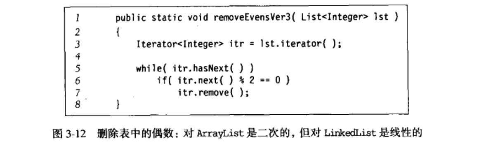

# 1、表、栈、队列

## 1) 抽象数据类型（ADT)

带有一组抽象操作的对象，例如集合ADT（collection），可以是有add、remove、contains、find、union等操作。

### 1、java Collections的API

### 2、迭代器接口

实现Iterator接口的集合必须提供一个称为iterator的方法，该方法返回一个Iterator类的对象，这是一个接口。

迭代的思路是：通过iterator方法，访问集合的下一项，用hasNext()来告诉程序是否有下一项，同时提供了remove()方法来对当前迭代的对象的删除操作。

以下可见增强for循环的的实际执行流程：

对于删除集合中的元素，我们有两种流行的方法进行删除，一个是使用迭代器的remove来进行删除，一个是使用Collection接口的remove来进行删除，一般来说，**使用Iterator的remove会更好**

1. **迭代器删除的效率一般比正常remove()要高**

​	例如上图的程序，ArrayList的话，删除操作是昂贵的（数组重排），对于LinkedList的话，remove()里面必须要用get()寻找下标，所以删除也是昂贵的（二次）

使用迭代器删除的话，对于LinkedList来说，迭代到哪个节点就删除哪个节点就行了，所以效率有了提高，但是对于ArrayList来说，效率仍然是不算高的，因为删除依旧需要重排数组。

2. **使用迭代器删除可以避免数组结构改变的产生的程序异常**

例如这样，使用List的remove()删除了元素，List的结构改变了，那么迭代器其实是找不到当前元素在数组的位置了，无法正常迭代了，会报异常。

但是使用迭代器的remove方法是可以进行正常删除的，因为迭代器的remove方法在当前位置只能调用一个，删除了一个元素后迭代器仍然能够或者一个正确的迭代器。