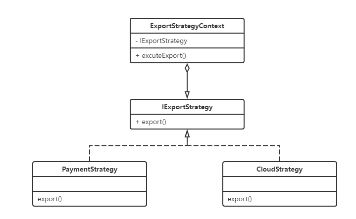
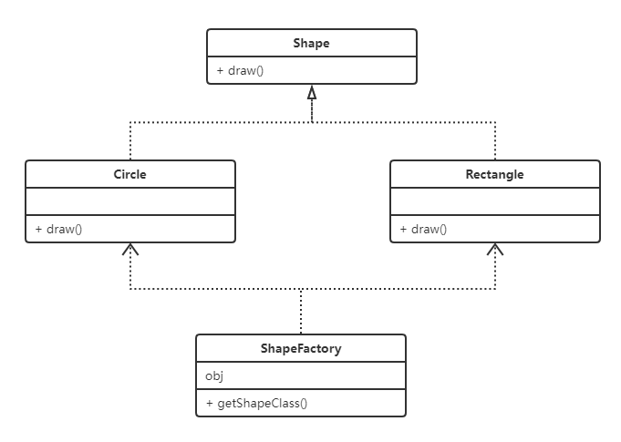
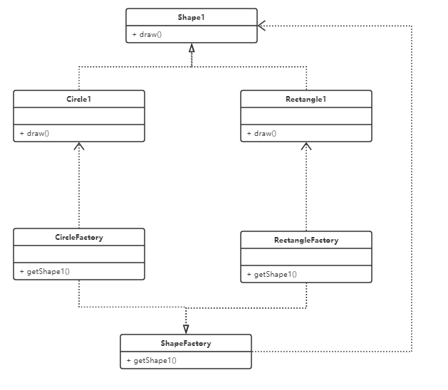
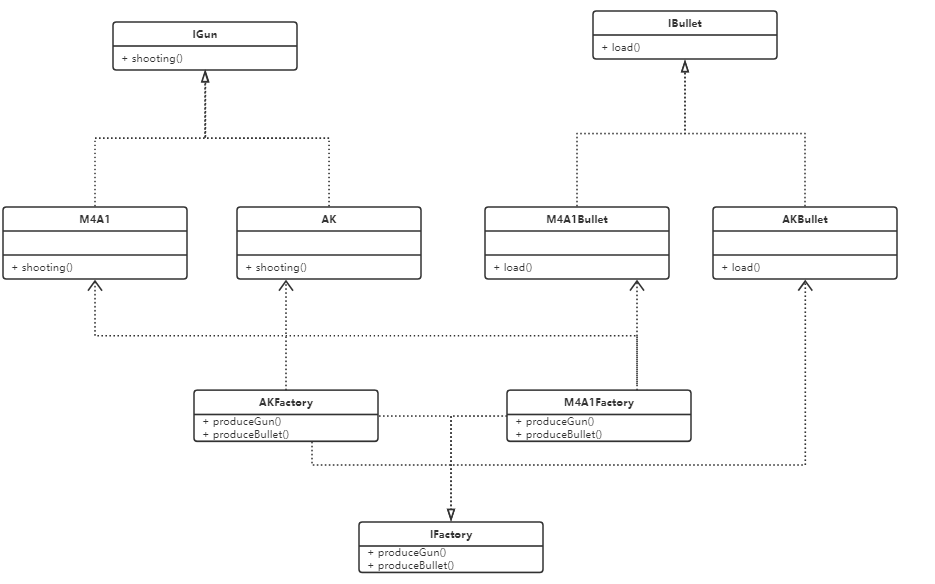

# 设计模式学习笔记

------

## 策略模式

### 简单策略模式

- 策略模式每个策略封装在一个类中, 每种策略对应一种场景, 策略之间可以替换
  - 例如下班回家, 有骑单车/坐公交/打车三种策略
- 策略模式中有三种角色
  - 抽象策略类: 通常是接口或者抽象类
  2. 具体策略类: 实现了抽象策略类中的策略方法, 封装了相关的算法和行为
  3. 环境上下文: 持有一个策略类的引用, 暴露给客户端调用的类
- 优缺点
  3. 优点: 算法可以自由切换/避免使用多重条件判断/拓展性好
  3. 缺点: 策略类会增多/所有策略类都需要向外暴露
- 常用场景
  3. 如果系统中有许多类, 区别只在行为, 策略模式可以动态让一个对象在许多行为中选择一种行为
  3. 一个系统需要动态在几种算法中选择一种
  3. 如果一个对象有许多行为,如果不用恰当的策略, 那就只能写多重条件语句来判断
3. UML类图



- 策略模式代码

```java

/**
 * @description 导出策略接口
 */
public interface IExportStrategy {
    /**
     * 导出公共方法
     */
    String export(List<Integer> ids);
}
/**
 * 收款单具体策略类
 */
class PaymentExportStrategy implements IExportStrategy{
    @Override
    public String export(List<Integer> ids) {
        String msg="这是收款单导出";
        System.out.println("这是收款单导出");
        return msg;
    }
}
class CloudExportStrategy implements IExportStrategy{
    @Override
    public String export(List<Integer> ids) {
        String msg="这是云订单导出";
        System.out.println("这是云订单导出");
        return msg;
    }
}
/**
 * 导出策略上下文
 */
class ExportStrategyContext {
    public static final int PAYMENT=0;
    public static final int CLOUD=1;
    private IExportStrategy exportStrategy;
    /**
     * 结合简单工厂模式, 避免客户端创建创建策略类,
     * 但是不可避免得破坏了开闭原则, 新增需要在contexrt中写case
     *提供一个根据传入参数创建具体策略类的set方法
     */
    public void setExportStrategy(int mode) {
        switch(mode){
            case PAYMENT:
                this.exportStrategy=new PaymentExportStrategy();
                break;
            case CLOUD:
                this.exportStrategy=new CloudExportStrategy();
                break;
        }
    }
    /**
     *暴露执行策略类中的具体方法
     */
    public String executeExport(List<Integer> ids){
       return this.exportStrategy.export(ids);

    }
    public static void main(String[] args) {
        ArrayList<Integer> ids = new ArrayList<>();
        ids.add(6483);
        ids.add(1234);
        //创建策略上下文
        ExportStrategyContext exportStrategyContext = new ExportStrategyContext();
        //根据参数初始化策略对象
        exportStrategyContext.setExportStrategy(PAYMENT);
        //执行策略
        exportStrategyContext.executeExport(ids);
        exportStrategyContext.setExportStrategy(CLOUD);
        exportStrategyContext.executeExport(ids);
    }
}
```

### 策略模式的变种-->策略枚举

- 单纯的策略模式需要写context和一个个策略类, 过于繁琐和难理解, 可以将策略和Java中的枚举绑定起来, 给枚举定义一个抽象方法, 使用枚举调用其中的具体策略, 大幅度简洁策略模式的代码

- 在策略枚举中, 不再具有context上下文, 具体的策略也跟枚举所绑定, 客户端可以直接通过枚举来调用其中的具体策略

- 代码展示

  ```java
  
  /**
   * @description 导出的策略枚举
   */
  enum ExportMode {
      EXPORT_PAYMENT(0){
          @Override
          public String export() {
              String msg="这是收款单导出";
              System.out.println("这是收款单导出");
              return msg;
          }
      },
      CLOUD_EXPORT(1) {
          @Override
          public String export() {
              String msg="这是云订单导出";
              System.out.println("这是云订单导出");
              return msg;
          }
      };
      private int mode;
      public int getMode() {
          return mode;
      }
      ExportMode(int mode) {
          this.mode = mode;
      }
      /**
       * 通过传入的值获取枚举常量
       */
      public static ExportMode  getExportModeByMode(int mode){
          return Arrays.stream(values())
                  .filter(exportMode ->exportMode.getMode()==mode)
                  .findFirst()
                  .orElseThrow(NoSuchElementException::new);
      }
  
      /**
       * 定义策略的抽象方法, 由具体策略去实现
       */
      abstract String export();
  
  }
  public class IExportEnumStrategy {
      public static void main(String[] args) {
          int variable=1;
          ExportMode.getExportModeByMode(variable).export();
      }
  }
  ```

------

## 工厂模式

### 简单工厂模式

- 工厂模式的好处
  - 解耦: 把对象的创建和使用过程分开
  - 降低代码的重复:如果创建对象的过程很复杂, 需要一定的代码量, 而且很多地方需要用到, 那么就会有很多的重复代码
  - 降低维护成本: 由于创建过程由工厂统一进行管理, 所以发生业务逻辑的变化, 不需要找到所有创建某个对象去逐个修正, 只需要在工厂里修改即可, 降低维护成本.

- 工厂模式的场景
  - 需要创建的对象比较少
  - 客户端不关心对象的创建过程

- 简单工厂的角色分配
  - 工厂角色: 简单工厂模式的核心, 负责创建所有实例的内部逻辑, 工厂可以被外界直接调用,创建所需的产品对象
  - 抽象产品角色: 简单工厂模式所创建的所有对象的父类, 它负责描述所有实例所有公共接口
  - 具体产品角色: 简单工厂模式的创建目标, 所有创建的对象都是充当这个角色的某个具体类的实例

- UML类图



代码展示

```java

/**
 * @author xiaojq
 * @date 2022/9/26 15:55
 * @description 绘制图形的形状接口
 */
public interface Shape {
    void draw();
}

// 具体图形类
class Circle implements Shape {

    @Override
    public void draw() {
        System.out.println("画一个圆");
    }
}

// 具体图形类
class Rectangle implements Shape {

    @Override
    public void draw() {
        System.out.println("画一个正方形");
    }
}


// 创建简单工厂类
class ShapeFactory {
    //    // 普通getShape方式获取对象, 因为每次新增产品类都要修改if-else, 不符合开闭原则
//    public static Shape getShape(String shapeType){
//        if(shapeType==null){
//            return null;
//        }
//        if(shapeType.equalsIgnoreCase("circle")){
//            return new Circle();
//        }
//        if(shapeType.equalsIgnoreCase("rectangle")){
//            return new Rectangle();
//        }
//        return null;
//    }
    public static Object getShapeClass(Class<? extends Shape> clazz) throws ClassNotFoundException, IllegalAccessException, InstantiationException {
        Object obj = null;
        // 通过反射解决简单工厂每次都需要增加产品类的弊端, 传入的全限定类名可以通过配置文件的方式进行配置
        obj = Class.forName(clazz.getName()).newInstance();
        return obj;
    }


    public static void main(String[] args) throws IllegalAccessException, InstantiationException, ClassNotFoundException {
        // 普通方式通过工厂获取对象, 不符合开闭原则
//        Shape circle = ShapeFactory.getShape("circle");
//        circle.draw();
//        Shape rectangle = ShapeFactory.getShape("rectangle");
//        rectangle.draw();

        // 反射方式获取对象, 符合开闭原则, 全限定类名可以通过配置文件的形式进行获取
        Circle circle = (Circle) ShapeFactory.getShapeClass(Circle.class);
        circle.draw();
        Rectangle rectangle = (Rectangle) ShapeFactory.getShapeClass(Rectangle.class);
        rectangle.draw();
    }
}
```

### 工厂方法模式

- 工厂方法模式是用得最多的模式, 一般项目中存在的都是这个模式
- 工厂方法模式是简单工厂的一种深化, 工厂方法模式中, 不再提供统一的工厂类来创建所有的对象, 而是针对不同的对象提供不同的工厂,(每一个对象都有一个对应的工厂)

- 使用场景:
  - 创建对象不需要直到具体的类名, 只需要知道他的工厂

- 优缺点:
  - 简单工厂需要一个大而全的工厂类, 新增一个产品需要修改工厂类, 违反了开闭原则, 工厂方法给每一个产品都提供了一个工厂, 遵循了开闭原则
  - 相比简单工厂, 新增一个产品不仅需要新增产品对象, 还要给定配套的工厂类, 类变多了
  - 相比简单工厂的修改工厂类修改选择判断, 工厂方法将选择产品对象的判断上升到了客户端, 客户端需要选择一个工厂类来生成对象, 没有本质的解决选择判断的问题(可以用反射+配置文件来解决)
  - 个人感觉(仅针对当前阶段): 工厂方法模式还没有简单工厂+反射获取产品对象的形式来得直接

- UML类图



- 代码展示

```java
package Factory;

/**
 * @author xiaojq
 * @date 2022/9/26 15:55
 * @description 绘制图形的形状接口
 */
interface Shape1 {
    void draw();
}

// 具体图形类
class Circle1 implements Shape1 {

    @Override
    public void draw() {
        System.out.println("画一个圆");
    }
}

// 具体图形类
class Rectangle1 implements Shape1 {

    @Override
    public void draw() {
        System.out.println("画一个正方形");
    }
}
// 抽象工厂接口
interface Factory{
    public Shape1 getShape1();
}
// 圆的工厂类
class CircleFactory implements Factory{


    @Override
    public Shape1 getShape1() {
        return new Circle1();
    }
}
// 方形的工厂类
class RectangleFactory implements Factory{

    @Override
    public Shape1 getShape1() {
        return new Rectangle1();
    }
}
public class FactoryMethod {
    public static void main(String[] args) {
        // 获取圆形工厂
        Factory circleFactory = new CircleFactory();
        // 圆形工厂获取圆形
        Shape1 shape1 = circleFactory.getShape1();
        shape1.draw();
    }

}
```

### 抽象工厂模式

- 抽象工厂模式是工厂方法模式的一种深化, 在抽象工厂模式中, 工厂类不仅仅能够生产一种产品, 而是能够生产一组的产品
- 使用场景
  - 客户端不需要直到它所创建对象的类
  - 需要一组对象共同完成某项功能, 并存在多组对象完成不同功能的情况(同属一个产品族的情况)
  - 系统结构稳定, 不会存在频繁增加对象(因为一旦增加就需要修改原有代码, 不符合开闭原则)
- 抽象工厂模式角色
  - 抽象工厂: 负责定义具体工厂的接口
  - 具体工厂:抽象工厂的实现子类, 负责生产一组产品
  - 抽象产品: 定义具体产品的接口
  - 具体产品: 所隐蔽的具体产品类
- 和工厂方法模式的区别:
- 抽象工厂模式是负责生产一套产品的(至少有两个产品), 而这些产品必须是有依赖或者组合的关系的, 而工厂方法模式是一个工厂类只能生产一个具体产品

- UML类图:(假设有两种枪, 每种枪对应一种子弹, 有生产AK的工厂(配套生产AK的子弹...)



- 代码展示

```java
package Factory;

/**
 * @author xiaojq
 * @date 2022/9/27 10:25
 * @description 抽象工厂模式
 */
// 枪的接口
interface IGun{
    void shooting();
}
// 子弹的接口
interface IBullet{
    void load();
}
// AK枪的实现类
class AKGun implements IGun{
    @Override
    public void shooting() {
        System.out.println("AK 射击");
    }
}
// M4A1枪的实现类
class M4A1Gun implements IGun{
    @Override
    public void shooting() {
        System.out.println("M4A1 射击");
    }
}
// AK子弹的实现类
class AKBullet implements IBullet{
    @Override
    public void load() {
        System.out.println("AKBullet 装弹");
    }
}
// M4A1子弹的实现类
class M4A1Bullet implements IBullet{
    @Override
    public void load() {
        System.out.println("M4A1 装弹");
    }
}
// 工厂接口
interface IProduceFactory {
    IGun produceGun();
    IBullet produceBullet();
}
// AK工厂接口实现类
class AKFactory implements IProduceFactory {
    @Override
    public IGun produceGun() {
        return new AKGun();
    }
    @Override
    public IBullet produceBullet() {
        return new AKBullet();
    }
}
// M4A1工厂接口实现类
class M4A1Factory implements IProduceFactory {
    @Override
    public IGun produceGun() {
        return new M4A1Gun();
    }
    @Override
    public IBullet produceBullet() {
        return new M4A1Bullet();
    }
}
public class AbstractFactory {
    public static void main(String[] args) {
        IProduceFactory akFactory=new AKFactory();
        IBullet bullet=akFactory.produceBullet();
        IGun gun=akFactory.produceGun();
        bullet.load();
        gun.shooting();
    }
}

```

### 使用简单工厂+反射优化抽象工厂

```java
package Factory.SimpleTo;


import java.util.ResourceBundle;

/**
 * @author xiaojq
 * @date 2022/9/27 11:22
 * @description 使用简单工厂模式改造抽象工厂模式
 */
// 枪的接口
interface IGun{
    void shooting();
}
// 子弹的接口
interface IBullet{
    void load();
}
// AK枪的实现类
class AKGun implements IGun {
    @Override
    public void shooting() {
        System.out.println("AK 射击");
    }
}
// M4A1枪的实现类
class M4A1Gun implements IGun {
    @Override
    public void shooting() {
        System.out.println("M4A1 射击");
    }
}
// AK子弹的实现类
class AKBullet implements IBullet {
    @Override
    public void load() {
        System.out.println("AKBullet 装弹");
    }
}
// M4A1子弹的实现类
class M4A1Bullet implements IBullet {
    @Override
    public void load() {
        System.out.println("M4A1 装弹");
    }
}
// 相对比与抽象工厂模式, 简化了大部分工厂类的编写, 相当于又回到了简单工厂模式,
// 通过一个简单的工厂, 读取配置文件反射读取生成的一组产品(对象)
class WeaponProduceFactory {
    // 此处应通过读取配置文件的形式, 将要反射实例化Gun和Bullet的全限定类名注入进来
//    private static final String GUN_CLASS_NAME="Factory.SimpleTo.AKGun"; // 或者M4A1Gun.class
//    private static final String BULLET_CLASS_NAME="Factory.SimpleTo.AKBullet";// 或者M4A1Bullet.class

    // 读取配置文件获取gun和bullet类的全限定类名, 后序使用反射实例化gun和bullet, 起到运行时决定实例化哪种类型的方式
   static final String GUN_CLASS_NAME=ResourceBundle.getBundle("Factory/SimpleTo/weapon").getString("gun");
   static final String BULLET_CLASS_NAME=ResourceBundle.getBundle("Factory/SimpleTo/weapon").getString("bullet");

    // 静态方式反射获取具体产品
    public static IGun getWeapon4Gun() throws ClassNotFoundException, IllegalAccessException, InstantiationException {
        return  (IGun) Class.forName(GUN_CLASS_NAME).newInstance();
    }
    public static IBullet getWeapon4Bullet() throws ClassNotFoundException, IllegalAccessException, InstantiationException {
        return  (IBullet) Class.forName(BULLET_CLASS_NAME).newInstance();
    }
}

public class SimpleToAbstractFactory {
    public static void main(String[] args) throws IllegalAccessException, InstantiationException, ClassNotFoundException {
        //客户端只管调用工厂类进行生产即可, 无须关心生产的是什么对象, 如何生产的
        IGun gun=WeaponProduceFactory.getWeapon4Gun();
        IBullet bullet=WeaponProduceFactory.getWeapon4Bullet();
        bullet.load();
        gun.shooting();


    }
}
```

配置文件

```properties
gun=Factory.SimpleTo.AKGun
bullet=Factory.SimpleTo.AKBullet
```