软件 = 程序 + 数据库 + 文档 + 服务 

定义: 人工/自动检测预期和实际结果差别,保证软件质量

目的: 发现错误(无法说明不存在,只能说明已出现)

原则: 尽早, 用例分为测试数据和预期结果, 专人测试, 包含合理输入条件和不合理输入条件, 严格执行计划排除随意性,

不等于程序测试, 贯穿整个开发周期

需求规格说明,概要设计说明,详细设计说明, 程序都是软件测试的对象

软件测试过程**V模型:** 

- 特点: 表明测试的不同级别,清晰展示测试和开发之间的关系

  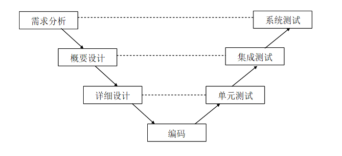

软件测试**W模型**:

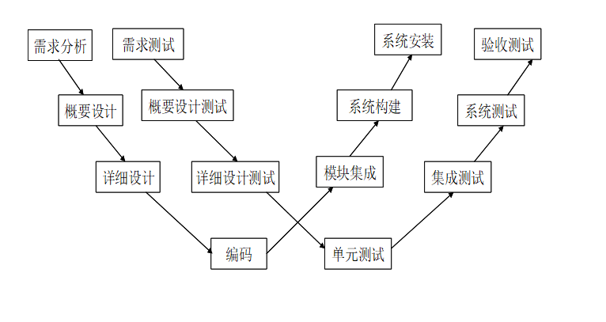

测试种类:

- 静态测试, 动态测试
- 白盒测试, 黑盒测试
- 单元测试, 系统测试, 集成测试
- 性能测试, 功能测试, 可靠性测试
- 自动测试, 手工测试

测试用例:

- 是一组测试输入.执行条件和预期结果, 目的满足一个特定目标, 如执行一条特定程序路径或者检验是否符合一个特定的需求

制定测试计划: 

测试原则: 

- 尽早开始

- 计划灵活性

- 测试计划简介易读

- 多渠道评审

- 计算测试计划投入

  

黑盒测试:

测试用例:

- 是一组测试输入.执行条件和预期结果, 目的满足一个特定目标, 如执行一条特定程序路径或者检验是否符合一个特定的需求
- 测试用例是执行的**最小实体**
- 对被测试程序需要 **多个测试用例**
- **测试用例是软件测试的关键**

1. 黑盒测试又称为功能测试, 把软件看成一个封闭的盒子,不考虑内部逻辑和内部结构,进行测试

2. 黑盒测试和 **软件如何实现无关**,如果实现发生变化, 黑盒测试用例仍然可用(可重用性, 面向回归测试)

   

等价类测试

1. 假设: 测试等价类的代表制,等效于这个等价类中其他值的测试
2. 思想: 把全部输入数据 **划分为若干个等价类** ,**在面我一个等价类中去一个数据** 来进行测试

有效等价类: 

- 对于 **需求说明	**来说是 **合理的	**,有意义的 **输入数据所构成的集合	**
- 利用它可以 **检验程序是否实现了预期的功能和特性**

无效等价类:

- 对于需求说明来说是不合理的, 没有意义的输入数据构成的集合
- 利用它可以检验程序对于无效数据的处理能力

设计

1. 分析**输入/输出**
2. 划分**有效等价类/无效等价类**

3. 设计测试用例, 使其尽可能多覆盖到 **有效等价类**
4. 设计测试用例, 使其覆盖到 **无效等价类**

设计过程如下:

1. 为等价类表中的每一个等价类分别规定一个唯一的编号
2. 设计一个新的测试用例,覆盖到尚未覆盖的有效等价类,重复
3. 设计一个新的测试用例,覆盖到尚未覆盖的无效等价类

边界值分析法

定义: 对 **输入或者输出边界值**进行测试的一种黑盒测试方法,通常作为等价类划分的补充, 这种情况下, **其测试用例来自等价类的边界	**

为何用? : 大量故障往往发生在输入定义域或者输出值域的边界上

如何确定边界值分析法设计测试用例?

1. **首先确定边界情况	**,通常输入输出等价类边界是着重测试的边界情况

2. 选取 **正好等于/刚刚大于/刚刚小于边界**的值作为测试数据,

   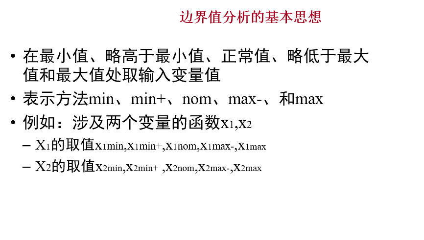

"单缺陷假设"

​	失效 **极少**是由两个或多个缺陷 **同时**发生引起的

"单缺陷"假设是边界值分析的关键假设

- 边界值分析或者测试用例方法

  1. 让所有变量取正常值, 只让一个变量取极值

  2. 对一个n变量函数, 边界值分析会产生4n+1个测试用例 

     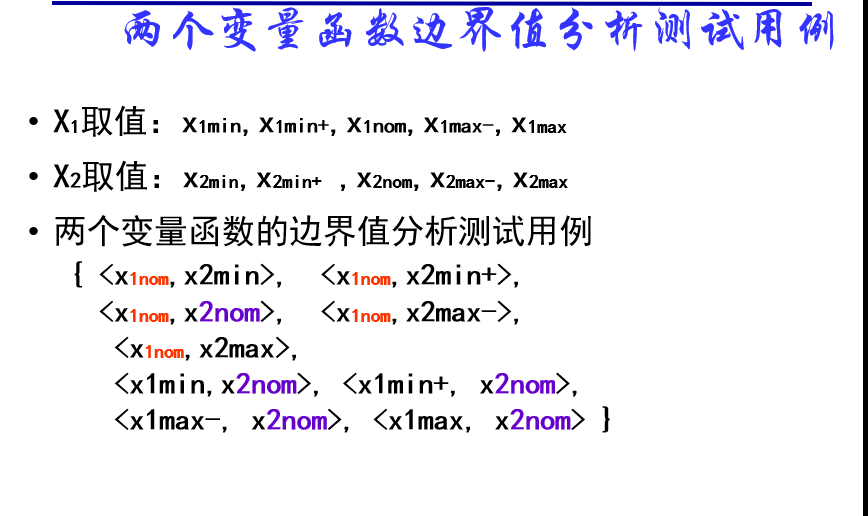

健壮性测试:

​	作为边界值分析的一个简单扩充, 对于n个变量的函数采用健壮性测试需要**6n+1**个测试用例

判定表:

- 条件桩

  列出问题的所有条件

- 动作桩

  列出可能采取的操作

- 条件项

  列出条件桩的取值

- 动作项

  列出条件想各种取值下应该采取的动作

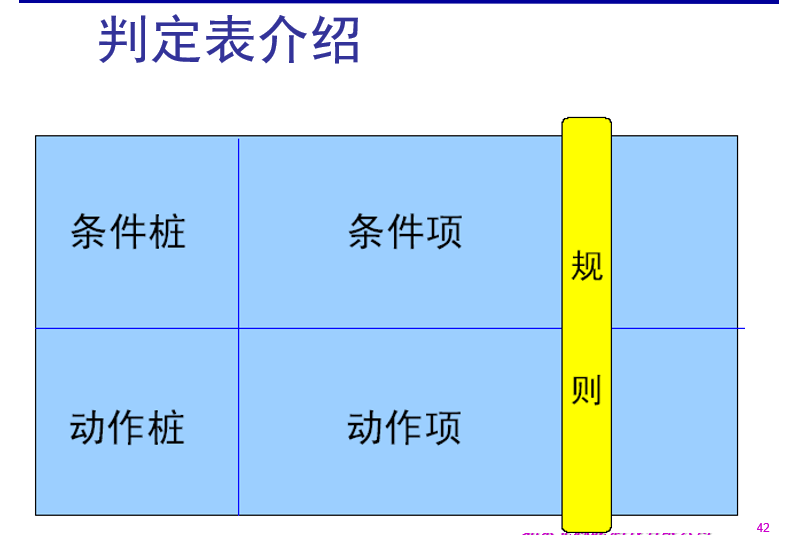

规则: 

- 任何一个条件组合的特定取值及其响应药执行的操作成为规则

- 在决策表中贯穿 **条件项和动作项**的一列就是一条规则

- 决策表中列出多少组条件取值, 也就有多少条规则, 即条件项和动作项有多少列]

  

规则合并;

- 规则合并就是决策表的 **简化**
- 两条或多条规则具有 **相同的动作**, 并且条件项存在 **相似的关系**,就可以将规则合并

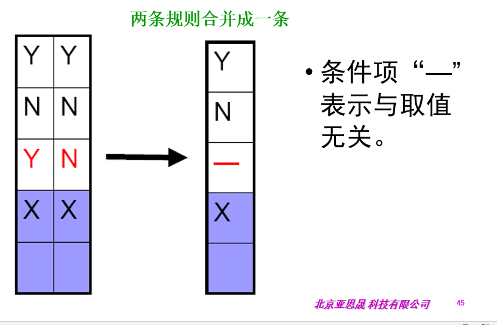

决策表建立步骤:

1. 列出所有条件桩和动作桩

2. 确定规则的个数

   假如有n个条件, 每个条件有两个取值(0,1),则有2的n次方种规则

3. 填入条件项
4. 填入动作项,得到初始决策表
5. 简化,合并相似规则(相同动作)

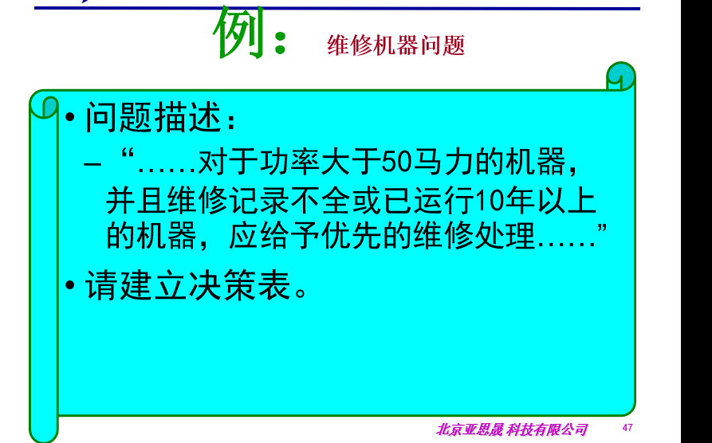

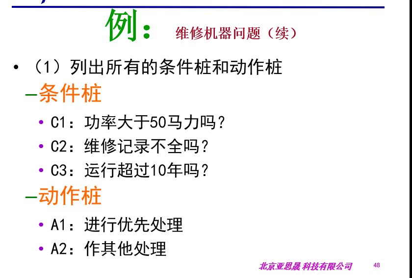

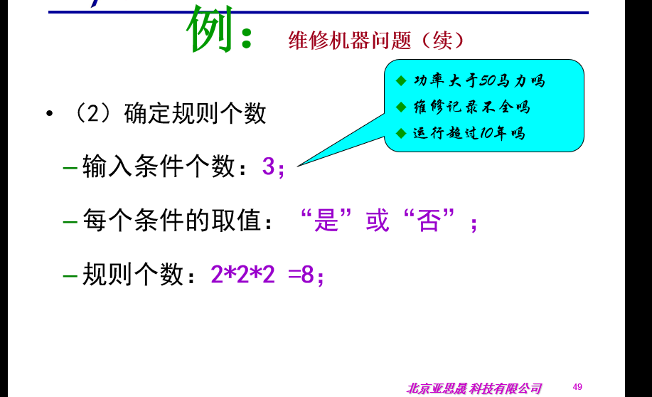

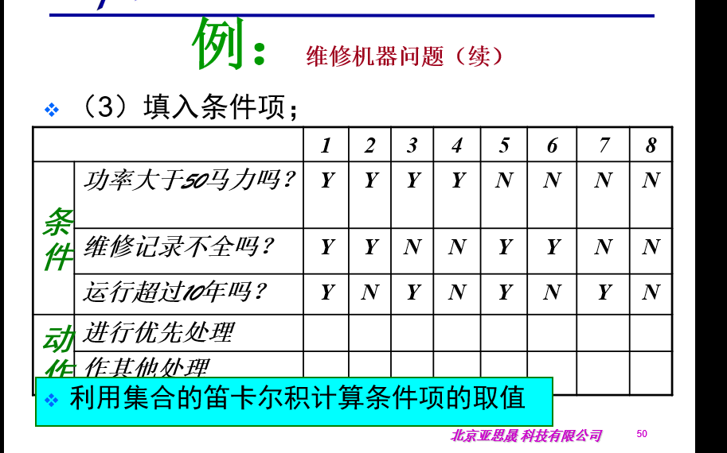

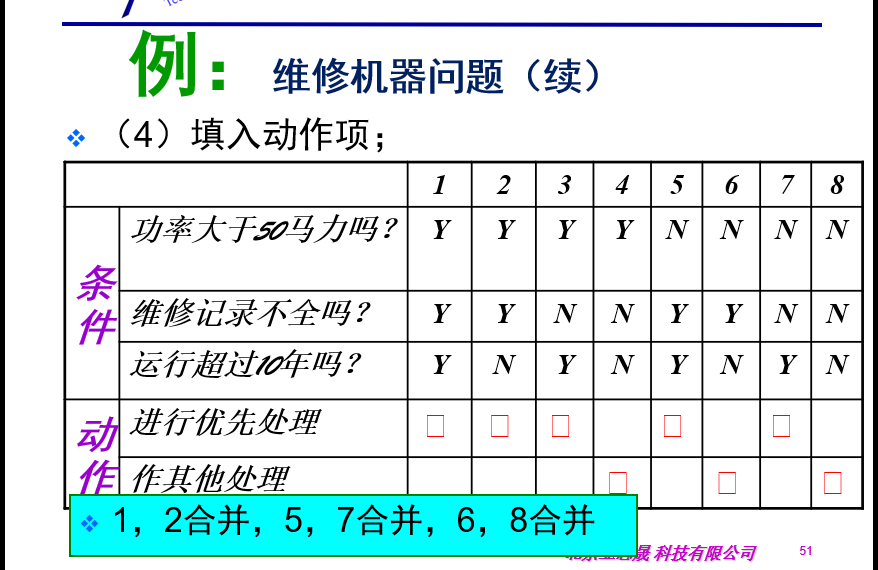

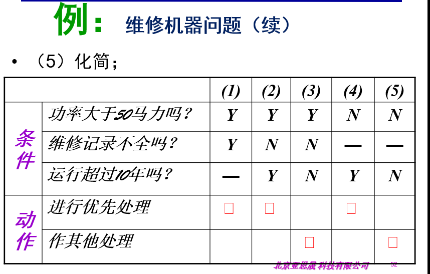

因果分析法

步骤:

1. 分析软件规格说明中 **哪些是原因** (即输入条件或者输入条件的等价类), **哪些是结果**(即输出条件),并给每个原因和结果都赋予一个标识符(找出原因和结果)

2. 分析软件规格说明中的予以, 找出 **原因和结果之间, 原因和原因之间**的对应关系, 根据这些关系 **画出因果图**(即: 标定因果关系)

3. 由于语法或环境限制, **有些原因于原因之间, 原因和结果之间的组合情况不可能出现**, 为了表明这些特殊情况, **在因果图上用一些记号表明页数或 限制条件**

4. 把因果图 **转换为决策表**

5. 根据 **决策表中的每一列设计测试用例**

   

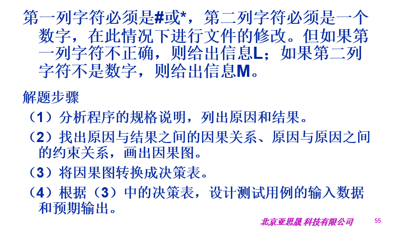

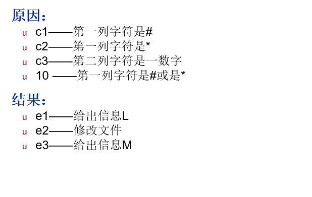

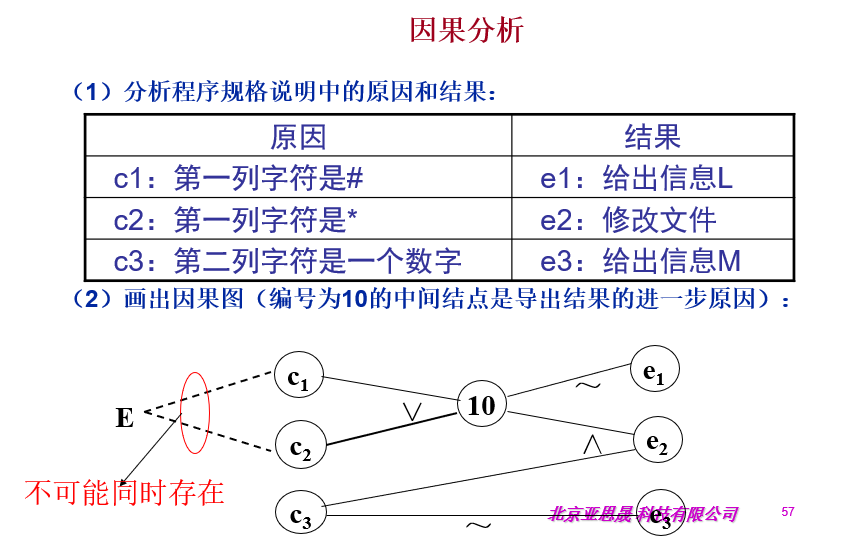

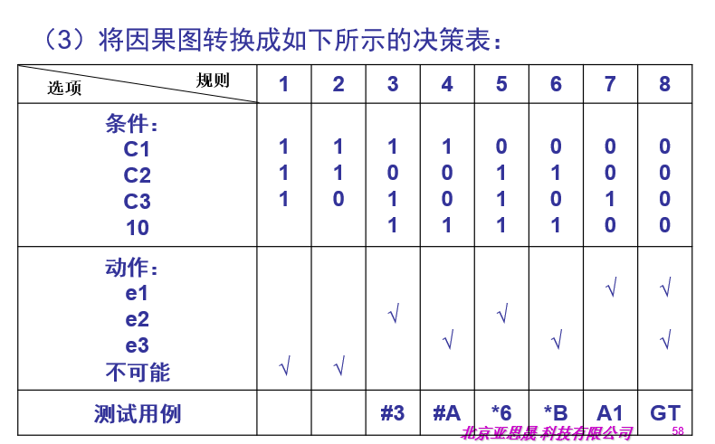

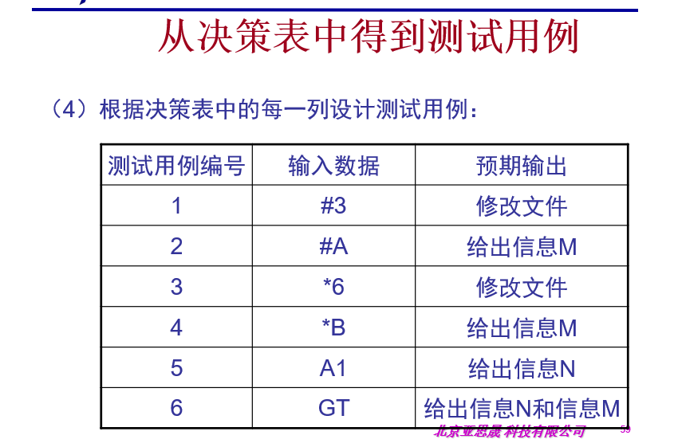

错误推测法:

​	基于经验和直觉推测程序中所有可能出现的错误, 从而针对性设计测试用例

参考原则:

1. 任何情况下都必须采取边界值分析法, 这种方法设计出来的测试用例发现程序错误能力最强
2. 必要时采取等价类划分法补充测试用例
3. 采取错误推断发再追加测试用例
4. 对照程序逻辑, 检查已经设计出来的测试用例逻辑覆盖程度, 如果没有达到要求的覆盖标准, 应该再补充更多的测试用例
5. 如果程序的功能说明中含有输入条件的组合情况, 则应该在一开始就选用因果图法

白盒测试

概念: 

 - 把测试对象堪称一个透明的盒子

 - 根据程序内部结果设计测试用例并且完成测试的一种测试方法

 - 白盒测试或者逻辑驱动测试

 - 基于应用代码的内部逻辑知识, 测试覆盖的全部代码,分支, 路径和条件

   

静态测试方法:

​	程序结构分析

- 正式审查
- 同时审查
- 公开陈述
- 检验

动态测试方法

​	逻辑覆盖

- 语句覆盖
- 判定覆盖
- 条件覆盖
- 判定-条件覆盖
- 条件组合

**路径覆盖**

白盒测试=**逻辑覆盖+路径覆盖**

覆盖标准:(从低到高排序)

1. **语句覆盖:** 一个比较弱的测试标准, 含义是:选择足够的测试用例, 让程序中每一个语句至少能执行一次
2. **判定覆盖(也成为分支覆盖)**: 执行足够的测试用例, 让程序中的每一个分支至少执行一次
3. **条件覆盖**: 执行足够的测试用例, 让程序中的每个判断每个条件的每个可能取值至少执行一次, 条件覆盖深入到判定中的每个条件, 但可能不能满足判定覆盖的要求

4. **判定/条件覆盖**: 执行足够的测试用例, 让判定中的每个条件取到各种可能的值, 让每个判定取到各种可能的结果

5. **条件组合覆盖** : 执行足够的例子, 让每个判定中条件对 各种可能组合都至少出现一次

   

**路径覆盖**:

- 基本思想: 设计所有测试用例,来覆盖程序中的**所有可执行路径**

可知, 人一种覆盖方法都不能满足我们测试的要求, 所以实际中我们要采取不同的覆盖方法来组合起来使用, 来实现最佳测试用例的设计

程序结构分析

- 程序结构形式是白盒测试的主要依据, 需要从控制流分析和数据流分析中的不同方面来讨论程序结构, 我们的目的是要在程序中找到隐藏的错误

- 控制流分析

- 数据流分析

  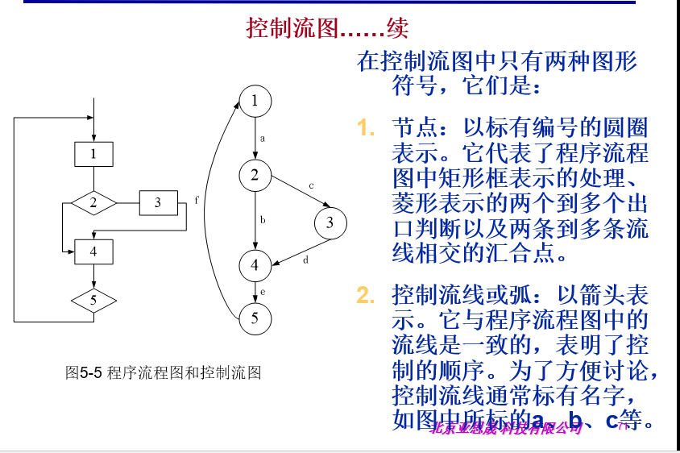

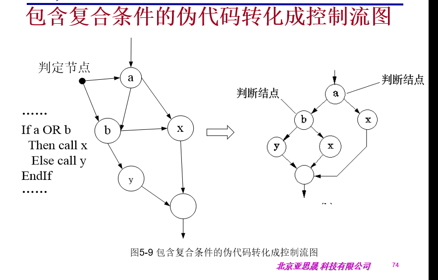

基本路径测试

- 路径测试是一个程序入口开始,执行经理的各个语句的完整过程, 广义上将, 任何有关于路径分析的都可以称为路径测试
- 完整的路径测试就是覆盖所有路径, 但是复杂的不能做到
- 不覆盖所有的前提下, 如果某一程序的每一个独立路径都被测试到了, 那么可以认为检验完了, 达到了语句覆盖, 这种测试方法就是通常说的基本路径测试方法

基本路径测试方法

- 即在控制流图的基础上, 通过分析控制结构的唤醒复杂度, 到处执行路径的基本集, 再从基本集合中设计测试用例, 包含以下步骤:

  1. 画出程序的控制流图

  2. 计算程序的环形复杂度, 导出基本路径条数, (确定测试用例数目的上届)

  3. 导出基本路径集合, 确定程序的独立路径

  4. 根据3的独立路径, 设计测试用例的输入数据和预期输出

     

环形复杂度

- 控制流图中区域的数量对应环形复杂度
- 给定环形复杂度V(G), 定义为**V(G)=E-N+2**, 其中E是控制流图中边的数量来, N是控制流图中节点的数量
- 也可以说**V(G)=P+1**, 其中P是控制流图G中的判定节点的数量, 判定节点是输出边至少2条以上的结点

控制流图的特点:

1. 具有唯一的入口节点, 表示开始语句
2. 具有唯一的出口节点,表示结束语句
3. 节点有带标号的圆圈表示, 表示一个或多个没有分支的源程序语句
4. 控制边由带箭头的直线或弧线表示,代表控制流的方向

单元测试

单元:

**结构化编程语言:**

​	单元测试的对象是 **函数**或 **子过程**

**面向对象语言:** 

​	单元测试的对象是 **类**,或 **类的方法**

基本单元不是一个独立的程序, 不能运行,需要其他部分 **调用和驱动**, 需要用到一些辅助模块

- **驱动模块(driver)**

  被测基本单元的主程序, 用来模拟被测模块的上一级模块, 接收测试数据, 并把数据传送给被测单元,启动被测模块, 最后输出实测结果

- **桩模块(stub)------存根模块**

  又称存根模块, 用来代替被测单元的子模块, 设计桩模块的目的是模拟被测单元的接口, 桩模块不需要包括子模块的全部功能, 但应做少量的数据操作,并且打印接口处的信息

  

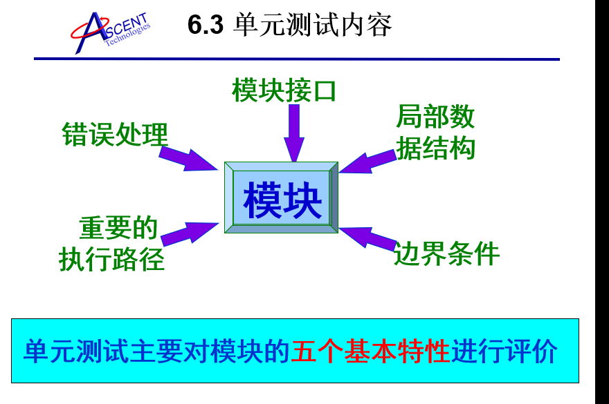

单元测试策略

1. **自顶向下** 的单元测试

   - 对顶层基本单元进行测试, 调用的单元做成桩模块, 再对第二层的基本单元进行测试, 用上面已测试的单元做驱动模块, 完成所有基本单元, 选择后续模块进行测试的原则是: 至少一个调用该模块的模块实现经过了测试

   - 不需要开发驱动模块

2. **自低向上**的单元测试

   - 对底层的基本单元(不调用其他模块的终端模块)进行测试, 然后对上面一层进行测试, 下面已经测试过的单元做成桩模块, 以此类推,知道调用所有单元, 选择下一模块的原则是: 该模块调用的所有模块已经经过了测试

   - 为了测试底层模块, 需要为他们设计驱动模块: 即包含着有效的测试输入, 调用被测模块切显示输出的模块

     

3. 孤立单元测试

   - 方法: 不考虑每个单元和其他单元之间的关系, 给每个单元设计桩模块或驱动模块, 每个模块进行独立的单元测试
   - 优点: 简单容易操作, 可以达到高的结构覆盖率
   - 缺点: 不提供一种系统早期集成途径
   - 总结: 最好的单元测试策略

   

   早期单元测试方式的不足:

   - 代码膨胀

     测试方法不算项目成果

   - 测试不可靠

     main()啥都能访问,容易出错

   - 缺乏对自动化测试的支持

     main()难以自动化测试

   

XUnit单元测试框架(包含JUnit)

- 而当一个测试结束的时候，可能需要对测试框架进行一些清理活动。在JUnit中，清理活动被称为拆卸（TearDown）。它保证每一个测试不会留下任何的影响。如果接下来有另一个测试活动开始了，那么这个测试的setup过程就能被正确得执行。setup和teardown被成为一个测试的固定环节

  1.重载setUp()，封装测试环境初始化及测试数据准备

  2.设计测试方法，以testXXX命名

  3.在测试方法中使用断言方法如assertEquals()，assertTrue()等

  4.设计测试套件，或使用缺省的测试套件，调用TestRunner执行测试脚本，生成测试结果

  5.重载tearDown()析构测试环境，执行收尾动作

JUnit的特征

A、使用断言方法判断期望值和实际值差异，返回Boolean值。

B、测试[驱动](http://drivers.21tx.com/)设备使用共同的初始化变量或者实例。

C、测试包结构便于组织和集成运行。

D、支持图型交互模式和文本交互模式。

集成测试

**概念:** 

​	集成: 是指把多个单元组合起来形成更大的单元

​	集成测试：是软件开发过程中概要设计阶段相对应的, 而在软件概要设计中关于整个系统的体系结构就是集成测试用例输入的基础.

**集成测试和单元测试的区别:**

- **测试对象的区别:** 集成测试关注的是模块间的接口, 接口之间的数据传递方式, 单元组合后是否实现预计的功能
- 集成测试组装的对象比单元测试的对象级别要高

集成策略: 

1. **自顶向下集成**

   - 自顶向下集成方法是一个日益为人们广泛采用的测试和组装软件的途径。从主控制模块开始，沿着程序的控制层次向下移动，逐渐把各个模块结合起来。

   - **这种测试方法不需要驱动模块**

   - 使用**深度优先**的策略，或者**宽度优先**的策略。

2. **自底向上集成**: 

    自底向上测试从“原子”模块（即在软件结构最底层的模块）开始组装和测试。因为是从底部向上结合模块，总能得到所需的下层模块处理功能，所以不需要桩模块。

3. **三明治集成**;  

   三明治集成是一种混合增量式测试策略，综合了自顶向下和自底向上两种集成方法的优点。这种方法桩模块和驱动模块的开发工作都比较小，不过代价是在一定程度上增加了定位缺陷的难度。

     

系统测试:

概念:

​	系统测试（system testing）是指测试整个系统已经确定是否能够提供用户的所有需求行为

功能测试

1. 链接或界面切换测试

   - 测试所有烂漫怕是否按照指示达到了链接的界面

   - 测试所链接的页面是否存在

   - 保证web系统没有孤立的页面

   - 整个应用系统所有页面开发完成之后进行链接的测试

     

2. 业务流程测试

   - 主要是系统应用功能的测试
   - 基于用例场景设计测试用例
   - 用例场景通过描述流用例的路径来确定过程, 这个流经过程要从用例开始到结束遍历其中所有基本流和备选流

   性能测试

   ​	主要检验软件是否达到需求规格说明书中的性能指标, 并满足一些性能相关的约束和限制条件

   - LoadRunner
   - JMeter
   - Apache的ab

验收测试:

- 验收测试应该是用黑盒方法验收系统业务需求和操作需求. 实际上, 用户代表通过执行平时再系统执行的典型任务测试被测应用, 验收测试也应该由用户代表进行系统文档(如用户指南)的测试
- 必须再被测应用的需求阶段考虑用户验收测试问题(如测试计划, 测试需求的评审和用户代表的确定)
- •掌握α测试和β测试的区别